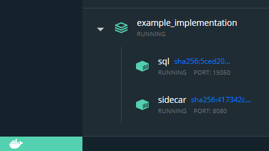

# RESTful API that leverages dbatools to manage sql server instances without your application having PowerShell or dbatools

- [RESTful API that leverages dbatools to manage sql server instances without your application having PowerShell or dbatools](#restful-api-that-leverages-dbatools-to-manage-sql-server-instances-without-your-application-having-powershell-or-dbatools)
  - [Too long; didn't read:](#too-long-didnt-read)
  - [Background - a testing framework with some infrastructure issues](#background---a-testing-framework-with-some-infrastructure-issues)
  - [Decoupling the database management from the business logic of the testing itself](#decoupling-the-database-management-from-the-business-logic-of-the-testing-itself)
  - [Getting the image and setting up a demo environment](#getting-the-image-and-setting-up-a-demo-environment)
  - [Things you can do with the example implementation](#things-you-can-do-with-the-example-implementation)
  - [How does it work?](#how-does-it-work)
  - [Further improvements](#further-improvements)
    - [Extending functionality](#extending-functionality)
    - [Why not all of dbatools?](#why-not-all-of-dbatools)


## Too long; didn't read:

- [Doug Finke wrote about pode server on docker](https://github.com/dfinke/PowerShellMicroservice)
  - [I added dbatools to it](https://github.com/QuadmanSWE/dbatools-restapi)
    - [It makes database restores go wroom](https://docs.microsoft.com/en-us/sql/relational-databases/databases/database-snapshots-sql-server?view=sql-server-ver15) 
    - Developers do not need to know powershell or dbatools and the restore always works.

## Background - a testing framework with some infrastructure issues
A customer of mine have written a fantastic framework for automatically testing a monolithic application whose database runs on sql server. The framework uses [playwright](https://playwright.dev/) to make sure that the behavior of the application doesn't regress. Playwright allows them to do things like finding information, changing information, and asserting that changes have been carried out as expected - while only interacting through chromium with the front end of the application. No APIs or database calls, just straight up telling their robot to look for element tags in what is rendered on the client.

To be able to decouple the test cases from each-other, I implemented SQL Server database snapshots about a year or two ago to restore data quickly. In an early implementation of this I would use PowerShell but I had not been exposed to dbatools yet. More on that later.

The basic structure is that before you start a batch of tests you would set up your database on an instance or on docker, run the application installer which would populate the base state of the application database, then add any base line testing data and lastly create the database snapshot. From there between each test the database would be restored to the snapshot.

It all worked most of the time but the testing team ended up taking ownership of the setup and restoration as I moved on to other things and they chose to implement it as custom tsql code running in their testing framework, to avoid calling PowerShell executables from dotnet. After a while they introduced functionality that then lead to some race condition issues and they sometimes ended up in wonky states while running the tests.

Meanwhile what I ended up doing was finding that the implementation that fits best is already inside dbatools with the [New-DbaDbSnapshot](https://docs.dbatools.io/New-DbaDbSnapshot) and [Restore-DbaDbSnapshot](https://docs.dbatools.io/Restore-DbaDbSnapshot) cmdlets.


## Decoupling the database management from the business logic of the testing itself
My idea then became to take back the ownership of proper database handling for the testing, while still not having to add any PowerShell or tsql to the testing framework.

[Enter Pode](https://badgerati.github.io/Pode/): A module for writing RESTful APIs (and more) with PowerShell.

[Featuring dbatools](https://docs.dbatools.io) to interact with the database

[All running on docker](https://dfinke.github.io/powershell,%20docker,%20pode/2020/08/01/PowerShell-Microservice-Hello-World.html), so that there is no new dependency while testing locally or in a build pipeline.

Not only do the testers no longer have to care about sql server internals, they can change the rest api for another type of database management if they would like to in the future run on something other than SQL Server.

Other teams and/or projects in the organization can leverage an API to perform tasks similar to this in other projects once they get comfortable with how easy it is to use.

## Getting the image and setting up a demo environment

This example is using [docker-compose](https://docs.docker.com/compose/) which is included with docker desktop. [If you are running on windows make sure you are using wsl2 to get it to work easily.](https://docs.docker.com/docker-for-windows/install/)

Download the image
```
docker pull dsoderlund/dbatools-restapi:latest
```

Create a new empty dir and step into it.

Create a .env file for the docker images to use

```
SA_USER=sa
SA_PASSWORD=<YourStrong@Passw0rd>
MSSQL_PID=Express
DB_NAME=testing_docker
ACCEPT_EULA=Y
DB_SERVICENAME=sql
DB_EXTERNALPORT=15050
DB_INTERNALPORT=1433
SNAPSHOTSUFFIX = _snapshot
```

Create a docker-compose.yaml file as so

``` yaml
version: "3.9"
services:
    db:
        image: mcr.microsoft.com/mssql/server:2019-latest
        container_name: ${DB_SERVICENAME}
        deploy:
            labels: [APP=sqlserver]
        ports:
            - "${DB_EXTERNALPORT}:${DB_INTERNALPORT}"
        env_file: 
            - .env
        
    db-sidecar:
        image: dsoderlund/dbatools-restapi:latest
        container_name: sidecar
        deploy:
            labels: [APP=pode]
        ports:
            - "8080:8080"
        depends_on:
            - db
        links:
            - "db:${DB_SERVICENAME}"
        env_file: 
            - .env
```

Up we go

```
docker-compose up -d
```

If you are using docker desktop you can find your two containers running happily in a bridge network


## Things you can do with the example implementation

All of the methods in the API are GETs.

You can call the the rest endpoint with any http client. For example [fetch api for javascript](https://developer.mozilla.org/en-US/docs/Web/API/Fetch_API), a [HttpClient in dotnet](https://docs.microsoft.com/en-us/dotnet/api/system.net.http.httpclient?view=net-5.0) or plain Invoke-RestMethod in PowerShell (or Invoke-WebRequest for that matter if you are so inclined)

``` powershell

Invoke-RestMethod -Method GET -Uri 'http://localhost:8080/'

Invoke-WebRequest -Uri 'http://localhost:8080/' | Select-Object -Expandproperty content

```

To simplify playing around you could wrap all of this nonsense like so

``` powershell

Function Invoke-SidecarRequest {
    [CmdletBinding()]
    param(
        [string]$MethodName,
        [string]$Uri = 'http://localhost:8080'
    )
    Write-Verbose "Calling restmethod [$MethodName] on endpoint [$Uri]"
    return Invoke-Restmethod -uri "$Uri/$MethodName" -TimeoutSec 60
}

Invoke-SidecarRequest 'Ping'

```

Running Ping like in the example above returns a message about the status of the sql server connectivity (using Test-NetConnection):


Running without a method name, just the root, will display a welcome message and give us the command palette:


- **/Ping** will indicate with a message the internal port and if the dbatools-restapi can communicate with the sql server configured in the environment file on that port.
- **/Errors** will display contents of any error log file and can be used to debug
- **/DebugConfig** will display what the dbatools-restapi is configured to use connect to the sql server through dbatools
- **/DatabaseExists** will indicate (True/False) if  the database in the environment file exists or not on the sql server instance
- **/CreateDatabase** will create the database if it doesn't exist and drop and recreate it if it does exist 
- **/DropDatabase** will drop the database if it exists and does nothing if it doesn't exist.
- **/SnapshotDatabase** will remove any existing database snapshot for the database and then create a database snapshot for the database
- **/RestoreDatabase** will restore any existing database snapshot for the database

As you can gather from this, there can be only one snapshot, and that is exactly the use case that you want most of the time.

## How does it work?

Pode lets you define your endpoints with PowerShell that when invoked runs some PowerShell code on the server and sends data back to the caller.

By running it on a docker image with dbatools preinstalled, we can let those invocations carry out dbatools cmdlets before returning.

Here is an example [straight from the source code of the docker image](https://github.com/QuadmanSWE/dbatools-restapi/blob/main/src/StartPodeServer.ps1) that describes what the server does when the /RestoreDatabase endpoint is called.

``` powershell
Add-PodeRoute -Method Get -Path '/RestoreDatabase' -scriptblock {
    try {
        if (Get-DbaDbSnapshot @using:splat) {
            Restore-DbaDbSnapshot @using:splat -Force
            Write-PodeTextResponse -Value 'OK'
        }
        else {
            Write-PodeTextResponse -Value 'No snapshot to restore from'
        }
    }
    catch {
        $_ | Write-PodeErrorLog
        Write-PodeTextResponse -Value $using:errormessage
    }
}
```

## Further improvements

### Extending functionality

You can use .pode files to get more advanced and dynamic behavior.

You could either start from [this reference base image](https://github.com/dfinke/PowerShellMicroservice) for pode in docker and write your own applicaiton or extend upon mine by layering your docker commands on top of my image. The reference image was [initially conceptualized by Doug Finke](https://dfinke.github.io/powershell,%20docker,%20pode/2020/08/01/PowerShell-Microservice-Hello-World.html)


### Why not all of dbatools?

You could, given some time, rewrite the functionality to incorporate any cmdlet from dbatools, perhaps with limitations of things you cannot do with a sql login on a remote instance. To do it you would iterate through dbatools with

``` Get-Command -Module 'dbatools' | foreach-object { <some magic> } ```

From there you would parse the parameter sets and for each set of parameters set up an endpoint of the appropriate method type that accepts the parameter sets as arguments.

Simple, but not easy.

