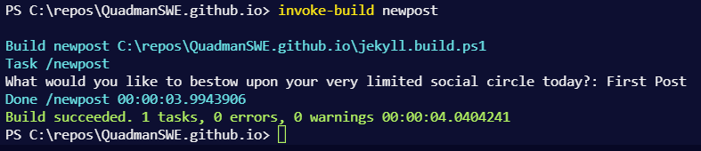
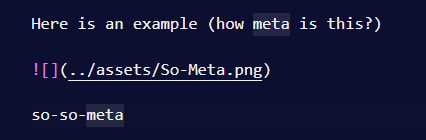

# Hello world

This is the first post, I have successfully managed to use jekyll through docker and set up invoke-build to manage the meta stuff like running jekyll, adding posts.

## I can do images now

I am using a plugin to manage images that is really cool.

Here is an example (how meta is this?)





## I can test it out

``` powershell

Invoke-Build serve, surf

```