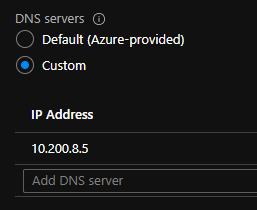

# Azure Rest API with Azure CLI - az rest to the rescue

- [Azure Rest API with Azure CLI - az rest to the rescue](#azure-rest-api-with-azure-cli---az-rest-to-the-rescue)
  - [Too long; didn't read:](#too-long-didnt-read)
  - [Background (It is always DNS)](#background-it-is-always-dns)
  - [DNS forwarding for point to site clients](#dns-forwarding-for-point-to-site-clients)
  - [Azure CLI and Powershell to the rescue](#azure-cli-and-powershell-to-the-rescue)
    - [Connect powershell to Azure and start browsing](#connect-powershell-to-azure-and-start-browsing)
    - [Converting pscustomobject to json that Azure cli can use](#converting-pscustomobject-to-json-that-azure-cli-can-use)
    - [Deploying the network profile with the Rest API](#deploying-the-network-profile-with-the-rest-api)
    - [Finally, where were we?](#finally-where-were-we)
    - [Finishing up dns-forwarding for the clients](#finishing-up-dns-forwarding-for-the-clients)
    - [We have name resolution](#we-have-name-resolution)

## Too long; didn't read:
    - Point to Site VPN in Azure cannot offer DNS service for private DNS zones.
    - You can deploy a virtual machine or container on the network to act as a proxy / dns-forwarder
    - Azure Container Instances is far from perfect
    - When the automatic stuff fails for some reason, you might have get your hands dirty with Azure's Rest API

## Background (It is always DNS)

Recently my team has been tasked to set up some infrastructure in Azure.

For the time being users will log on with point to site VPN and everything is working nicely.

Something that bothered me though was that while we could connect to resources on the private IP addresses the private DNS zone names would not be forwarded to clients over VPN.

The resources in Azure get their DNS resolution from Azure itself, us VPN clients are not so lucky. This is a well documented limitation of point to site VPN: 

https://docs.microsoft.com/en-us/answers/questions/64223/issue-with-resolving-hostnames-while-connected-to.html

## DNS forwarding for point to site clients

So basically, we have to deploy our own DNS-forwarder and point to it from the gateway. No biggie. Here is a nice implementation that is quick and easy to set up with Azure Container Instances.

https://github.com/whiteducksoftware/az-dns-forwarder

And then what happened was that Azure tried to help me and create the network profile that the Azure Container Instance will use, how nice of Azure.

The only problem was that since both the vnet and subnets have rather long names due to our naming convention, the resulting autogenerated name was longer than 80 characters and the deployment failed. No DNS-forwaring for us today!

So what we had to do was to override the automatic creation of the network profile for the Azure container instance.

## Azure CLI and Powershell to the rescue

*I will be mixing Azure cli and powershell, it just felt like the right thing to do.*


### Connect powershell to Azure and start browsing

While navigating Azure I like to use out-gridview, that way I can interact effortlessly with the intermediate objects and save my code for later.

``` powershell
#Gets the tenant I need from all my tenants
$tenant = get-aztenant | out-gridview -passthru 
Set-AzContext -Tenant $tenant.id

#Gets the subscription I need from all subscriptions for that tenant
$subscription = Get-AzSubscription -TenantId $tenant.id | out-gridview -PassThru
set-azcontext -Tenant $tenant.id -Subscription $subscription.Id

#Gets the resource group with the vnet I want to be using
$rg = Get-AzResourceGroup  | out-gridview -PassThru | Select -expandproperty ResourceGroupName

#now lets find the vnet
$vnet = Get-AzVirtualNetwork -resourcegroupname $rg | out-gridview -PassThru

#The network profile will live in a subnet
$snet = $vnet.Subnets | out-gridview -PassThru
```

### Converting pscustomobject to json that Azure cli can use
Here is how I like to format my objects and transform them to json that az rest can use

``` powershell
Function Get-AzRestJson {
    [CmdletBinding()]
    param (
        [Parameter(Mandatory = $true,
            Position = 0,
            ValueFromPipeline = $true,
            ValueFromPipelineByPropertyName = $true)]
        [ValidateNotNullOrEmpty()]
        [object]$InputObject
    )
    Return ConvertTo-Json -InputObject $InputObject -Compress -Depth 32 | Foreach-Object { $_ -replace '"', '\"' }
}
```

For example the object I will be deploying will have a structure which for me is easiest to build and look at with powershell as pscustomobject

$vnet and $snet are taken from the code about where we navigated from the tenant to the subscription, resource groups, virtual networks and their subnets.

``` powershell
$bodyobject = @{
    location   = $vnet.Location
    properties = @{
        containerNetworkInterfaceConfigurations = @(
            @{
                name       = "eth1"
                properties = @{
                    ipConfigurations = @(
                        @{
                            name       = "ipconfig1"
                            properties = @{
                                subnet = @{
                                    id = $snet.Id
                                }
                            }
                        }
                    )
                }
            }
        )
    }
}
```

### Deploying the network profile with the Rest API

Allright, so now we can get our request body and put all this to work and finally enjoy our DNS-forwarding

``` powershell

$newprofilename = "aci-network-profile-$($snet.Name)" #80 chars is too long let us just use the subnet name
$apiversion = '2020-11-01'
$requestbody = $bodyobject | Get-AzRestJson #using the function we defined earlier to format correctly
$requestheaders = @{"Content-Type" = "application/json" } | Get-AzRestJson

#The full path to the resource we want to interact with
$requesturi = "/subscriptions/{0}/resourceGroups/{1}/providers/Microsoft.Network/networkProfiles/{2}?api-version={3}" -f $subscription.id, $rg, $newprofilename, $apiversion

#connect with az cli
az account set --subscription $subscription.Id 

#create network profile (put)
az rest --method put --url $requesturi --body $requestbody --headers $requestheaders

```

You can of course use the rest api to search (get) and remove (delete) too!

``` powershell
#look for network profile
az rest --method get --url $requesturi

#delete network profile
az rest --method delete --url $requesturi
```

### Finally, where were we?

Now that I have a network profile for my container instance that doesn't fail validation (thanks Microsoft), I can finally do the comparitably trivial task of spinning up the container.

``` powershell
#Region create the container instance
# source: https://github.com/whiteducksoftware/az-dns-forwarder
# iwr https://raw.githubusercontent.com/whiteducksoftware/az-dns-forwarder/master/LICENSE | select -expand content
$imageref = "ghcr.io/whiteducksoftware/az-dns-forwarder/az-dns-forwarder@sha256:8671e086b0be1b7e43e9feebba833ff9025852f3b45570cb13d1d5bfc39f12c5"
#docker pull $imageref #test url for image

az container create `
    --resource-group $rg `
    --name dns-forwarder `
    --image $imageref `
    --cpu 1 `
    --memory 0.5 `
    --restart-policy always `
    --vnet $vnet.Name `
    --subnet $snet.Name `
    --location $vnet.Location `
    --os-type Linux `
    --port 53 `
    --protocol UDP `
    --network-profile $newprofilename
#EndRegion
```

Look at that little container go!


### Finishing up dns-forwarding for the clients

Lastly I needed to set the DNS server for the vnet with the gateway to the container IP.



### We have name resolution

After my vm restarted and I reconnected VPN I got the name resolution to work.

