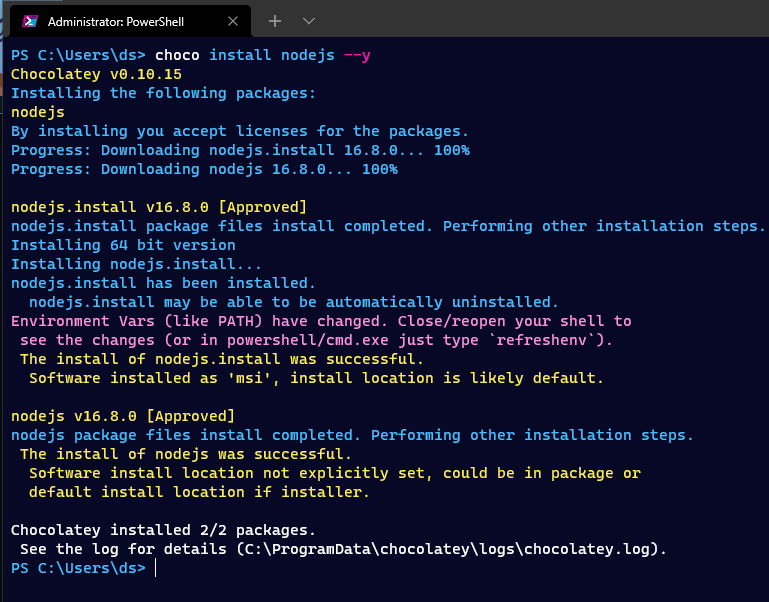
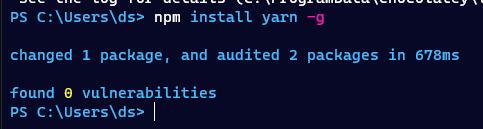
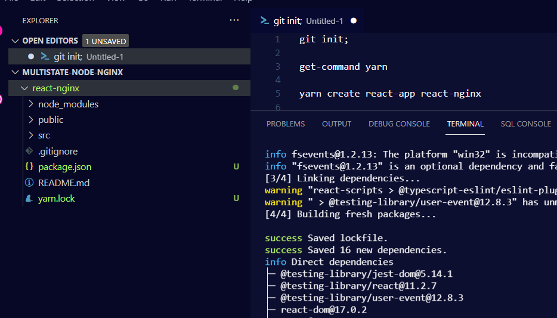
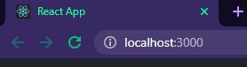
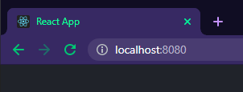
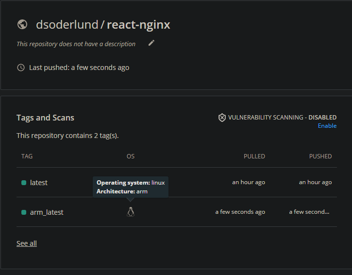
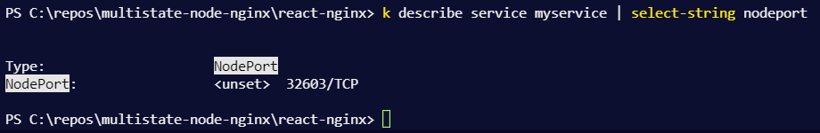
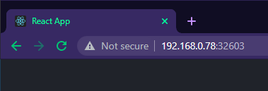

# Building a simple react web app on docker that can be hosted anywhere

I wanted to learn how to create a plain and simple front end to serve some buttons for rest apis or azure runbooks that we are building.

This way I get a chance to learn something other than powershell and sql and others get invited to show off their skills with typescript and css to make my buttons prettier.

<!--more-->

Disclaimer: the multi-stage docker method in this blogpost is derived from [this excellent blog post by Nick Scialli](https://typeofnan.dev/how-to-serve-a-react-app-with-nginx-in-docker/).

- [Building a simple react web app on docker that can be hosted anywhere](#building-a-simple-react-web-app-on-docker-that-can-be-hosted-anywhere)
  - [Nodejs](#nodejs)
  - [Yarn](#yarn)
  - [New repo](#new-repo)
  - [Dockerize](#dockerize)
  - [Getting ready to roll out](#getting-ready-to-roll-out)
  - [Example deployment on kubernetes](#example-deployment-on-kubernetes)

## Nodejs

I will install nodejs with [chocolatey](https://chocolatey.org/install), the package manager for windows.

Remember that chocolatey should not run from vscode or powershell ise, but from the normal powershell, as an administrator.

``` powershell
choco install nodejs --y
```




## Yarn

Then I will use the node package manager to install yarn

``` powershell
npm install yarn -g
```



## New repo

Let's just create an empty dir, make it a workspace in vscode and make a repo out of it.

Then once we have made sure vscode can run yarn, lets just init the react application and call it react-nginx.

``` powershell
new-item -ItemType Directory -Path "C:\repos\multistate-node-nginx"
Set-Location "C:\repos\multistate-node-nginx"
git init;
get-command "yarn"
yarn create react-app react-nginx
```



The yarn output suggests we start with "yarn start", let's:

``` powershell

set-location "react-nginx" 
yarn start

```



## Dockerize

Before we start to develop our application further, let us finish up how we intend to serve our application as a docker container.

That way once it is up and running on docker instead of yarn start, we can ship it to our web provider and know we get the same experience. For hosting I will use Azure web app in the future and in this blog post my little raspberry pi kubernetes cluster.

I use [docker desktop](https://www.docker.com/products/docker-desktop) on windows, it is pretty nifty.

I will create a docker ignore file for the modules and that is about it.

``` powershell
'node_modules' | out-file .dockerignore

new-item dockerfile
```

This part is copied over from the blog post I referenced up at the top, but I've specified which versions I want of node and nginx for build and for run.

``` dockerfile
# Multi-stage
# 1) Node image for building frontend assets
# 2) nginx stage to serve frontend assets

# Name the node stage "builder"
FROM node:16.8.0-alpine3.11 AS builder
# Set working directory
WORKDIR /app
# Copy all files from current directory to working dir in image
COPY . .
# install node modules and build assets
RUN yarn install && yarn build

# nginx state for serving content
FROM nginx:1.21.1-alpine
# Set working directory to nginx asset directory
WORKDIR /usr/share/nginx/html
# Remove default nginx static assets
RUN rm -rf ./*
# Copy static assets from builder stage
COPY --from=builder /app/build .
# Containers run nginx with global directives and daemon off
ENTRYPOINT ["nginx", "-g", "daemon off;"]

```

Now all we need to do is build and test it out locally on docker.

``` powershell
docker build -t react-nginx .

docker run --name myapp --rm -d -p 8080:80 "react-nginx"

start chrome "http://localhost:8080"
```
The nginx service is now serving the content built with node. Sweet.



## Getting ready to roll out

At this point if I was going to start to add content, I would make this my first commit.

``` powershell
git add .
git commit -m "Added my app"
```

Then I would add my gitattributes and extension recommendations.

Then we can finally add some content.

## Example deployment on kubernetes

In the future I hope to expand my knowledge of kubernetes enough that I can set up a private container registry. Instead I will opt to publish my container to docker hub and pull it from there with a simple deployment.

Now since my specific cluster is running on ARM and not x64, the images need to be built for that architecture.

``` powershell
#take our build and just tag it nicely
docker tag react-nginx dsoderlund/react-nginx:latest

#up to docker hub we go
docker push dsoderlund/react-nginx:latest

#for my pi cluster, it must be built for ARM
docker build -t dsoderlund/react-nginx:arm_latest --platform linux/arm/v8 .
docker push dsoderlund/react-nginx:arm_latest

```



Great, now the image can be used in my kubernetes deployment.

I will as a bonus add an example of how to send instructions to kubernetes without yaml files.

``` powershell
#My lazy method of running kubectl apply without a yaml file.
function kapow([Parameter(ValueFromPipeline = $true)][string]$param) {$tf=New-TemporaryFile; $param|out-file $tf; & kubectl apply --recursive -f $tf; rm $tf }

#a simple function as a wrapper for kubectl that helps me when writing a lot of kubectl commands.
function k([Parameter(ValueFromRemainingArguments = $true)]$params) { & kubectl $params }

k create namespace myapp
k config set-context --current --namespace=myapp

# deploy a string into kubernetes directly like a savage
kapow @"
apiVersion: apps/v1
kind: Deployment
metadata:
  name: myapp-deployment
spec:
  selector:
    matchLabels:
      app: myapp
  replicas: 1
  template:
    metadata:
      labels:
        app: myapp
    spec:
      containers:
      - name: myapp
        image: dsoderlund/react-nginx:arm_latest
        ports:
        - containerPort: 80
"@

# expose the deployment with a service
k expose deployment myapp-deployment --type=NodePort --name myservice

```

Last thing, since I am doing a simple nodeport type service, I need to find what random port it was assigned

``` powershell
k describe service myservice | select-string nodeport
```



There we go, the application we wrote with node is now running on kubernetes.



