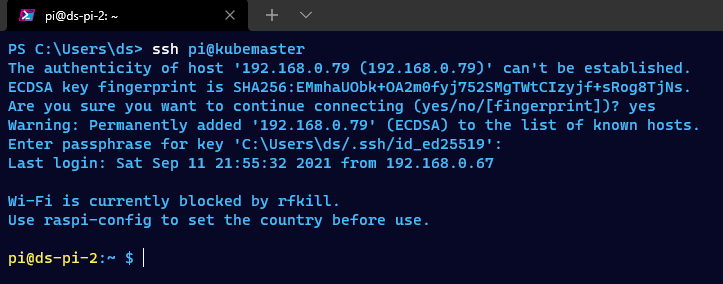
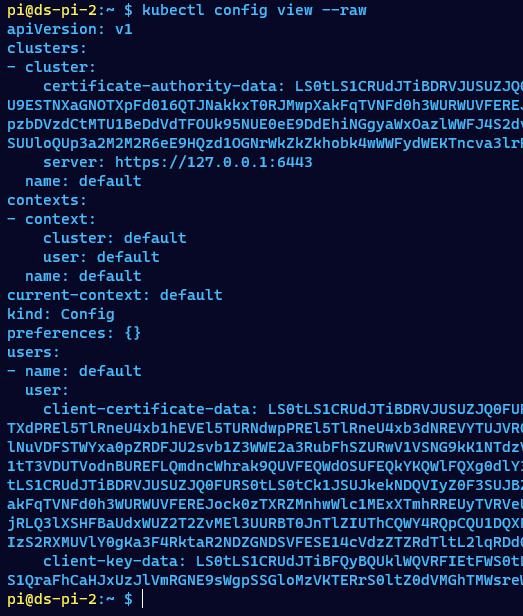
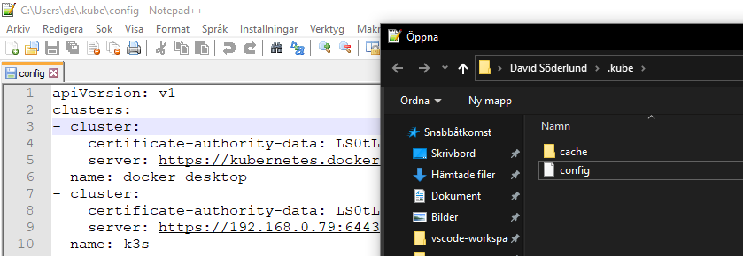
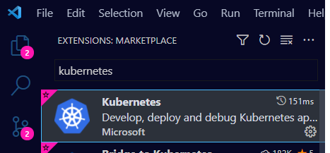
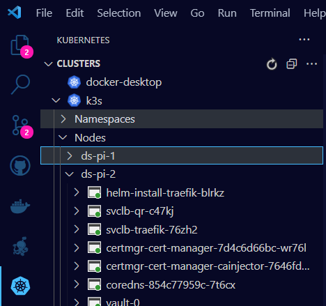
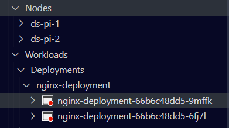
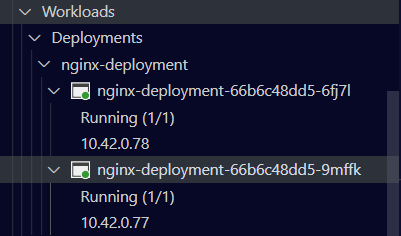
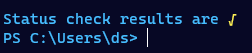
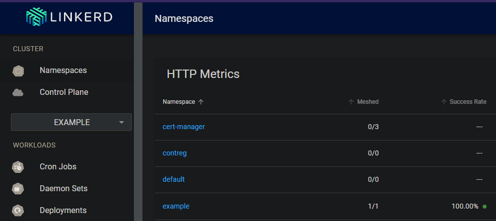

# Beyond Minikube - setting up two raspberry pi with k3s to get experience with kubernetes.

The scope of this post is not to give an introduction to what kubernetes is or why to use it.

Chances are if you find this post that you want to build a physical cluster on your home network and practice deploying services to it.

We will be using [k3s from rancher](https://k3s.io/) as our kubernetes distro.

This guide is intended for developers that use primarily Windows 10 and want an example of what setting up a physical kubernetes cluster is like.

I highly recommend to read up until the extra credit section, there will be lots of pretty pictures!

- [Beyond Minikube - setting up two raspberry pi with k3s to get experience with kubernetes.](#beyond-minikube---setting-up-two-raspberry-pi-with-k3s-to-get-experience-with-kubernetes)
  - [Cluster infrastructure set up](#cluster-infrastructure-set-up)
    - [Unpacking and bootstrapping rasbian](#unpacking-and-bootstrapping-rasbian)
    - [Configuring raspbian after boot on each node](#configuring-raspbian-after-boot-on-each-node)
    - [Assiging static IP](#assiging-static-ip)
    - [Installing k3s on the first node](#installing-k3s-on-the-first-node)
    - [Installing and joining the other nodes](#installing-and-joining-the-other-nodes)
  - [The tools I use to interact with kubernetes from windows 10](#the-tools-i-use-to-interact-with-kubernetes-from-windows-10)
    - [kubectl and friends](#kubectl-and-friends)
    - [vs code extension](#vs-code-extension)
    - [kubernetes-dashboard](#kubernetes-dashboard)
  - [My first deployment](#my-first-deployment)
    - [Straight up simplest web app of your life](#straight-up-simplest-web-app-of-your-life)
    - [Something a bit harder, with helm](#something-a-bit-harder-with-helm)
  - [Extra credit and homework for the nerds in the front of the class](#extra-credit-and-homework-for-the-nerds-in-the-front-of-the-class)
    - [You own CA with your proper let's encrypt cert](#you-own-ca-with-your-proper-lets-encrypt-cert)
    - [Private container registry](#private-container-registry)
    - [Service meshes - Linkerd specifically](#service-meshes---linkerd-specifically)

---

## Cluster infrastructure set up

I bought the two rasberry pi, usb-c cables for power, some cute [ebony](https://www.inet.se/produkt/1974085/okdo-raspberry-pi-4-case-black) and [ivory](https://www.inet.se/produkt/1974087/okdo-raspberry-pi-4-case-clear) cases and micro SD-cards from [https://www.inet.se/](Inet.se) (shout out to their webshop, expect more business from me).

Once the package showed up, me and [Algaron87](https://twitter.com/Algaron87) unpacked everything and put the two raspberry pi into their cases. Algaron is my high school buddy / friend of the family / godfather of my children / all around good guy.


---
### Unpacking and bootstrapping rasbian

We unpacked the micro SD-cards and began flashing over a rasbian image that you can [download here.](https://downloads.raspberrypi.org/)

The one we chose for the occation was ["2020-08-20-raspios-buster-arm64-lite.zip"](https://downloads.raspberrypi.org/raspios_arm64/images/raspios_arm64-2020-08-24/2020-08-20-raspios-buster-arm64.zip).

We mounted the image in windows and added an empty ssh file to the image before copying over to show that we wanted to use ssh in the future. (We killed the ability to log on with password in the future in the sshd_config file.)

I am using an old mp3 player ascesory as a docking station for micro SD-cards.

The disk write software we used was [Win32DiskImager](https://sourceforge.net/projects/win32diskimager/), instructions in [the raspberry pi documentation](https://www.raspberrypi.org/documentation/computers/getting-started.html#installing-images-on-windows).


---
### Configuring raspbian after boot on each node

I named my nodes ds-pi-1 and ds-pi-2, assigning them ip addresses 192.168.0.78 and 192.168.0.79 respectively.

The one named ds-pi-2 became the master node. (We assigned this by which was the first case we unpacked and somehow switched SD-cards around and got them confused!)

Adding this info to your local ssh_config file will make it a bit easier to keep track while boostrapping. Once the cluster is up and running the need to ssh to them diminishes.

``` powershell
@"

Host ds-pi-2
  HostName 192.168.0.79
  User pi

Host kubemaster
  HostName 192.168.0.79
  User pi

Host ds-pi-1
  HostName 192.168.0.78
  User pi

Host kubeworker
  HostName 192.168.0.78
  User pi

"@ | out-file C:\ProgramData\ssh\ssh_config -append

```

Time to connect and configure each node, had I had three or more nodes I would look into automating this part further.
``` powershell
ssh pi@kubemaster
```
[Reference this documetation on rasp-config.](https://www.raspberrypi.org/documentation/computers/configuration.html)

``` bash
sudo raspi-config #follow the steps

mkdir /home/pi/.ssh

echo "<Mine and Algaron's ssh keys>" > /home/pi/.ssh/authorized_keys

sed -i 's/#PasswordAuthentication.*/PasswordAuthentication no/' /etc/ssh/sshd_config #kill the ability to log on with password
sed -i 's/UsePAM yes.*/UsePAM no/' /etc/ssh/sshd_config

printf %s " cgroup_enable=cpuset cgroup_memory=1 cgroup_enable=memory" >> /boot/cmdline.txt

```

Now repeat that step for each worker node (in my case the only one)

``` powershell
ssh pi@kubeworker
```

### Assiging static IP

You should set your static ip on the nodes and not in your router like I did to prevent issues with DNS inside the cluster. I don't care about that stuff and I live my life pretty much as a renegade (I am hiding an insecurity with my lazyness, don't judge).


### Installing k3s on the first node

We performed a proper reboot of the nodes by unplugging and replugging the two raspberry pi.

Let's fire up windows terminal and ssh to the nodes.

``` powershell
ssh pi@kubemaster
```



These commands will initialize the cluster by downloading the script from the k3s site. Then it will output the token we need.

```bash
export K3S_KUBECONFIG_MODE=644
curl -sfL https://get.k3s.io | sh -
kubectl config view --raw #shows you the token you need to connect nodes and your dev environement
```



Replace 127.0.0.1 with the ip address of the kube master, in our case 192.168.0.79

### Installing and joining the other nodes

``` powershell
ssh pi@kubeworker
```

Replace master ip and master key

``` bash
sudo curl -sfL https://get.k3s.io | K3S_URL="https://<master ip>:6443" K3S_TOKEN=<master key> sh -
```

## The tools I use to interact with kubernetes from windows 10

### kubectl and friends

If you know anything about me you know about [chocolatey](https://chocolatey.org/install).

[kubectl](https://kubernetes.io/docs/tasks/tools/) is the command line interface for kubernetes, I will use it for most of the interaction with the cluster, as well as the vs code extension for a visualization.

[helm](https://helm.sh/) and its charts lets developers describe their applications for kuberenets deployment rather than an array of kubernetes deployments.
This way you can install and upgrade an application in one go and it is a great interface for talking about the application between the development team and the operations team / SRE.

Lastly I suggest for people who are comfortable with docker-compose to try out [kompose](https://kubernetes.io/docs/tasks/configure-pod-container/translate-compose-kubernetes/) which will translate yaml from the former to the latter so that you can deploy an application you are familiar with to kubernetes and see what gets created to facilitate your application.

``` powershell
choco install kubernetes-cli --y
choco install kubernetes-helm --y
choco install kubernetes-kompose --y
#let's see what we have got installed
choco list --local
```


You can connect to the cluster from your local machine by importing the connection settings shown through the info from the cluster 

Save the output from the config command you ran on the master node. Put it into a file named config under ~/.kube. Merge it if you have a file from before for one or more other clusters.



Now we can check out our deployment status with kubectl, it will use our configuration that we saved in the previous step.

```
kubectl get nodes
``` 


### vs code extension

The kube config we saved can also be leveraged by the kubernetes extension for vscode.



Now we can for example browse our nodes from here, and what they are running. I find this a great visual tool to learn how my deployments become entities in kubernetes and what yaml they produce internally.



### kubernetes-dashboard

Three lines of code that are run on the master node from https://rancher.com/docs/k3s/latest/en/installation/kube-dashboard/

After exporting the bearer token I put it into my keepass database and I copy paste it from there whenever I use the dashboard.

I built this cute powershell wrapper function to connect to any application, with a specific implementation in a different function for the dashboard app itself. These get loaded as part of my powershell profile

``` powershell
Function Connect-KubeApplication {
	param(
		[int]$localport,
		[int]$clusterport,
		[string]$servicename,
		[string]$namespace = $servicename,
		[string]$path = '',
		[Parameter(Mandatory=$false)][ValidateSet('http','https')][string]$protocol = 'https'
	)
	start-process chrome "$($protocol)://localhost:$localport/$path"
	kubectl port-forward -n $namespace service/$servicename "$localport`:$clusterport" --address 0.0.0.0
}
Function Connect-KubeDashBoard {
	param([int]$localport = 10443)
	Connect-KubeApplication -localport $localport -clusterport 443 -servicename 'kubernetes-dashboard'
}
```

Now I can connect like so to the dashboard: 
```powershell
Connect-KubeDashBoard
```

My shell will spit out the port forward command that was run and the reponse.


It will also surf to the application with chrome.


## My first deployment

### Straight up simplest web app of your life
``` powershell
kubectl apply -f "https://raw.githubusercontent.com/kubernetes/website/main/content/en/examples/application/deployment.yaml"
```

If you are quick in the extension you can see the two pods of the deployment being unavailable for a time



In a few short moments they will turn green, indicating they are in the ready state.



Get rid of that stuff by running kubectl delete deployment nginx-deployment

``` powershell
kubectl delete deployment nginx-deployment
```


### Something a bit harder, with helm

Note that when you install helm charts, that a lot of them contain images which are not built for the ARM architecture of our raspberry pi cluster. Your milage might wary. Here is a chart I built for a simple golang app that translates string input into a QR code png.

helm qr thing

If you are interested in not only running helm charts but creating them, check out this great documentation and then run: 

```powershell

```


## Extra credit and homework for the nerds in the front of the class

### You own CA with your proper let's encrypt cert

http is better with TLS, by installing cert-manager on kubernetes you can let it act as a CA.

Since I use a service mesh I will be using it for my ingress controller, the thing that makes it so that the network traffic reaches services inside the cluster.

``` powershell
helm install --namespace kube-system -n cert-manager stable/cert-manager
```

### Private container registry

Rather than putting the docker images I build myself on docker hub I would like to host them directly inside the cluster, that way there isn't a roundtrip up to the Internet all the time.

### Service meshes - Linkerd specifically

Service meshes act as another layer of abstraction on top of kubernetes and what it already provides in terms of infrastructure for our applications. A service mesh orchestrates the intra connection between services that make up an application. This way the application developer can describe **WHAT** a service needs but doesn't have to write native code in the each service on **HOW** it gets it.

There are a couple of popular choices for service meshes on top of kubernetes, most prominent are [Istio](https://istio.io/) and [Linkerd](https://linkerd.io/).

Istio to my knowledge does not run on ARM so to get a service mesh to work on our particular cluster we are goint to run with Linkerd.

``` powershell
#add Linkerd runtime to my machine
choco install Linkerd2 --y

#function to mimic linux reading from stdin in a pipeline
function kapow([Parameter(ValueFromPipeline = $true)][string]$param) {
  $tf=New-TemporaryFile;
  $param | out-file $tf;
  & kubectl apply --recursive -f $tf;
  rm $tf 
}
#once I have the software, install Linkerd runtime to the current cluster
linkerd install | out-string | kapow #This is equivalent of sh Linkerd install | kubectl apply --recursive -f -

#checks status of the installation
linkerd check --proxy -n Linkerd

#Add the Linkerd viz dashboard
linkerd viz install | out-string | kapow

```

Look at all those happy check marks / saxophone emoji



Linkerd will automatically enforce mTLS between meshed pods, but to get your pods meshed, you have to specify it on your deployment or your namespace.

By always creating a namespace for each instance of an application, I don't have to think much about it since I will just add the tag for proxy injection to my namespace.

Here is an example deployment into the mesh, some-deployment.yaml is a copy of the deployment I did in the last blogpost: [7 sept 2021 -  Exploring multi-stage build in docker to learn javascript in the future](./react-nginx-docker-multistage)

```powershell
k create namespace example
k annotate namespace example linkerd.io/inject="enabled"

ka "some-deployment.yaml" #a react app in nginx, see previous blog post.
k expose deployment myapp-deployment --name myservice

#check that app is running properly
Connect-KubeApplication -localport 10987 -clusterport 80 -protocol http -servicename myservice -namespace example 

#open the dashboard
linkerd viz dashboard #similar to my Connect-KubeApplication cmdlet
```

Look at that, blesh this mesh.

