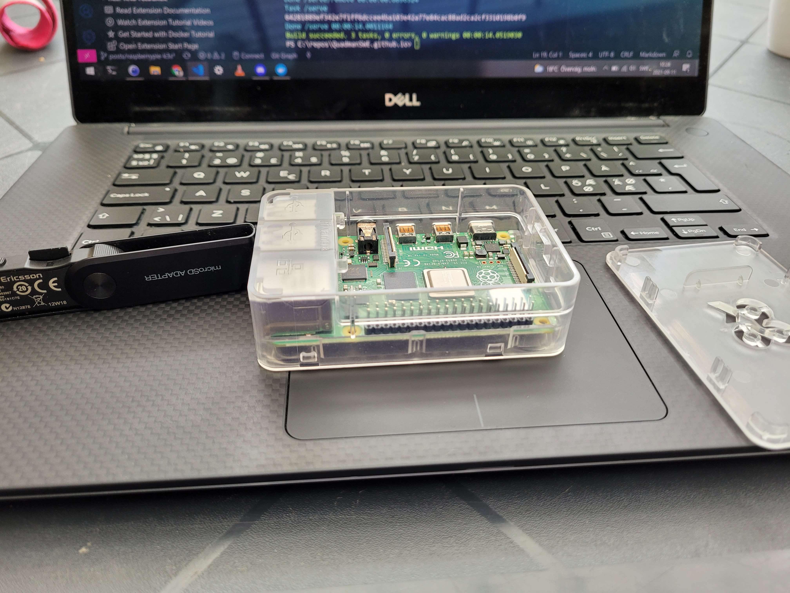
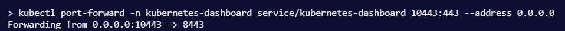
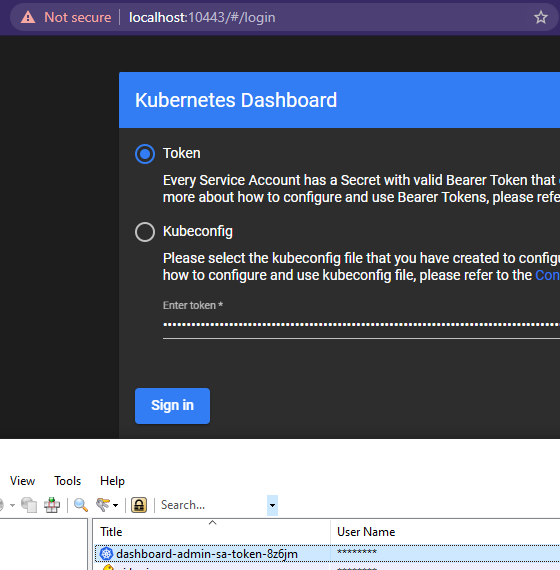

# Beyond Minikube - setting up two raspberry pi with k3s to get experience with kubernetes.

The scope of this post is not to give an introduction to what kubernetes is or why to use it.

Chances are if you find this post that you want to build a physical cluster on your home network and practice deploying services to it.

We will be using [k3s from rancher](https://k3s.io/) as our kubernetes distro.

- [Beyond Minikube - setting up two raspberry pi with k3s to get experience with kubernetes.](#beyond-minikube---setting-up-two-raspberry-pi-with-k3s-to-get-experience-with-kubernetes)
  - [Cluster infrastructure set up](#cluster-infrastructure-set-up)
    - [Unpacking and bootstrapping rasbian](#unpacking-and-bootstrapping-rasbian)
    - [Configuring raspbian after boot on each node](#configuring-raspbian-after-boot-on-each-node)
    - [Assiging static IP](#assiging-static-ip)
    - [Installing k3s on the first node](#installing-k3s-on-the-first-node)
    - [Installing and joining the other nodes](#installing-and-joining-the-other-nodes)
  - [The tools I use to interact with kubernetes from windows 10](#the-tools-i-use-to-interact-with-kubernetes-from-windows-10)
    - [kubectl and friends](#kubectl-and-friends)
    - [vs code extension](#vs-code-extension)
    - [kubernetes-dashboard](#kubernetes-dashboard)
  - [My first deployment](#my-first-deployment)
  - [Things you can do for fun and profit (extra credit and homework)](#things-you-can-do-for-fun-and-profit-extra-credit-and-homework)
    - [You own CA with your proper let's encrypt cert](#you-own-ca-with-your-proper-lets-encrypt-cert)
    - [Private container registry](#private-container-registry)
    - [Service meshes - Linkerd specifically](#service-meshes---linkerd-specifically)

## Cluster infrastructure set up

I bought the two rasberry pi, usb-c cables for power, some cute [ebony](https://www.inet.se/produkt/1974085/okdo-raspberry-pi-4-case-black) and [ivory](https://www.inet.se/produkt/1974087/okdo-raspberry-pi-4-case-clear) cases and micro SD-cards from [https://www.inet.se/](Inet.se) (shout out to their webshop, expect more business from me).


Once the package showed up, me and [Algaron87](https://twitter.com/Algaron87) unpacked everything and put the two raspberry pi into their cases. Algaron is my high school buddy / friend of the family / godfather of my children / all around good guy.

### Unpacking and bootstrapping rasbian

We unpacked the micro SD-cards and began flashing over a rasbian image that you can [download here.](https://downloads.raspberrypi.org/)

The one we chose for the occation was ["2020-08-20-raspios-buster-arm64-lite.zip"](https://downloads.raspberrypi.org/raspios_arm64/images/raspios_arm64-2020-08-24/2020-08-20-raspios-buster-arm64.zip).

We mounted the image in windows and added an empty ssh file to the image before copying over to show that we wanted to use ssh in the future. (We killed the ability to log on with password in the future in the sshd_config file.)

I am using an old mp3 player ascesory as a docking station for micro SD-cards.



The disk write software we used was [Win32DiskImager](https://sourceforge.net/projects/win32diskimager/), instructions in [the raspberry pi documentation](https://www.raspberrypi.org/documentation/computers/getting-started.html#installing-images-on-windows).

### Configuring raspbian after boot on each node

This is by far the most boring task if you have to redo it, because it involves physical labor.

[Reference this documetation on rasp-config.](https://www.raspberrypi.org/documentation/computers/configuration.html)

I named my nodes ds-pi-1 and ds-pi-2, assigning them ip addresses 192.168.0.78 and 192.168.0.79 respectively.

The one named ds-pi-2 became the master node. (We assigned this by which was the first case we unpacked and somehow switched SD-cards around and got them confused!)

Adding this info to your local ssh_config file will make it a bit easier to keep track while boostrapping. Once the cluster is up and running the need to ssh to them diminishes.

``` powershell
@"

Host ds-pi-2
  HostName 192.168.0.79
  User pi

Host kubemaster
  HostName 192.168.0.79
  User pi

Host ds-pi-1
  HostName 192.168.0.78
  User pi

Host kubeworker
  HostName 192.168.0.78
  User pi

"@ | out-file C:\ProgramData\ssh\ssh_config -append

```

``` bash
sudo raspi-config #follow the steps

mkdir /home/pi/.ssh

echo "<Mine and Algaron's ssh keys>" > /home/pi/.ssh/authorized_keys

sed -i 's/#PasswordAuthentication.*/PasswordAuthentication no/' /etc/ssh/sshd_config #kill the ability to log on with password
sed -i 's/UsePAM yes.*/UsePAM no/' /etc/ssh/sshd_config

printf %s " cgroup_enable=cpuset cgroup_memory=1 cgroup_enable=memory" >> /boot/cmdline.txt

```

### Assiging static IP

You should set your static ip on the nodes and not in your router like I did to prevent issues with DNS inside the cluster. I don't care about that stuff and I live my life pretty much as a renegade, but please don't be like me.


### Installing k3s on the first node

Let's fire up windows terminal and ssh to the nodes.

``` powershell
ssh pi@kubemaster
```


These commands will initialize the cluster by downloading the script from the k3s site. Then it will output the token we need.

```bash
export K3S_KUBECONFIG_MODE=644
curl -sfL https://get.k3s.io | sh -
kubectl config view --raw #shows you the token you need to connect nodes and your dev environement
```


Replace 127.0.0.1 with the ip address of the kube master, in our case 192.168.0.79

### Installing and joining the other nodes

Replace master ip and master key

``` bash
sudo curl -sfL https://get.k3s.io | K3S_URL="https://<master ip>:6443" K3S_TOKEN=<master key> sh -
```

## The tools I use to interact with kubernetes from windows 10

### kubectl and friends

If you know anything about me you know about [chocolatey](https://chocolatey.org/install).

``` powershell
choco install kubernetes-cli --y
choco install kubernetes-helm --y
choco install kubernetes-kompose --y
#let's see what we have got installed
choco list --local
```


You can connect to the cluster from your local machine by importing the connection settings shown through the info from the cluster 


Save the output from the config command you ran on the master node. Put it into a file named config under ~/.kube. Merge it if you have a file from before for one or more other clusters.


Now we can check out our deployment status 

```
kubectl get nodes
``` 


### vs code extension

### kubernetes-dashboard

Three lines of code that are run on the master node from https://rancher.com/docs/k3s/latest/en/installation/kube-dashboard/

After exporting the bearer token I put it into my keepass database and I copy paste it from there whenever I use the dashboard.

I built this cute powershell wrapper function to connect to any application, with a specific implementation in a different function for the dashboard app itself. These get loaded as part of my powershell profile

``` powershell
Function Connect-KubeApplication {
	param(
		[int]$localport,
		[int]$clusterport,
		[string]$servicename,
		[string]$namespace = $servicename,
		[string]$path = '',
		[Parameter(Mandatory=$false)][ValidateSet('http','https')][string]$protocol = 'https'
	)
	start-process chrome "$($protocol)://localhost:$localport/$path"
	kubectl port-forward -n $namespace service/$servicename "$localport`:$clusterport" --address 0.0.0.0
}
Function Connect-KubeDashBoard {
	param([int]$localport = 10443)
	Connect-KubeApplication -localport $localport -clusterport 443 -servicename 'kubernetes-dashboard'
}
```

Now I can connect like so to the dashboard: 
```powershell
Connect-KubeDashBoard
```

My shell will spit out the port forward command that was run and the reponse.



It will also surf to the application with chrome.



## My first deployment

helm qr thing


## Things you can do for fun and profit (extra credit and homework)

### You own CA with your proper let's encrypt cert

http is better with TLS, by installing cert-manager on kubernetes you can let it act as a CA.

Since I use a service mesh I will be using it for my ingress controller, the thing that makes it so that the network traffic reaches services inside the cluster.

``` powershell
helm install --namespace kube-system -n cert-manager stable/cert-manager
```

### Private container registry

Rather than putting the docker images I build myself on docker hub I would like to host them directly inside the cluster, that way there isn't a roundtrip up to the Internet all the time.

### Service meshes - Linkerd specifically

There are a couple of popular choices for service meshes on top of kubernetes, most prominent are [Istio](https://istio.io/) and [Linkerd](https://linkerd.io/).

Istio to my knowledge does not run on ARM so to get a service mesh to work on our particular cluster we are goint to run with Linkerd.

``` powershell
#add Linkerd runtime to my machine
choco install Linkerd2 --y

#once I have the software, install Linkerd runtime to the current cluster
Linkerd install

#checks status of the installation
Linkerd check --proxy -n Linkerd
```

Look at all those happy check marks / saxophone emoji


Linkerd will automatically enforce mTLS between pods, but to get proxy injection you have to specify it on your deployment or your namespace.

By always creating a namespace for each application, I don't have to think much about it since I will just add the tag for proxy injection to my namespace.

```powershell
kubectl create namespace example
kubectl annotate namespace example linkerd.io/inject="enabled"

```

