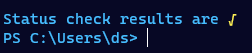

# Installing Linkerd on raspberry pi k3s cluster

## Extra credit and homework for the nerds in the front of the class

### Private container registry

Rather than putting the docker images I build myself on docker hub I would like to host them directly inside the cluster, that way there isn't a roundtrip up to the Internet all the time.

### You own CA with your proper let's encrypt cert

http is better with TLS, by installing cert-manager on kubernetes you can let it act as a CA.

Since I use a service mesh I will be using it for my ingress controller, the thing that makes it so that the network traffic reaches services inside the cluster.

``` powershell
helm install --namespace kube-system -n cert-manager stable/cert-manager
```
---
### Service meshes - Linkerd specifically

Service meshes act as another layer of abstraction on top of kubernetes and what it already provides in terms of infrastructure for our applications. A service mesh orchestrates the intra connection between services that make up an application. This way the application developer can describe **WHAT** a service needs but doesn't have to write native code in the each service on **HOW** it gets it.

There are a couple of popular choices for service meshes on top of kubernetes, most prominent are [Istio](https://istio.io/) and [Linkerd](https://linkerd.io/).

Istio to my knowledge does not run on ARM so to get a service mesh to work on our particular cluster we are goint to run with Linkerd.

``` powershell
#add Linkerd runtime to my machine
choco install Linkerd2 --y

#function to mimic linux reading from stdin in a pipeline
function kapow([Parameter(ValueFromPipeline = $true)][string]$param) {
  $tf=New-TemporaryFile;
  $param | out-file $tf;
  & kubectl apply --recursive -f $tf;
  rm $tf 
}
#once I have the software, install Linkerd runtime to the current cluster
linkerd install | out-string | kapow #This is equivalent of sh Linkerd install | kubectl apply --recursive -f -

#checks status of the installation
linkerd check --proxy -n Linkerd

#Add the Linkerd viz dashboard
linkerd viz install | out-string | kapow

```

Look at all those happy check marks / saxophone emoji



Linkerd will automatically enforce mTLS between meshed pods, but to get your pods meshed, you have to specify it on your deployment or your namespace.

By always creating a namespace for each instance of an application, I don't have to think much about it since I will just add the tag for proxy injection to my namespace.

Here is an example deployment into the mesh, some-deployment.yaml is a copy of the deployment I did in the last blogpost: [7 sept 2021 -  Exploring multi-stage build in docker to learn javascript in the future](./react-nginx-docker-multistage)

```powershell
k create namespace example
k annotate namespace example linkerd.io/inject="enabled"

ka "some-deployment.yaml" #a react app in nginx, see previous blog post.
k expose deployment myapp-deployment --name myservice

#check that app is running properly
Connect-KubeApplication -localport 10987 -clusterport 80 -protocol http -servicename myservice -namespace example 

#open the dashboard
linkerd viz dashboard #similar to my Connect-KubeApplication cmdlet
```

Look at that, blesh this mesh.


