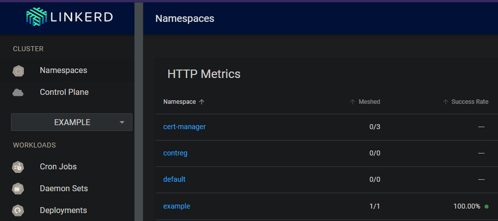

# Installing Linkerd 

In this post I will show how using windows 10 with chocolatey, we can download the Linkerd cli and use it to install Linkerd in a k3s kubernetes cluster on raspberry pi.

<!--more-->

This post is a continuation on a previous post that guides you through all of setting up such a cluster: [12 Sep - Quick guide to kubernetes on raspberry pi](./setting-up-two-raspberry-pi-and-installing-k3s).

- [Installing Linkerd](#installing-linkerd)
  - [Requirements](#requirements)
  - [Service meshes for kubernetes](#service-meshes-for-kubernetes)
  - [Linkerd, the lightweight service mesh](#linkerd-the-lightweight-service-mesh)
  - [Installing the cli on Windows 10](#installing-the-cli-on-windows-10)
  - [Example features of Linkerd](#example-features-of-linkerd)
    - [Mutual TLS](#mutual-tls)
    - [Debugging applications that consist of many services](#debugging-applications-that-consist-of-many-services)
    - [Drop the example namespace](#drop-the-example-namespace)
  - [DNS names for kubernetes](#dns-names-for-kubernetes)
  - [Conclusion](#conclusion)

## Requirements

A kubernetes cluster to play with, and the kubectl cli tools installed.

I use Windows 10, and chocolatey for installations. I use a list of kubectl aliases for invoking kubectl from PowerShell.

``` powershell 
### Some short hands for common kubectl commands
function k([Parameter(ValueFromRemainingArguments = $true)]$params) { & kubectl $params }
function kn([Parameter(ValueFromRemainingArguments = $true)]$params) { & kubectl config set-context --current --namespace=$params }
function ka([Parameter(ValueFromRemainingArguments = $true)]$params) { & kubectl apply --recursive -f $params }
### and many more!
``` 

## Service meshes for kubernetes

Service meshes act as another layer of abstraction on top of kubernetes and what it already provides in terms of infrastructure for our applications. A service mesh orchestrates the intra connection between services that make up an application. This way the application developer can describe **WHAT** a service needs but doesn't have to write native code in the each service on **HOW** it gets it.

There are a couple of popular choices for service meshes on top of kubernetes, most prominent are [Istio](https://istio.io/) and [Linkerd](https://linkerd.io/), the subject of this post.

## Linkerd, the lightweight service mesh

Istio to my knowledge does not run on ARM so to get a service mesh to work on our particular cluster we are going to run with Linkerd.

It being lightweight is perfect when starting to experiment with the tools that they provide.

## Installing the cli on Windows 10

``` powershell
#add Linkerd runtime to my machine
choco install Linkerd2 --y

#function to mimic linux reading from stdin in a pipeline
function kapow([Parameter(ValueFromPipeline = $true)][string]$param) {
  $tf=New-TemporaryFile;
  $param | out-file $tf;
  & kubectl apply --recursive -f $tf;
  rm $tf 
}
#once I have the software, install Linkerd runtime to the current cluster
linkerd install | out-string | kapow #This is equivalent of sh Linkerd install | kubectl apply --recursive -f -

#checks status of the installation
linkerd check --proxy -n Linkerd

#Add the Linkerd viz dashboard
linkerd viz install | out-string | kapow

```

Look at all those happy check marks / saxophone emojis


## Example features of Linkerd

The problems I wanted to tackle that got me interested in services meshes in the first place is intra service security and multi service application debugging.

### Mutual TLS

Linkerd will automatically enforce mTLS between meshed pods, but to get your pods meshed, you have to specify it on your deployment or your namespace.

By always creating a namespace for each instance of an application, I don't have to think much about it since I will just add the tag for proxy injection to my namespace.

Here is an example deployment into the mesh, some-deployment.yaml is a copy of the deployment I did in an older blogpost: [7 sept 2021 -  Exploring multi-stage build in docker to learn javascript in the future](./react-nginx-docker-multistage)

```powershell
k create namespace example
k annotate namespace example linkerd.io/inject="enabled"

kn example #set this namespace as the default to interact with to avoid deploying random jank into kube-system

ka "some-deployment.yaml" #a react app in nginx, see previous blog post.
k expose deployment myapp-deployment --name myservice

#check that app is running properly
Connect-KubeApplication -localport 10987 -clusterport 80 -protocol http -servicename myservice -namespace example 

#open the dashboard
linkerd viz dashboard #similar to my Connect-KubeApplication cmdlet
```

Look at that, blesh this mesh.




### Debugging applications that consist of many services

Let's build on top of the example namespace and add ingress instead of forwarding to our cluster-ip service.

k3s comes bundled with the traefik ingress controller, we can deploy ingress and annotate for Linkerd to mesh the ingress controller.

[Here is a guide and explanation of what is happening.](https://linkerd.io/2.10/tasks/using-ingress/#traefik-1-x)

Adding ingress to the service named myservice in the namespace example.

``` powershell

@"
# apiVersion: networking.k8s.io/v1beta1 # for k8s < v1.19
# I am running version 1.22.1 so this ought to do fine
apiVersion: networking.k8s.io/v1
kind: Ingress
metadata:
  name: myapp-ingress
  namespace: example
  annotations:
    ingress.kubernetes.io/custom-request-headers: l5d-dst-override:myservice.example.svc.cluster.local:80
spec:
  ingressClassName: traefik
  rules:
  - host: myservice.k3s.dsoderlund.consulting
    http:
      paths:
      - path: /
        pathType: Prefix
        backend:
          service:
            name: myservice
            port:
              number: 80
"@ | kapow

#If you have a custom DNS, or an actual domain, you would add the required configuration to route the traffic to the cluster.
#You can just add a static route in windows directly in the hosts file.
"192.168.0.78 myservice.k3s.dsoderlund.consulting" | out-file -append c:\

```

We can now surf to our web application with this name.


To actually get the ingress controller to be meshed we need to add it to the mesh like so:

``` powershell 
#k3s puts traefik in with helm into kube-system namespace. 
$tf=New-TemporaryFile;
k get deployment traefik -n kube-system --output yaml | linkerd inject --ingress - | Out-File $tf
ka $tf 
remove-file $tf;
```

My ingress controller (traefik) will be meshed too, allowing linkerd to control the behaviour of the ingress and to inject prometheus for logging.

As we can see here the intracluster network traffic gets logged and we can look start to use it to diagnose our applications.


### Drop the example namespace

To remove this deployment you can just drop that namespace.

``` powershell
k delete namespace example
```

## DNS names for kubernetes

In our ingress example I was using the domain k3s.dsoderlund.consulting

In our household we are using a pi-hole which I can use for DNS internally like so:


But to get the behaviour I typcally want I will add the entire subdomain directly in dnsmasq on the pi-hole:


If I were to expose the cluster to the Internet I would just configure global DNS through Google, where I buy my domain.

## Conclusion

Service meshes provide a wide variaty of features that help you homogenize your applications and simplify devops.

They are not a higher goal in their own right, don't treat them as a hammer in search for a nail.
