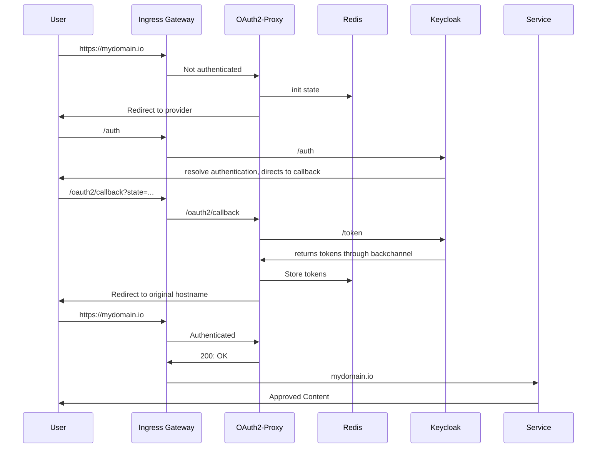
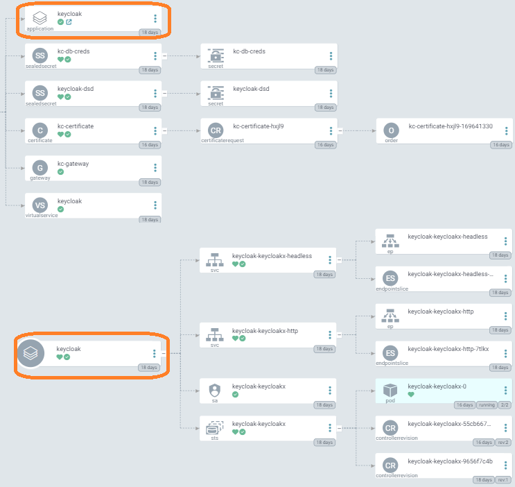
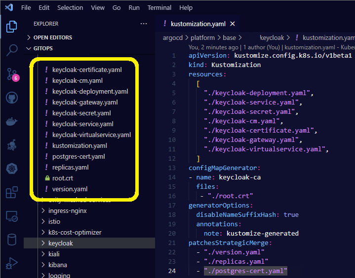
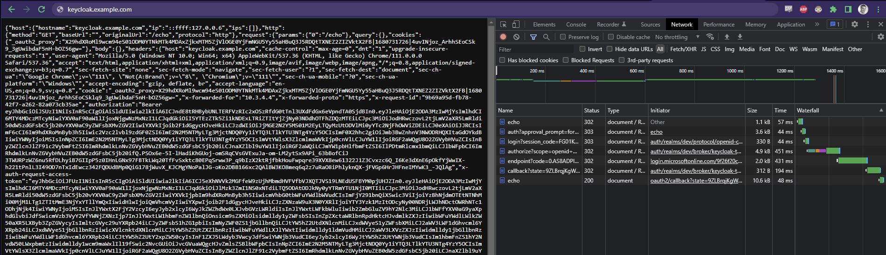

# Introduction

Having an API gateway and single sign on for every service deployed behind that gateway allows our developers to ignore developing their applications to be aware of issuers, token validation for authentication, et cetera and they can focus on checking the token claims for authorization.

## Prerequisites:

- A running Kubernetes cluster that you can control.

We choose to run on Azure, and have created our cluster using terraform.

We choose to store our platform resources in a git repo and have them being synced through ArgoCD. You can deploy the helm charts and or resources manually with kubectl.

## The API gateway we were looking to build had the following requirements:

- Handle authentication of any traffic from the outside
  - Demonstrate brokering identities from AAD
- Allow services to be plug and play in the mesh
  - Services should not need to implement authentication
  - Demonstrate custom role claims in tokens for services to use in business logic

## The technologies we chose to use:

- Keycloak to handle authentication and handing out tokens
- Oauth2-Proxy to validate and store tokens in redis.
- Istio to handle incoming requests and forward headers for validation

This is the general flow that we imagined for end users when sending requests to any service inside our mesh

## Terraform for AKS, ArgoCD for resources.

ArgoCD app of apps for our platform cluster deploys the following using third party helm charts or some simple custom manifests:

- External-DNS
- Istio
  - base
  - istiod
  - gateway
  - Oauth2-Proxy
- Certmanager
- AAD-pod-identity
- Keycloak
- kube prometheus stack
- Sealed secrets

## Postgres

We chose postgres for our keycloak database, we also use if for [Backstage](https://backstage.io/).

We run our postgres server on Azure.

One issue you might run into is that Azure signs the keys with sha1 for flexibles servers. So keycloak 21 and higher need you to mount the suitable ca.crt for it to trust it. (Works normally up until version 20 of keycloak and for other postgres offerings on Azure.)

## Keycloak setup

We used [this helm chart](https://github.com/codecentric/helm-charts/tree/master/charts/keycloakx) and created [sealed secrets](https://github.com/bitnami-labs/sealed-secrets) for a keycloak root account and the postgres credentials.

Here is what it looks like in argocd, the app of apps scheme makes it look a bit wonky but it works.

After our initial bout with keycloak we have set up another implementation of it using kustomize with great results. That instance is for experimenting with some other stuff and not used for our istio api gateway. Much simpler to work with though in my opinion than the helm installation

## Istio

We went ahead and installed istio with [its helm charts](https://istio.io/latest/docs/setup/install/helm/) through argocd. 

Some configuration highlights from what I remember

> 📝 This is a very summarized list, I implore you to scour the web for details on how to set everything

- Created an oidc client in keycloak for oauth2 proxy with a bunch of mappers and scope settings to fit our needs.

- istiod configuration extensionprovider envoyExtAuthzHttp set to point to oauth2 proxy.

- Added an AuthorizationPolicy of type CUSTOM for the oauth2 proxy extensionprovider to apply to everything but the /auth prefix (can't redirect requests that are being redirected to keycloak 😄)

- set oauth2_proxy.cfg to use keycloak as its issuer and a bunch of related keycloak urls and settings

- secrets for redis and keycloak client credentials and cookie encryption
  

## Single sign on 

Here is what the experience is like for a user.

I cleared out my cookies and refreshed the /echo service we have set up that just dumps the request back to the user.

Otherwise the client could not see what is going on (remember the user only gets the cookie from oauth2 proxy to store).

As you can see on the right in dev tools, when requesting "echo" service I get redirected to /auth (keycloak), then to /login (microsoft azure active directory which we federate to), then I get passed around in there by microsoft for a while, then back to /callback with the code that oauth2 proxy expects in return for a cookie that it has already prepared in redis. Lastly the upstream service /echo loads and I can see all of the info that every upstream service has available (while I the user have only a cookie).

## Summary

Benefits for developers of running apps in kubernetes is of course to be able to get logs and metrics in a unified way. With the addition of istio we can add to that richer traffic metrics, and traffic management abilities such as circuit breaking and retry logic. All which reduces the cognetitive load and meta-data handling bloat that takes away from focus on the business logic.

All in all this approach enables us to raise the bar of what a new application can do without a lot of boiler plate, and everyone's apps work the same way in these aspects since it is dealt with on the infrastructure level.

An API gateway with istio becomes one more thing in that effort. One more thing that we can take out of each application to otherwise deal with.

Essentially we can promise developers that "if traffic hits your app on any port: it has been encrypted and is always authenticated, just make sure it is authorized."