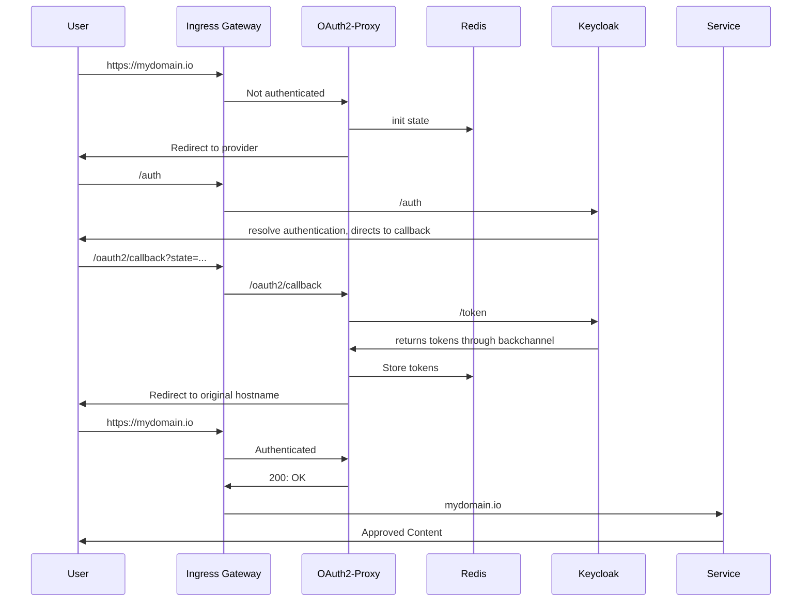

# Introduction

## Prerequisites:

A running Kubernetes cluster that you can control.

We choose to run on Azure, and have created our cluster using terraform.

We choose to store our platform resources in a git repo and have them being synced through ArgoCD. You can deploy the helm charts and or resources manually with kubectl.

## The API gateway we were looking to build had the following requirements:

- Handle authentication of any traffic from the outside
  - Demonstrate brokering identities from AAD
- Allow services to be plug and play in the mesh
  - Services should not need to implement authentication
  - Demonstrate custom role claims in tokens for services to use in business logic

## The technologies we chose to use:

- Keycloak to handle authentication and handing out tokens
- Oauth2-Proxy to validate and store tokens in redis.
- Istio to handle incoming requests and forward headers for validation

This is the general flow that we imagined for end users when sending requests to any service inside our mesh

## Terraform for AKS, ArgoCD for resources.

ArgoCD app of apps for our platform cluster deploys the following using third party helm charts or some simple custom manifests:

- External-DNS
- Istio
  - base
  - istiod
  - gateway
  - Oauth2-Proxy
- Certmanager
- AAD-pod-identity
- Keycloak
- kube prometheus stack
- Sealed secrets

## Keycloak setup

We used this helm chart and created sealed secrets for a root account and the postgres accounts