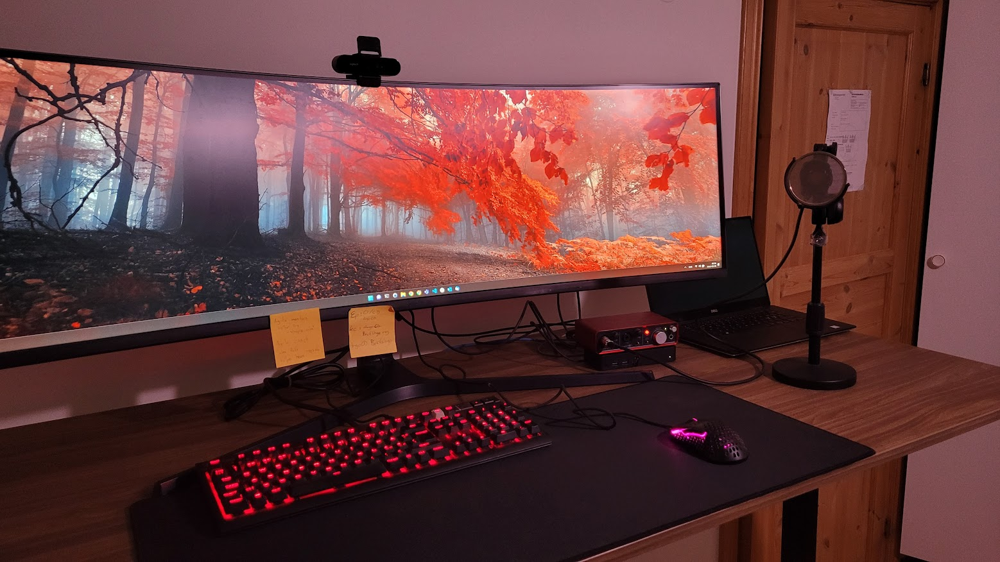
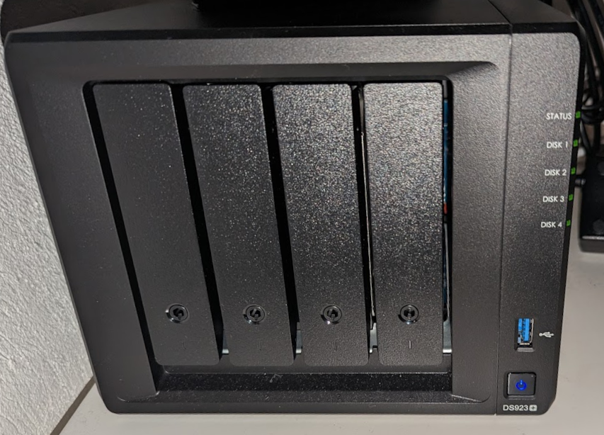
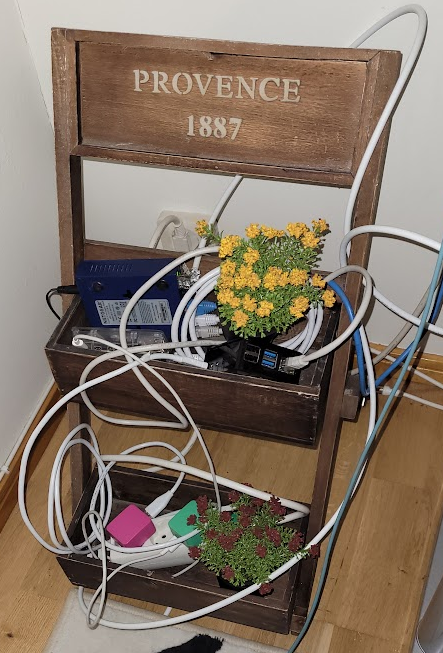
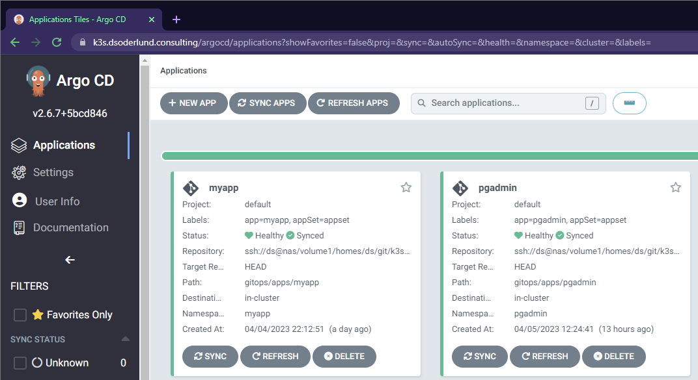

Hello there. Over the coming weeks I hope to share some of the fun stuff I have had with the setup I run at home.

I was thinking of picking up [painting like Bob Ross](https://www.twitch.tv/bobross), but I fell back on Kubernetes instead and it gives me comparable joy.

First of I got a new standing desk that will help me with my problems with back-ache, pretty cool.

I also bought this Synology NAS on which I added the ability to store my local git repos and can serve permanent storage for my cluster since I have no USB-SSD to run longhorn with effectively.

I have spun up my old k3s cluster which I have dubbed [Kirchsteigernetes](https://fransverige.se/wp-content/uploads/2021/01/Ernst1_tulpan_blomsterframjandet_inla%CC%88gg_1260x860-768x524.jpg). I have been trying out ArgoCD in there and it is a blast so far!

After the first apps popped up with my appset, I continued to get inspired. Here is some of what I expect to publish this year on the blog:

- Cert-manager using Let's Encrypt for Google Cloud DNS
- ArgoCD on a local private git repo with ssh.
- Persisted volume claims for NFS
- Running a docker registry on Kubernetes
- Keycloak on Kubernetes with NFS storage (durability be damned)
- Traefik forward auth middleware to keycloak
- Bridge to Kubernetes and telepresence

Looking forward to having a lot of more stuff here to demo.

