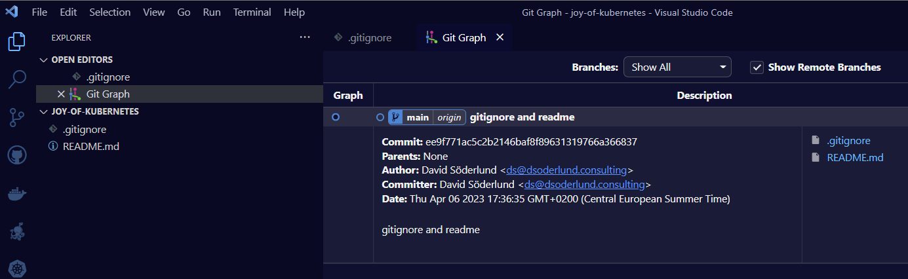

# Argo CD - gitops from a private git repo

In this first entry in The Joy of Kubernetes we will explore setting up Argo CD and deploying applications through gitops. That is our desired state of our applications are recoreded and versioned controlled in git, while an agent called Argo CD makes sure that state is synchronized into Kubernetes objects in one or more clusters.

- [Argo CD - gitops from a private git repo](#argo-cd---gitops-from-a-private-git-repo)
  - [Prerequisites 🎨](#prerequisites-)
  - [My git server setup](#my-git-server-setup)
  - [Using a private git repo in development](#using-a-private-git-repo-in-development)
  - [Installing ArgoCD](#installing-argocd)
  - [Connecting to git from ArgoCD](#connecting-to-git-from-argocd)
    - [Enable auth with new key](#enable-auth-with-new-key)
    - [Trust the server from Argo CD](#trust-the-server-from-argo-cd)
    - [Add the git repo in ArgoCD](#add-the-git-repo-in-argocd)
  - [Application Sets](#application-sets)
    - [The application set for The Joy Of Kubernetes Series](#the-application-set-for-the-joy-of-kubernetes-series)
    - [Hello World through our Application Set](#hello-world-through-our-application-set)
  - [Summary](#summary)
  - [Join us next time 📺](#join-us-next-time-)


## Prerequisites 🎨

- ~~A canvas, some brushes, and some paint~~  A kubernetes cluster and kubectl.
- A private git repo
- ssh and ssh-keygen

Rather than using kubectl for everything you could perhaps be more comfortable using a graphical interface like [the kubernetes dashboard](https://kubernetes.io/docs/tasks/access-application-cluster/web-ui-dashboard/), [lens](https://k8slens.dev/) or [k9s](https://k9scli.io/) or whatever you prefer. Check them all out and pick what feels good for you. Personally I use k9s.


## My git server setup

So I got this Network Storage server recently and during set up I saw that it came with some cool applications like a git server.


After installation all I really needed to configure was which users in the system could use it. I went ahead and set up ssh to nas and added my public ssh key to authorized_keys of my user in there.


## Using a private git repo in development

Once the server was set up I could initialize new repos and set up local repos to use them as remotes. I wrote a little powershell script that I added to my profile. In the future this will simplify things for me if I choose to add more repos.

``` powershell
Function Init-NasGitRepo {
	Param([Parameter(Mandatory)][string]$repoName) 
	ssh ds@nas.local "cd ~/git && mkdir $repoName.git && cd $repoName.git && git init -b main --bare"
	git init -b main
	git remote add origin "ssh://ds@nas.local/~/git/$repoName.git"
	git pull --set-upstream origin main
}
```

I went ahead and initilized the git repo we will use in the Joy of Kubernetes series. I implore you to create your own. I might push some or all of the code to the blog repo though if you get stuck.


As you can see I have successfully connected the git repo on NAS as my remote with the name "origin", let's get started with an initial commit with README.md and .gitignore.



## Installing ArgoCD

Allright now we have all the pieces to interact with git.

Let's go ahead and install Argo CD on our designated cluster to get started. I will put the code for myself in the git repo but I will execute it manually.

``` powershell
kubectl create namespace argocd;
kubectl apply -n argocd -f https://raw.githubusercontent.com/argoproj/argo-cd/stable/manifests/install.yaml;
```

Let's wait for it to deploy, you can use this command to check the status of the pods for example.

```
kubectl get pods -n argocd
```

```
| NAME                                                READY   STATUS    RESTARTS      AGE
| argocd-redis-8f7689686-w5p7l                        1/1     Running   0             15s
| argocd-server-5685b99d68-nhzc4                      1/1     Running   0             18s
| argocd-notifications-controller-56578cd466-gzvsm    1/1     Running   0             22s
| argocd-applicationset-controller-676749c97d-4mthh   1/1     Running   0             15s
| argocd-dex-server-68fdffbdb6-tcb4z                  1/1     Running   0             15s
| argocd-repo-server-658b549674-f4twp                 1/1     Running   0             17s
| argocd-application-controller-0                     1/1     Running   0             14s
```

I can see that it has deployed and I will create a port-forward to Argo CD-server to logon.

``` powershell
kubectl port-forward service/argocd-server 8080:80 -n argocd
```

```
| Forwarding from 127.0.0.1:8080 -> 8080
| Forwarding from [::1]:8080 -> 8080
| Handling connection for 8080
| ...
```


The default admin password can be extracted from a secret like so.

``` powershell
kubectl get secret -n argocd argocd-initial-admin-secret --output json | convertfrom-json | select -expandproperty data | select -expandproperty password
```


Like all opaque secrets it is base 64 encoded so you can get the password by decoding the output. base64 -d in WSL can do it. [I use this plugin to vscode](https://marketplace.visualstudio.com/items?itemName=ipedrazas.kubernetes-snippets) which has built in keyboard shortcuts to encode/decode base64.

After logging on I changed it to a new password that I liked better, (in the future this will be single sign on through keycloak or google).


Once the password was changed I went ahead and dropped the initial password secret from the cluster.

```
kubectl delete secret -n argocd argocd-initial-admin-secret
```

## Connecting to git from ArgoCD

Okay so Argo CD is running and we can push to a private git repo, let's close the loop and let Argo CD interact with that same repo.

We will start by getting the URL to git to give to Argo CD

```
git remote get-url origin
```
```
| ssh://ds@nas.local/~/git/joy-of-kubernetes.git
```
It is important that you resolve the full URL, there cannot be the ~ symbolic home link in the URL.
For me this translates to this address. I can't use the .local domain since kubernetes runs its own network. The DNS I run on the office network however will translate the name properly. You should perhaps take action in your router or pi-hole.
```
| ssh://ds@nas/volume1/homes/ds/git/joy-of-kubernetes.git
```

Instead of signing in with my normal ssh public key I will generate a new keypair. This helps me protect my key while still allowing Argo CD to impersonate me for this particular git server. The private key should not go into git, so let's add that to our gitignore also.
```
ssh-keygen -t ed25519 -C "argocd" -f argocdkey -O argocd_ed25519
"`r`nargocdkey" | Out-File .\.gitignore -Append
```
Here is a picture of what it might look like when the new key files have been generated and the private key has been ignored in the repo.


### Enable auth with new key

Firstly we need to tell our git server about our new key.

Add the public key to .ssh/authorized_keys for your user in your server.

In my case I just repeated [the steps in the intro](#my-git-server-setup)

### Trust the server from Argo CD

Secondly we need to tell ArgoCD about the git server, using the ssh known hosts built in functionality.

In the ArgoCD web page that we port-forward to, click "settings" and then "Add ssh known hosts" and then follow the instructions.


> If you have set up a private git repo you have probably already accepted the host certificate. You can read them from your local known hosts file. It is usually in this place: ```~\.ssh\known_hosts```

I added all records I could find of the server and after submitting it looks something like this.


### Add the git repo in ArgoCD

Lastly, once the known hosts record is in place and the git server can accept the ssh key, we can set up the repo connection in ArgoCD

Move back to settings and then click "Connect repo"

Enter a name, default project, the correct full URL to the repo on the server and the private SSH key from the key file we created before.


Click Connect, hopefully everything will be green. Else check the logs for troubleshooting.

``` powershell
kubectl logs deployment/argocd-repo-server -n argocd
``` 
Green is good.


## Application Sets

ApplicationSets are a great way to combine application defintions with generators to produce multiple deployments.

For example

- Each of these apps need to exist in each of these clusters
- Every app in this directory should use meta data from its location as labels

You can read more about application sets in the [Argo CD documentation and user guides](https://argo-cd.readthedocs.io/en/stable/user-guide/application-set/).

### The application set for The Joy Of Kubernetes Series

We can create a folder that will containt the defintions of the applications I want Argo CD to monitor and deploy automatically. We will call it simply "gitops"

Let us create the applicationset that will translate subdirectories to the gitops directory in our repo to individual applications. We will continue using this application set to deploy all the wonderful applications we will create in future installments of this series.

Here is a script that will create the directory, put in the application set defintion, and apply it to your cluster.

``` powershell
# MAKE SURE THIS MATCHES WHAT YOU ADDED TO ARGO CD
$repoUrl = 'ssh://ds@nas/volume1/homes/ds/git/joy-of-kubernetes.git'
# Create the directory
mkdir gitops;
# Write a file with the application set defitinion
<!--  -->
@"
apiVersion: argoproj.io/v1alpha1
kind: ApplicationSet
metadata:
  name: root-appset
  namespace: argocd
spec:
  generators:
  - git:
      repoURL: $repoUrl
      revision: HEAD
      directories:
        - path: gitops/*

  template:
    metadata:
      name: '{{path.basename}}'
      labels:
        app: "{{path.basename}}"
        appSet: "root-appset"
    spec:
      project: default
      source:
        repoURL: $repoUrl
        targetRevision: HEAD
        path: '{{path}}'
      destination:
        server: https://kubernetes.default.svc
        namespace: "{{path.basename}}"
      syncPolicy:
        automated:
          selfHeal: false
        syncOptions:
        - CreateNamespace=true
        - ApplyOutOfSyncOnly=true

"@ | Out-File ./gitops/root-appset.yaml;
<!--  -->
# Fire that into your cluster
kubectl apply -f ./gitops/root-appset.yaml;
```

This defintion we created will put each app in its own namespace which will be automatically created. Furthermore they will be labled with app and appSet.


Argo CD can automatically sync apps for you if you turn that on and it can even prune and heal if the state in kubernetes drifts from the expressed desired state in git. In our example I've turned self-heal off but you can add it if you like. [Full guide on Argo CD sync in their documentation](https://argo-cd.readthedocs.io/en/stable/user-guide/auto_sync/).

Going back to the applications page, it looks pretty empty. It is time to put some paint on the canvas.


### Hello World through our Application Set

Get in touch with your imagination and let's get typing. We will deploy an nginx hello world application as "joy-of-kubernetes-1".

``` powershell

# Adding manifest files. ArgoCD will figure out that they are plain manifests, had we put a kustomize structure or helm that would work too

mkdir ./gitops/joy-of-kubernetes-1;

# Deployment
@"
apiVersion: apps/v1
kind: Deployment
metadata:
  name: joy-of-kubernetes-1
spec:
  selector:
    matchLabels:
      app: joy-of-kubernetes-1
  template:
    metadata:
      labels:
        app: joy-of-kubernetes-1
    spec:
      containers:
      - name: joy-of-kubernetes-1
        image: nginxdemos/hello
        resources:
          limits:
            memory: "128Mi"
            cpu: "500m"
        ports:
        - containerPort: 80
"@ | out-file .\gitops\joy-of-kubernetes-1\deployment.yaml;

# Service
@"
kind: Service
apiVersion: v1
metadata:
  name: joy-of-kubernetes-1-svc
spec:
  selector:
    app: joy-of-kubernetes-1
  type: ClusterIP
  ports:
    - name: http
      port: 80
      targetPort: 80

"@ | out-file .\gitops\joy-of-kubernetes-1\service.yaml;

## Add files to git locally

git add .

git commit -m "Added the first joy of kubernetes hello world nginx app"

```

Now our history will look something like this. For my sake I went ahead and added an ingress route for traefik, the ingress controller that comes bundled with k3s. If you are new to ingress or are using something else you can safely ignore it. You add what ever you like for your application. It is your world, get creative. 🏔🌄⛰🏔🗻🌲🌲


Now once this commit is pushed to origin we will start to see things happening in the ArgoCD UI.

```
# update origin so that Argo CD can see the changes
git push
```

There it is, the application overview is automatically  updated. We can click on it to get details.


Look at that happy little app.


Let's give it a visit with port forwarding like we have done for ArgoCD.

``` powershell
kubectl port-forward deployment/joy-of-kubernetes-1 8081:80 -n joy-of-kubernetes-1
```


As I in my deployment also specified an ingress route for traefik and have certificates set up, I can just jump in without port forwarding.


## Summary 

In this post we've looked at how we can connect to private git repos with ssh. We've leveraged this to get a gitops workflow in place with Argo CD and deployed a hello world application. All while passing the Bob Ross vibe check. This is the Joy of Kubernetes.

## Join us next time 📺

To learn about automatic certificate generation with cert-manager in kubernetes using the Let's Encrypt Issuer, look out for the next entry in this series.


