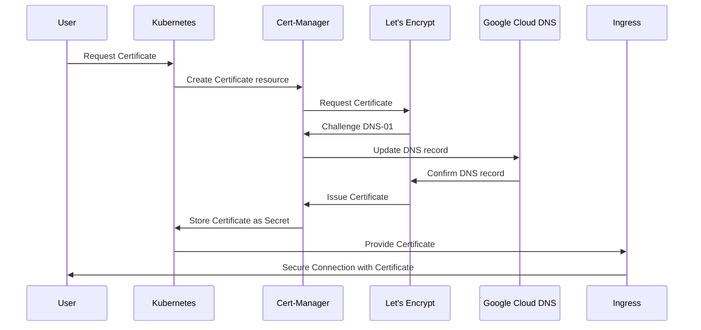
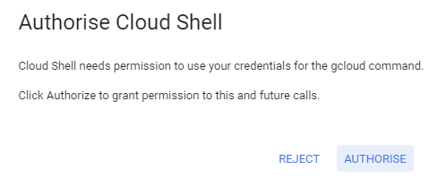
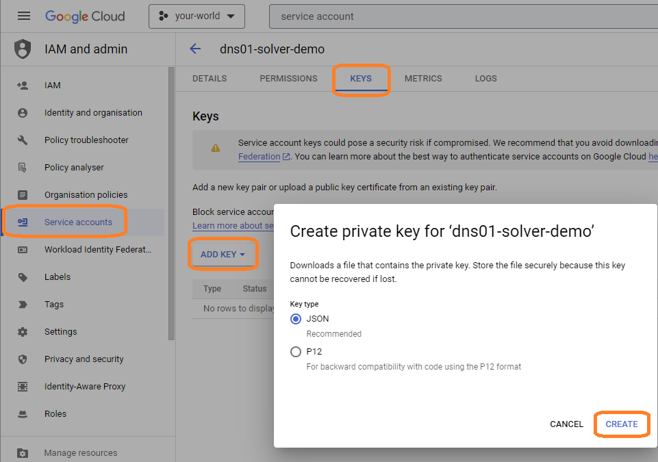
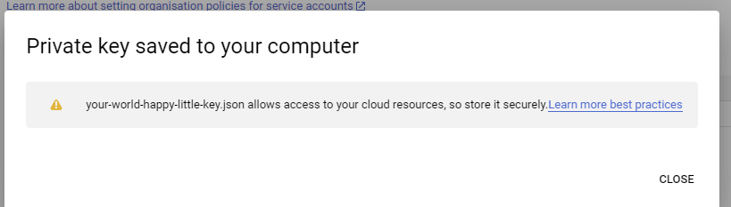
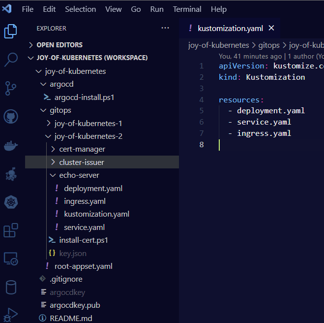
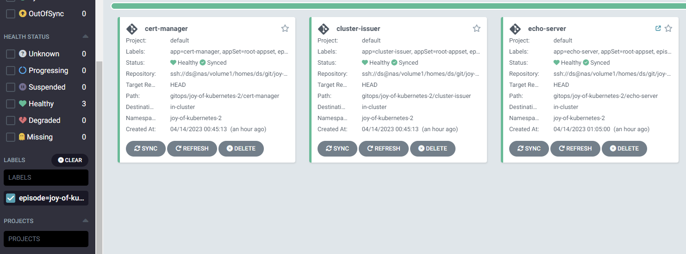
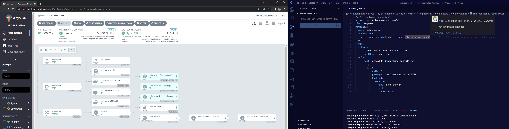
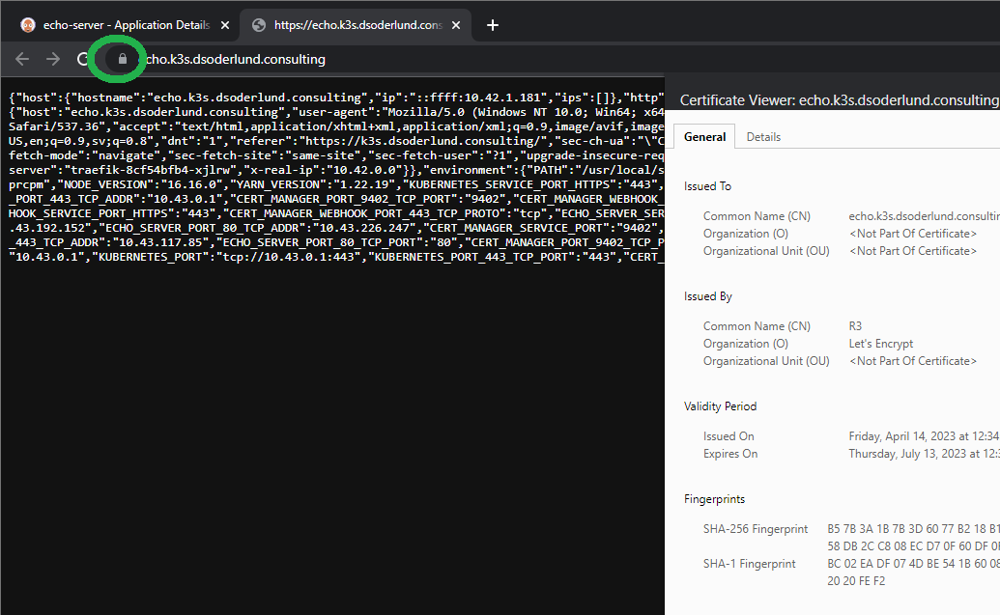
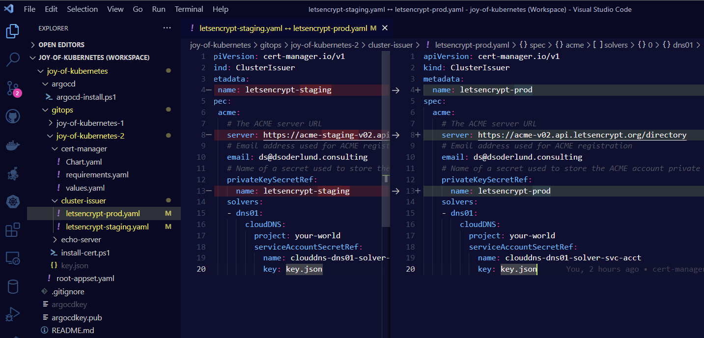

# Welcome to the Joy of Kubernetes

If you are new to the series, check out [the previous post](../the-joy-of-kubernetes-1-argocd-with-private-git-repo) about Argo CD if you like, we will leverage Argo CD a bit to deploy what we are doing today. You can just as well replace Argo CD with applying the manifests or helm charts manually.

In this second entry in The Joy of Kubernetes we will take a closer look at the Cert-Manager and it's ClusterIssuer resource. I am interested in requesting and issuing TLS certificates as secrets in kubernetes by just asking nicely, particulary for a real external DNS.

- [Welcome to the Joy of Kubernetes](#welcome-to-the-joy-of-kubernetes)
  - [Prerequisites 🎨](#prerequisites-)
  - [Overview](#overview)
  - [A Little About Cert-Manager](#a-little-about-cert-manager)
  - [ClusterIssuers: Crafting Your Certificates](#clusterissuers-crafting-your-certificates)
  - [Let's Encrypt: Bringing Your Certificates to Life](#lets-encrypt-bringing-your-certificates-to-life)
  - [Google Cloud DNS: The Beautiful Backdrop](#google-cloud-dns-the-beautiful-backdrop)
  - [Automatic certificate creation example](#automatic-certificate-creation-example)
  - [A Peaceful Summary: The Joy of Kubernetes with Cert-Manager](#a-peaceful-summary-the-joy-of-kubernetes-with-cert-manager)
  - [Appendecies](#appendecies)
    - [A - Staging issuers](#a---staging-issuers)
    - [B - Appset changes](#b---appset-changes)
    - [C - cert-manager and cluster-issuer application specs](#c---cert-manager-and-cluster-issuer-application-specs)

## Prerequisites 🎨

- ~~A canvas, some brushes, and some paint~~  A kubernetes cluster and kubectl.
- Optional, Argo CD with the application set creation from [the previous post](../the-joy-of-kubernetes-1-argocd-with-private-git-repo).
- A domain that you control
- A [supported DNS provider](https://cert-manager.io/docs/configuration/acme/dns01/#supported-dns01-providers)

## Overview

So glad you could join us for this post about Cert-Manager and Let's Encrypt.

The basic concept is that by interacting with the API of one of the [supported DNS provider](https://cert-manager.io/docs/configuration/acme/dns01/#supported-dns01-providers), we can get some resource in our cluster to react to the fact that TLS certificates appear to be being required, and issue them by posing an ACME challenge to Let's Encrypt.

That resource is [Cert-Manager](https://cert-manager.io/docs/).

I've gone ahead and prepared a rough sketch for us to follow along to what a flow can look like when adding TLS to an ingress.



There are a lot of different ways to give the Cert-Manager ceritificate requests beyond the native resource defintion. There are also a lot of things for which you might want to request certificates beyond proving the authenticity of your service to incoming requests and encrypting with TLS.

Read up on the cert-manager documentation for what else you can use it for that fits your needs.

## A Little About Cert-Manager

Let's start by discussing our main tool: the cert-manager. Picture it as your paintbrush for managing certificates within your Kubernetes clusters. It automates the creation, renewal, and management of TLS certificates, ensuring your applications are secure, just like the snug embrace of a warm, cozy cabin.

To install cert-manager, we'll need to apply a few custom resources to our cluster. It's as simple as mixing your favorite colors on your palette:

``` bash
kubectl apply -f https://github.com/jetstack/cert-manager/releases/download/v1.11.0/cert-manager.yaml
```

If painting with helm is your sort of thing, you might want to try this: 
``` bash
helm repo add jetstack https://charts.jetstack.io
helm repo update
helm install cert-manager jetstack/cert-manager --namespace cert-manager --create-namespace --version v1.11.0 
```

Now, let's give it a few moments to get ready, just like letting your paint dry (but not as slow or boring):

``` bash
kubectl -n cert-manager rollout status deploy/cert-manager-webhook
```
Once everything is up and running, we'll have our cert-manager installed and ready to paint our beautiful certificate landscape.

I went ahead and added the helm chart for cert-manager into joy-of-kubernetes-2, and deployed it via Argo CD. The status is more vibrant in the GUI than the pale and grim text output of kubectl.

## ClusterIssuers: Crafting Your Certificates
Now that we have our cert-manager, let's create a ClusterIssuer. It's like a delicate tree branch on which our certificates will blossom. With ClusterIssuer, we define where and how our certificates will be issued.

Here's a lovely example to create a Let's Encrypt ClusterIssuer:

``` yaml
apiVersion: cert-manager.io/v1
kind: ClusterIssuer
metadata:
  name: letsencrypt-prod
spec:
  acme:
    email: email@example.com
    server: https://acme-v02.api.letsencrypt.org/directory
    privateKeySecretRef:
      name: letsencrypt-prod
    solvers:
    - dns01:
        google:
          project: my-project-id
          serviceAccountSecretRef:
            name: clouddns-dns01-solver-svc-acct
            key: key.json
``` 
This ClusterIssuer configures cert-manager to issue certificates from Let's Encrypt. Remember to replace email@example.com with your email and my-project-id with your Google Cloud project ID. Save this as letsencrypt-prod.yaml and apply it like a gentle brushstroke:

``` bash
kubectl apply -f letsencrypt-prod.yaml
```

We can now see that things are not really popping out of the canvas just yet, we need to add some high lights in the form of granting our cluster issuer access to manage our DNS records.

## Let's Encrypt: Bringing Your Certificates to Life
Think of Let's Encrypt as the vibrant colors that bring life to your canvas. It's a free and open Certificate Authority (CA) that offers a simple way to obtain and renew TLS certificates, ensuring your applications stay secure and bright.

By using Let's Encrypt with cert-manager, we can automate the issuance and renewal of certificates, making your Kubernetes journey a pleasant and stress-free experience.

## Google Cloud DNS: The Beautiful Backdrop
Now, let's create a picturesque backdrop with *Google Cloud DNS*. This service allows you to manage DNS records with ease, setting the stage for our certificate landscape.

To use Google Cloud DNS with cert-manager, create a service account with the required permissions and generate a key:

For google cloud dns particularly I created a role I called `dns.cert_manager` which I made grant the following permissions.

- dns.resourceRecordSets.*
- dns.changes.*
- dns.managedZones.list

I could then provision my service account and add this role as so:

``` bash
PROJECT_ID="The project id of your world"
gcloud config set project $PROJECT_ID
gcloud iam service-accounts create dns01-solver --display-name "dns01-solver"
gcloud projects add-iam-policy-binding $PROJECT_ID \
   --member serviceAccount:dns01-solver@$PROJECT_ID.iam.gserviceaccount.com \
   --role projects/$PROJECT_ID/roles/dns.cert_manager
```

When using the cloud shell on google cloud, you sometimes need to authorize the use of your login credentials to perform actions.



Once the account is created you need to export the key to be able to close the loop and grant cert-manager's issuers and clusterissuers the service account credentials via secrets in kubernetes.

1. Click Service accounts for your world
2. Click the service account name that you just created and navigate to KEYS
3. Click ADD KEY
4. Select Key type JSON and click CREATE



A file with the key will be automatically downloaded in your browser. This is the content of the secret you need to connect to your cluster issuer. Read about key security and best practices with the link google gives you to make sure that you protect your happy cloud going forward.




I highly recommend that you deploy these secrets ad hoc or with a solution like hashicorp vault or a cloud provided secret manager rather than trying to do it via gitops. If you are set on gitops you can use *Sealed Secrets* to encrypt the file before adding it to your git repo. Look forward to sealec secrets in a future episode.

Rename the downloaded file so that it matches what the cluster issuer is looking for, then install it inside the same namespace as you put cert-manager. In my case it is joy-of-kubernetes-2

``` bash
kubectl create secret generic clouddns-dns01-solver-svc-acct --from-file gitops/joy-of-kubernetes-2/key.json --namespace joy-of-kubernetes-2
```

## Automatic certificate creation example

Let's say you wanted to create a happy little application like so:

A deployment for three pods of the echo-server, a simple app that dumps back the entire request back to the client.

``` yaml
apiVersion: apps/v1
kind: Deployment
metadata:
  name: echo-server
spec:
  replicas: 3
  selector:
    matchLabels:
      app: echo-server
  template:
    metadata:
      labels:
        app: echo-server
    spec:
      containers:
        - name: echo-server
          image: ealen/echo-server
          ports:
            - containerPort: 80
              name: http

```
A cluster ip service for service discovery of the pods in the cluster
``` yaml
apiVersion: v1
kind: Service
metadata:
  name: echo-server
spec:
  selector:
    app: echo-server
  ports:
    - name: http
      port: 80
      targetPort: http

```
An ingress to allow traffic from outside the cluster reach the cluster ip service
``` yaml
apiVersion: networking.k8s.io/v1
kind: Ingress
metadata:
  name: echo-server
spec:
  tls:
  - hosts:
      - echo.k3s.dsoderlund.consulting
    secretName: echo-tls
  rules:
    - host: echo.k3s.dsoderlund.consulting
      http:
        paths:
          - path: /
            pathType: ImplementationSpecific
            backend:
              service:
                name: echo-server
                port:
                  number: 80
```

Bringing it all home with kustomization.yaml

``` yaml
apiVersion: kustomize.config.k8s.io/v1beta1
kind: Kustomization

resources:
  - deployment.yaml
  - service.yaml
  - ingress.yaml

```

By adding this to our episodes folder in gitops Argo CD can deploy the app automatically on the next sync and we can test it out.



You can notice that I also added the helm chart for cert-manager and the cluster-issuer to my gitops structure. With a few modifications to the application set we created in the last episode we can label the apps by episode. Now I am showing only the apps from episode 2. The updated appset defintion is in [the appendix](#b---appset-changes) after the summary.



The thing that would really make the echo-server we painted shine is a real proper certificate, it can be achived by the simple technique of annotating your ingress with the issuer or cluster-issuer to use.

Notice how when I commited this annotation for the ingress

``` yaml
metadata:
  annotations:
    cert-manager.io/cluster-issuer: "letsencrypt-prod"
```

Argo CD will automatically draw for me the most wonderful chain of resource creation that happened in the cluster, just like that.



You can click the link on the ingress in Argo CD and be brought to the URL, notice the TLS certificate in a thalo green. Just beautiful.



## A Peaceful Summary: The Joy of Kubernetes with Cert-Manager

In today's delightful journey, we explored the soothing world of Kubernetes certificate management. We began by introducing the cert-manager, our trusty paintbrush, which automates the creation, renewal, and management of TLS certificates. We then looked at ClusterIssuers, the delicate branches upon which our certificates will flourish, allowing us to define where and how our certificates are issued.

We also discussed Let's Encrypt, the vibrant colors bringing life to our masterpiece, offering free and open Certificate Authority services to keep our applications secure. Finally, we set the stage with the picturesque backdrop of Google Cloud DNS, managing our DNS records effortlessly as shown in the Ingress example.

Together, these components harmoniously create a serene and efficient certificate management experience, reminiscent of the calming charm of Bob Ross's "The Joy of Painting". Happy cert-managing, and remember: we don't make mistakes, just happy little accidents!

## Appendecies

### A - Staging issuers

The staging issuer allows for a higher rate of certificate creation from Let's Encrypt, but they aren't trusted. It is very useful for experimenting with certificate creation without exhauting the generous limitation that Let's Encrypt grants us.

The only difference between the two defintions is that I changed out the spec.acme.server to `server: https://acme-staging-v02.api.letsencrypt.org/directory`. Pretty sneaky huh?




### B - Appset changes

I change the appset defintion like so to reflect that I want to use the episode folder as namespace, but there might be more than one app:

``` yaml

apiVersion: argoproj.io/v1alpha1
kind: ApplicationSet
metadata:
  name: root-appset
  namespace: argocd
spec:
  generators:
  - git:
      repoURL: ssh://ds@nas/volume1/homes/ds/git/joy-of-kubernetes.git
      revision: HEAD
      directories:
        - path: gitops/joy-of-kubernetes-1
        - path: gitops/joy-of-kubernetes-2/*

  template:
    metadata:
      name: '{{path.basename}}'
      labels:
        app: "{{path.basename}}"
        appSet: "root-appset"
        episode: "{{path[1]}}"
    spec:
      project: default
      source:
        repoURL: ssh://ds@nas/volume1/homes/ds/git/joy-of-kubernetes.git
        targetRevision: HEAD
        path: '{{path}}'
      destination:
        server: https://kubernetes.default.svc
        namespace: '{{path[1]}}'
      syncPolicy:
        automated:
          selfHeal: false
        syncOptions:
        - CreateNamespace=true
        - ApplyOutOfSyncOnly=true

```

### C - cert-manager and cluster-issuer application specs

As eluded to in the post, I added cert-manager and cluster-issuer to gitops instead of just deploying them as the short and simple examples I gave.

If you are painting along at home for the long run, you can finish your masterpiece with these defintions in gitops/joy-of-kubernetes-2.

`gitops\joy-of-kubernetes-2\cert-manager\Chart.yaml`

``` yaml
apiVersion: v2
name: cert-manager
type: application
version: 0.1.0
appVersion: "1.0"
```
`gitops\joy-of-kubernetes-2\cert-manager\requirements.yaml`

``` yaml
dependencies:
- name: cert-manager
  version: v1.10.1
  repository: https://charts.jetstack.io
```
`gitops\joy-of-kubernetes-2\cert-manager\values.yaml`

``` yaml
cert-manager:
  installCRDs: true
```

`gitops\joy-of-kubernetes-2\cluster-issuer\letsencrypt-prod.yaml`

``` yaml
apiVersion: cert-manager.io/v1
kind: ClusterIssuer
metadata:
  name: letsencrypt-prod
spec:
  acme:
    email: email@example.com
    server: https://acme-v02.api.letsencrypt.org/directory
    privateKeySecretRef:
      name: letsencrypt-prod
    solvers:
    - dns01:
        google:
          project: my-project-id
          serviceAccountSecretRef:
            name: clouddns-dns01-solver-svc-acct
            key: key.json
```
`gitops\joy-of-kubernetes-2\cluster-issuer\letsencrypt-staging.yaml`

``` yaml
apiVersion: cert-manager.io/v1
kind: ClusterIssuer
metadata:
  name: letsencrypt-staging
spec:
  acme:
    email: email@example.com
    server: https://acme-staging-v02.api.letsencrypt.org/directory
    privateKeySecretRef:
      name: letsencrypt-staging
    solvers:
    - dns01:
        google:
          project: my-project-id
          serviceAccountSecretRef:
            name: clouddns-dns01-solver-svc-acct
            key: key.json
```