# Welcome to the Joy of Kubernetes.

Hi everyone, so glad you could join us today and enjoy deploying some useful tools.

If you are painting along at home, this one might be an episode where you need to take some brave creative efforts.

The goal is to set up a private container registry on our kubernetes cluster using external storage.

<!--more-->

- [Welcome to the Joy of Kubernetes.](#welcome-to-the-joy-of-kubernetes)
  - [Prerequisites 🎨](#prerequisites-)
    - [Argo CD](#argo-cd)
  - [Setting the scene, what our landscape will be](#setting-the-scene-what-our-landscape-will-be)
  - [Storage Classes: The colors on todays palette](#storage-classes-the-colors-on-todays-palette)
    - [NFS is not secure](#nfs-is-not-secure)
  - [Creation of the storage class](#creation-of-the-storage-class)
    - [Without Argo CD](#without-argo-cd)
  - [Persistent Volume Claims: Choosing the Perfect Canvas](#persistent-volume-claims-choosing-the-perfect-canvas)
  - [A private Docker Registry with helm: Bringing our masterpiece together](#a-private-docker-registry-with-helm-bringing-our-masterpiece-together)
  - [TLS and Ingress: Finishing touches](#tls-and-ingress-finishing-touches)
  - [Summary](#summary)
  - [Further things you can try](#further-things-you-can-try)
  - [Thank you for joining](#thank-you-for-joining)

## Prerequisites 🎨

- ~~A canvas, some brushes, and some paint~~  A kubernetes cluster and kubectl.
- Optional, Argo CD with the application set creation from [the first post in the series](./the-joy-of-kubernetes-1-argocd-with-private-git-repo).
- The ability to set up NFS storage, or some other storage class

### Argo CD

This is the structure that we will create today in our Argo CD gitops structure to get the required results splattered onto our canvas.

``` powershell
mkdir gitops/joy-of-kubernetes-3
mkdir gitops/joy-of-kubernetes-3/nfs
mkdir gitops/joy-of-kubernetes-3/docker-registry
mkdir gitops/joy-of-kubernetes-3/docker-registry-helm
```

I went ahead and simplified the directories generator of our appset gitops/root-appset.yaml and applied that. This is hopefully the last time we will need to make changes to it in a while. Remember that we don't make mistakes, we just have happy little accidents. 😀

Instead of individual folders, each episode will have the same structure under gitops with one folder for each application neatly under its episode number.

The first app we made is renamed "hello" and put under episode 1.

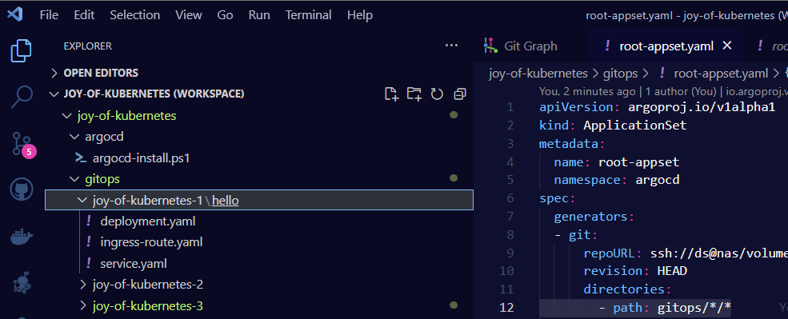

This allows all apps to have names that make sense, but we can still search and filter by episodes.

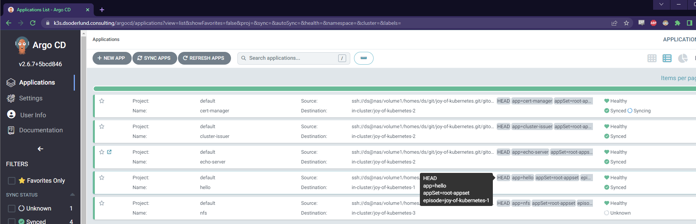

## Setting the scene, what our landscape will be

The goal as we talked about is to have a private docker registry in kubernetes. This can be used to host images that we might want faster access to than loading from docker hub. Or simply images that we build ourselves but don't want to share with docker hub.

Once the installation is complete, we will take a look at connecting docker to our new registry with docker login. So we will need to generate ourselves a password in the [bcrypt format](https://en.wikipedia.org/wiki/Bcrypt).

Using the same registry container image that our installation in kubernetes will use, we can generate a bcrypt password with the htpasswd executable. I think this has been removed in later versions of the registry though. There are of course a million differnet ways you can generate this hash, but this one is elegant on top of docker and I like it. Let us know if you come up with a way that you would like to share!

``` bash
docker run --entrypoint htpasswd registry:2.7.0 -Bbn youruser yourplaintextpassword
```

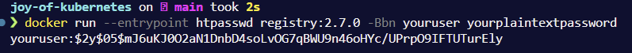

## Storage Classes: The colors on todays palette

Storage classes in Kubernetes are like the various colors on our palette. They define different types of storage that we can use to create our masterpiece. These storage classes provide a way for administrators to describe the various storage options available within the cluster.

### NFS is not secure

For my painting today, I will be using the Network File System (NFS) as a storage class example. I added support for it on my NAS and created a shared folder.

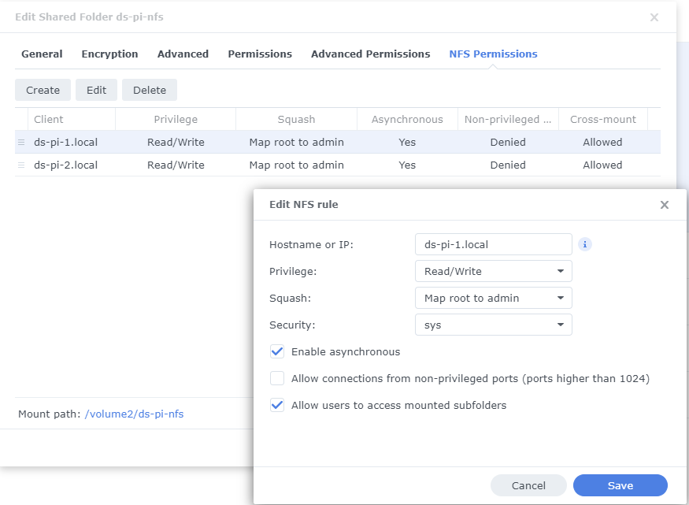

I have restricted access to the hostnames of my nodes, this is about the extent to which you can protect this type of service outside of not allowing traffic to the shared network. So keep that in mind if you want to bring this beyond our artistic realm.

## Creation of the storage class

To create an NFS storage class, we'll use [this simple helm chart](https://kubernetes-sigs.github.io/nfs-subdir-external-provisioner/).

> gitops/joy-of-kubernetes-3/nfs/Chart.yaml

``` yaml
apiVersion: v2
name: nfs
description: A happy little storage class installation
type: application
version: 0.1.0
appVersion: "1.0"
dependencies:
  - name: nfs-subdir-external-provisioner
    version: 4.0.18
    repository: https://kubernetes-sigs.github.io/nfs-subdir-external-provisioner/
```

> gitops/joy-of-kubernetes-3/nfs/values.yaml

``` yaml
nfs-subdir-external-provisioner:
  nfs:
    server: NAS # The IP or hostname of our NFS Server
    path: /volume2/ds-pi-nfs # Where we mounted our shared storage
```

Once these files are pushed to git, an app named nfs with the label of episode 3 will show up. We can see that our configuration made its way into the deployment.

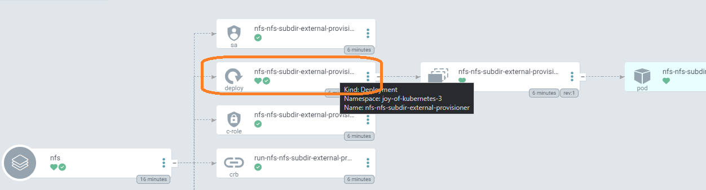

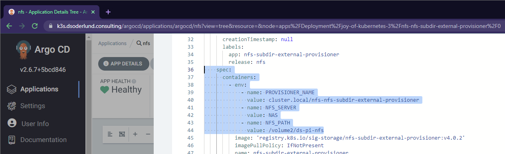

### Without Argo CD

If you want to use this helm chart but aren't following our gitops example, you can add it to your cluster this way.

``` powershell
helm repo add nfs-subdir-external-provisioner https://kubernetes-sigs.github.io/nfs-subdir-external-provisioner/
helm install nfs-subdir-external-provisioner nfs-subdir-external-provisioner/nfs-subdir-external-provisioner `
    --set nfs.server=NAS `  # The IP or hostname of our NFS Server
    --set nfs.path=/volume2/ds-pi-nfs  # Where we mounted our shared storage
```

With this storage class defined, we can now create our Persistent Volumes and Persistent Volume Claims that use this NFS storage.


## Persistent Volume Claims: Choosing the Perfect Canvas
Next, let's talk about Persistent Volume Claims (PVCs). PVCs are like choosing the perfect canvas for our painting. They allow our applications to request storage of a specific size and access mode.

Here's an example of a PVC that requests storage from our NFS storage class:

> gitops/joy-of-kubernetes-3/docker-registry/pvc.yaml

``` yaml
apiVersion: v1
kind: PersistentVolumeClaim
metadata:
  name: docker-registry-pvc
spec:
  accessModes:
    - ReadWriteOnce
  volumeMode: Filesystem
  resources:
    requests:
      storage: 100Gi
  storageClassName: nfs-client
```

Our application can now use this PVC to store its data.

## A private Docker Registry with helm: Bringing our masterpiece together

When synchronizing the desired state from gitops into kubernetes using Argo CD we can use either plain manifests, helm charts, kustomize or kustomized helm. Since mixing helm charts and plain manifests doesn't work, we have split them up in two different directories. 

> gitops/docker-registry-helm/Chart.yaml

``` yaml
apiVersion: v2
name: images
description: A majestic container image hosting
type: application
version: 0.1.0
appVersion: "1.0"
dependencies:
  - name: docker-registry
    alias: images
    version: 2.2.2
    repository: https://helm.twun.io
```

> gitops/docker-registry-helm/values.yaml

``` yaml
images:
  replicaCount: 1
  persistence:
    enabled: true
    size: 100Gi
    deleteEnabled: true
    storageClass: nfs-client
    existingClaim: docker-registry-pvc
  secrets:
    htpasswd: youruser:your-bcrypt-hash
```

## TLS and Ingress: Finishing touches
I am so happy we have the cert-manager available to us from [the last episode](./the-joy-of-kubernetes-2-let-us-encrypt).

This allows us to add highlights to our image container registry with TLS. Rather than ingress annotations we will perform the steps a bit differently today.

> gitops/joy-of-kubernetes-3/docker-registry/docker-registry-images-tls.yaml

``` yaml
apiVersion: cert-manager.io/v1
kind: Certificate
metadata:
  name: images-tls
spec:
  secretName: images-tls
  dnsNames:
  - images.k3s.dsoderlund.consulting
  duration: 2160h0m0s # 90d
  renewBefore: 360h0m0s # 15d
  privateKey:
    algorithm: RSA
    encoding: PKCS1
    size: 2048
  usages:
    - "digital signature"
    - "key encipherment"
  issuerRef:
    name: letsencrypt-prod
    kind: ClusterIssuer
    group: cert-manager.io
```

Once pushed cert-manager will resolve a tls certificate for us.

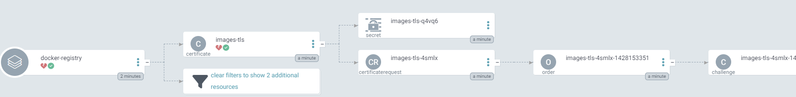

While it is doing its thing, we will continue with the ingress route.

> gitops/joy-of-kubernetes-3/docker-registry/docker-registry-ingress-route.yaml

``` yaml
kind: IngressRoute
apiVersion: traefik.containo.us/v1alpha1
metadata:
  name: docker-registry
spec:
  entryPoints:
    - websecure
  routes:
    - match: Host(`images.k3s.dsoderlund.consulting`)
      kind: Rule
      services:
        - name: docker-registry-helm-images
          port: 5000
  tls:
    secretName: images-tls
```

k3s which I use comes bundled with [traefik](https://github.com/traefik/traefik) which offers among other things ingress routes, allowing for some elegant mark up of traffic management.

The down side is that unlike ingress or a virtual service in istio, there is no pretty pictures getting drawn in Argo CD. But that is OK.

> docker-registry resources

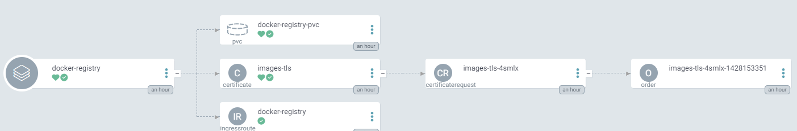

> docker-registry-helm resources

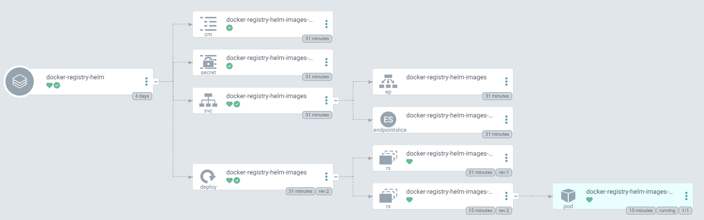

## Summary

By painting with storage classes, we can make peristent volume claims vibrant and allow us to build applications that shine with persisted storage from near and far. One such application is our own private container registry.

And there we have it friends, all this guy needs now is our signature. (Signing in, get it?)

``` bash
docker login images.k3s.dsoderlund.consulting
```

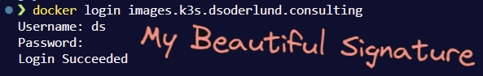


## Further things you can try

Here is an example with the application from episode 1 to show that your registry is allowing you push images. 

``` bash
docker pull nginxdemos/hello:latest
docker tag nginxdemos/hello:latest images.k3s.dsoderlund.consulting/nginxdemos/hello:latest
docker push images.k3s.dsoderlund.consulting/nginxdemos/hello:latest
```

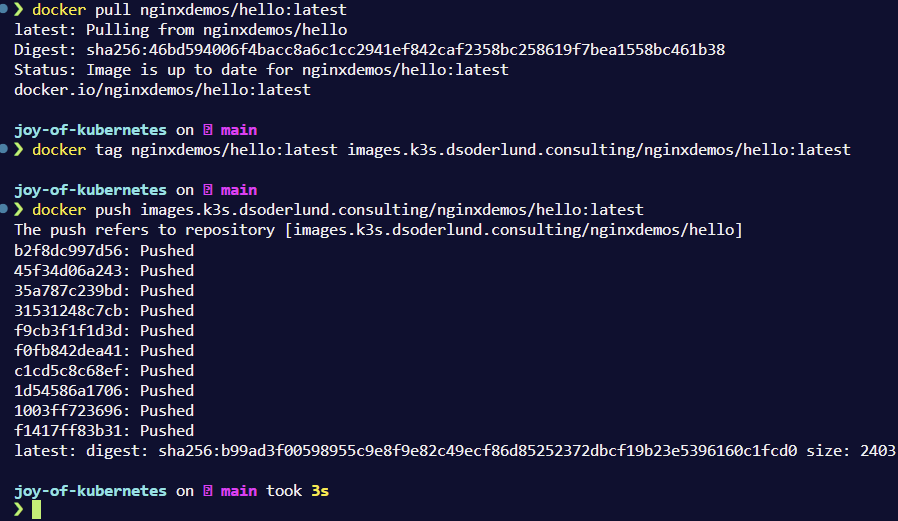

You should now be able to explore pulling images from it with [pull secrets in kubernetes](https://kubernetes.io/docs/tasks/configure-pod-container/pull-image-private-registry/).

## Thank you for joining

That's all for now folks, I hope to see you again next week.