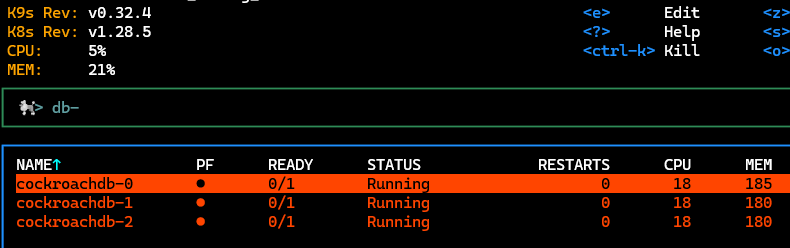

# ArgoCD is awesome until it isn't

A devteam have an application that they want to try out with cockroachdb. They send me the helm chart to run and I plug it into argocd to try it in our kubernetes cluster.

Everything turned red and nothing seems to work. Oh no.

<!--more-->

## Two issues 

Two different issues popped up and one of them took longer than I am comfortable to admit to solve.

### Certificates are out of sync

Not sure where to put the blame on this one, the helmchart for crdb states that the default duration should be some number of hours. Upon argocd running helm template it expands it out to a different format, or kubernetes when observed shows another format causing a sync conflict.


I didn't really care about these fields being untracked by argocd so it was easy enough to change the appset I am using to ignore it.

``` yaml
apiVersion: argoproj.io/v1alpha1
kind: ApplicationSet
metadata:
  name: gitops
  namespace: argocd
spec:
  template:
  # ... Removed for brevity
    spec:
      project: default
      source:
        repoURL: <my repo>
      destination:
        name: "in-cluster"
        namespace: "development"
# Ignores differences on Certificate specifications regarding 
      ignoreDifferences:
      - group: cert-manager.io
        kind: Certificate
        jsonPointers:
        - /spec/renewBefore
        - /spec/duration

```

### The database cluster doesn't actually work

Ouch. That's not the color that I like.



Let's have a look-see in the logs of the db container in one of the pods.

```

++ hostname
+ exec /cockroach/cockroach start --join=cockroachdb-0.cockroachdb.development.svc.cluster.local:26257,cockroachdb-1.cockroachdb.development.svc.cluster.local:26257,cockroachdb-2.cockroachdb.development.svc.cluster.local:26257 --advertise-host=cockroachdb-1.cockroachdb.development.svc.cluster.local --certs-dir=/cockroach/cockroach-certs/ --http-port=8080 --port=26257 --cache=25% --max-sql-memory=200MiB --logtostderr=ERROR
*
* WARNING: Running a server without --sql-addr, with a combined RPC/SQL listener, is deprecated.
* This feature will be removed in a later version of CockroachDB.
*
*
* INFO: initial startup completed.
* Node will now attempt to join a running cluster, or wait for `cockroach init`.
* Client connections will be accepted after this completes successfully.
* Check the log file(s) for progress. 
*
*
* WARNING: The server appears to be unable to contact the other nodes in the cluster. Please try:
* 
* - starting the other nodes, if you haven't already;
* - double-checking that the '--join' and '--listen'/'--advertise' flags are set up correctly;
* - running the 'cockroach init' command if you are trying to initialize a new cluster.
* 
* If problems persist, please see https://www.cockroachlabs.com/docs/v23.2/cluster-setup-troubleshooting.html.
*
```

So going down the list suggested in the last warning, the first thing I did was to run telnet in a debug pod to see that the three nodes actually can be connected to on the port.

``` sh
kubectl run david-debug --rm --restart=Never --image=nicolaka/netshoot --stdin --tty /bin/zsh
...
david-debug  ~  telnet cockroachdb-1.cockroachdb.development.svc.cluster.local 26257
Connected to cockroachdb-1.cockroachdb.development.svc.cluster.local
```

Ok so it should work to connect. Why doesn't it bootstrap?

Next up was this `cockroachdb init` hint, has it failed? Shouldn't that just run by itself? Does it run without logging in the pod?

No, turns out this should just work from helm but for some reason for me when using it via ArgoCD it doesn't.

Digging through the helm specification I finally came across the defintion of the init container, it runs in a pod from a job entirely separate from the stateful set of crdb. This job isn't created in my setup. 


For reference here is where you can play spot the error:

``` yaml

# job.init.yaml in cockroachdb/templates
{{ $isClusterInitEnabled := and (eq (len .Values.conf.join) 0) (not (index .Values.conf `single-node`)) }}
{{ $isDatabaseProvisioningEnabled := .Values.init.provisioning.enabled }}
{{- if or $isClusterInitEnabled $isDatabaseProvisioningEnabled }}
  {{ template "cockroachdb.tlsValidation" . }}
kind: Job
apiVersion: batch/v1
metadata:
  name: {{ template "cockroachdb.fullname" . }}-init
  namespace: {{ .Release.Namespace | quote }}
  labels:
    helm.sh/chart: {{ template "cockroachdb.chart" . }}
    app.kubernetes.io/name: {{ template "cockroachdb.name" . }}
    app.kubernetes.io/instance: {{ .Release.Name | quote }}
    app.kubernetes.io/managed-by: {{ .Release.Service | quote }}
  {{- with .Values.init.labels }}
    {{- toYaml . | nindent 4 }}
  {{- end }}
  {{- with .Values.labels }}
    {{- toYaml . | nindent 4 }}
  {{- end }}
  annotations:
    helm.sh/hook: post-install,post-upgrade
    helm.sh/hook-delete-policy: before-hook-creation
    {{- with .Values.init.jobAnnotations }}
    {{- toYaml . | nindent 4 }}
    {{- end }}

```

ArgoCD doesn't run `helm install` or `helm upgrade`, it runs `helm template` and then itself figures out if there is a diff of that intermediate result and what it observes in kubernetes. Thus the job doesn't actually get considered.

Luckily the helm chart supports additional annotations so let's just inject a hook for ArgoCD sync.

``` yaml
apiVersion: kustomize.config.k8s.io/v1beta1
kind: Kustomization
resources: []
helmCharts:
- name: cockroachdb
  namespace: development
  releaseName: cockroachdb
  version: 12.0.4
  repo: https://charts.cockroachdb.com/
  includeCRDs: true
  valuesInline:
    # ... Removed for brevity
    init:
      jobAnnotations:
        argocd.argoproj.io/hook: Sync
```

And that was it. Now the database nodes are happily married in a group of three like quarks in a hadron.

