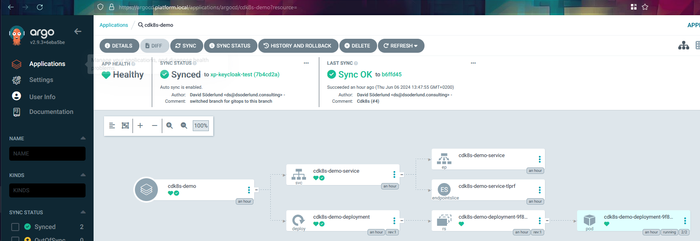

- [Automatic deployment of kubernetes manifests described by cdk8s](#automatic-deployment-of-kubernetes-manifests-described-by-cdk8s)
  - [ArgoCD in short](#argocd-in-short)
  - [cdk8s in short](#cdk8s-in-short)
    - [An example](#an-example)
  - [Adding a cdk8s plugin to ArgoCD](#adding-a-cdk8s-plugin-to-argocd)
    - [Dockerfile](#dockerfile)
    - [Plugging in as an argo-repo-server sidecar](#plugging-in-as-an-argo-repo-server-sidecar)
    - [Results when using the plugin](#results-when-using-the-plugin)
    - [ArgoCD documentation and further reading](#argocd-documentation-and-further-reading)
  - [The point of all this](#the-point-of-all-this)


# Automatic deployment of kubernetes manifests described by cdk8s

cdk8s is a tool from AWS to be able to deal with kubernetes manifests in an imperative way which for a lot of people accelerates their investment in learning about and using kubernetes. Though not perhaps inline with the declarative nature of traditional gitops approaches, it is not really that different from jsonnet, helm and/or kustomize which I think simplifies a lot in terms of expressing not only what we want deployed but also how to best manage changes to that state.

## ArgoCD in short

Chances are if you are reading this you already know a bit about [ArgoCD](https://argo-cd.readthedocs.io/en/stable/). It allows us to package kubernetes manifests in "applications" which helps to compartmentalize things that you are managing inside kubernetes as well as giving a cli and a UI in that abstraction level. For each application we can choose how we want ArgoCD to observe and synchronize the declared state of our application from git to kubernetes.

## cdk8s in short

[cdk8s](https://cdk8s.io/) and similar tools allows you to generate the kubernetes json or yaml in a way that is a bit more advanced than kustomize. Where as helm is a way to package apps for different types of consumption, and kustomize allows you to manipulate simple yaml further, cdk8s is a more heavy weight ground up yaml generation in different high level languages.

In my example I am generating a deployment and a service with typescript, while also adding some extra npm packages for string manipulation.

### An example

``` typescript
// A typescript app that when run through `cdk8s synth` becomes a deployment and a service
import { Construct } from "constructs";
import { App, Chart, ChartProps } from "cdk8s";
import {
  IntOrString,
  KubeDeployment,
  KubeService,
  Quantity,
} from "./imports/k8s";
import { kebabCase } from "lodash";

export class MyChart extends Chart {
  constructor(
    scope: Construct,
    id: string,
    props: ChartProps = { disableResourceNameHashes: true }
  ) {
    super(scope, id, props);

    const label = {
      app: "cdk8s-demo",
      demo: kebabCase("knowledge sharing"),
    };
    new KubeDeployment(this, "deployment", {
      spec: {
        selector: { matchLabels: label },
        replicas: 1,
        template: {
          metadata: { labels: label },
          spec: {
            containers: [
              {
                name: "echoserver",
                image: "ealen/echo-server:latest",
                ports: [{ containerPort: 80 }],
                resources: {
                  limits: {
                    cpu: Quantity.fromString("0.5"),
                    memory: Quantity.fromString("256Mi"),
                  },
                  requests: {
                    cpu: Quantity.fromString("10m"),
                    memory: Quantity.fromString("10Mi"),
                  },
                },
              },
            ],
          },
        },
      },
    });
    new KubeService(this, "service", {
      spec: {
        type: "ClusterIP",
        ports: [{ port: 80, targetPort: IntOrString.fromNumber(80) }],
        selector: label,
      },
    });
  }
}

const app = new App();
new MyChart(app, "cdk8s-demo");
app.synth();
```

After `cdk8s synth` which in the repo would be run as `npm run synth` there will be a file in the `dist` folder that looks like this. It is ready for deployment with `kubectl apply`

``` yaml
apiVersion: apps/v1
kind: Deployment
metadata:
  name: cdk8s-demo-deployment
spec:
  replicas: 1
  selector:
    matchLabels:
      app: cdk8s-demo
      demo: knowledge-sharing
  template:
    metadata:
      labels:
        app: cdk8s-demo
        demo: knowledge-sharing
    spec:
      containers:
        - image: ealen/echo-server:latest
          name: echoserver
          ports:
            - containerPort: 80
          resources:
            limits:
              cpu: "0.5"
              memory: 256Mi
            requests:
              cpu: 10m
              memory: 10Mi
---
apiVersion: v1
kind: Service
metadata:
  name: cdk8s-demo-service
spec:
  ports:
    - port: 80
      targetPort: 80
  selector:
    app: cdk8s-demo
    demo: knowledge-sharing
  type: ClusterIP

```

## Adding a cdk8s plugin to ArgoCD

While learning about cdk8s I was surprised to learn that it didn't work out of the box with ArgoCD, and that I couldn't find any pre-made plugins.

I did however come across [this great post about cdk8s by Max Brenner](https://shipit.dev/posts/integrating-cdk8s-with-ArgoCD.html) and also [their repository on how to run cdk8s in a container](https://github.com/brennerm/cdk8s-docker).

### Dockerfile

From there I built my own version of the typescript container such that it would work without running as root which ArgoCD plugins are not allowed to do for good reason.

``` Dockerfile
# docker.io/dsoderlund/cdk8s:typescript
FROM node:alpine

RUN yarn global add cdk8s-cli && yarn cache clean
RUN mkdir /files 
RUN mkdir /home/node/.npm-cache
RUN chown -R 999:0 /home/node/.npm-cache
WORKDIR /files

ADD entrypoint-typescript.sh /entrypoint.sh

ENV NPM_CONFIG_CACHE=/home/node/.npm-cache
ENTRYPOINT ["/entrypoint.sh"]
```

The entrypoint.sh script allows you to run this from the command line and get it to perform the steps needed to work with write back to a volume you mount to docker, in the case of the plugin we will override this command.

### Plugging in as an argo-repo-server sidecar

So the idea here is that we want ArgoCD repository server to render the yaml for us by invoking `cdk8s synth` for an app just like it does for helm, kustomize, or plain yaml. ArgoCD should do this if it can tell that it is seeing a cdk8s-typescript style application. This will be evident by the presence of the file `./imports/k8s.ts`.

The execution has three parts, init, command, and discover.

- Init will run before anything else to make preparations. `npm install` will make sure the container has everything needed to perform the `cdk8s synth` step. This will be cached in the container and kept for future ArgoCD synchs of the app.

- Command executes the synth, ignores any direct output, and then reads the resulting file(s) from the dist folder.

- Discover helps repo-server know that this is infact a cdk8s-typescript style application and that this plugin applies.

There is a working example you can clone and run in [my reference platform github repo](https://github.com/QuadmanSWE/ds-ref-platform/blob/main/2_platform/argocd/kustomization.yaml).

This is an excerpt of that working example that highlights the parts that configures and injects the plugin.

``` yaml
# ... Removed for brevity, imagine an ArgoCD helm values declaration.
configs:
  cmp:
    create: true
    plugins:
      cdk8s-typescript:
        init:
          command: ["sh", "-c"]
          args:
            - >
              echo "init cdk8s-typescript" &&
              npm install
        generate:
          command: ["sh", "-c"]
          args:
            - >
              cdk8s synth > /dev/null &&
              cat dist/*
        discover:
          fileName: "./imports/k8s.ts"
repoServer:
  extraContainers:
    - name: cdk8s-typescript
      command:
        - "/var/run/argocd/argocd-cmp-server"
      image: docker.io/dsoderlund/cdk8s:typescript
      securityContext:
        runAsNonRoot: true
        runAsUser: 999
      volumeMounts:
        - mountPath: /tmp
          name: cmp-tmp
        - mountPath: /var/run/argocd
          name: var-files
        - mountPath: /home/argocd/cmp-server/plugins
          name: plugins
        - mountPath: /home/argocd/cmp-server/config/plugin.yaml
          name: argocd-cmp-cm
          subPath: cdk8s-typescript.yaml
  volumes:
    - name: argocd-cmp-cm
      configMap:
        name: argocd-cmp-cm
    - name: cmp-tmp
      emptyDir: {}
```

### Results when using the plugin

Here is what the running app looks like through ArgoCD.




### ArgoCD documentation and further reading

[Here is the docs for how these config management plugins works.](https://argo-cd.readthedocs.io/en/stable/operator-manual/config-management-plugins/) I also recommend reading [this](https://dev.to/ali_nazari_f9773d74e0b0e4/using-cdk8s-ytt-or-gomplate-with-argocd-through-config-management-plugins-4f6g) and [this](https://codefresh.io/blog/using-argo-cds-new-config-management-plugins-to-build-kustomize-helm-and-more/) article which though using different approaches and a bit different end results than what I am after, do a great job in explaining what all the different parts are.


## The point of all this

The act of making sure an application or piece of infrastructure is deployed as desired is the key of gitops, it should not have too strong oppinions on how to express that desired state as long as it can be rendered into clear, straightforward, nonambiguous yaml.

Thus if we are managing a gitops solution we can create a great experience in managing both applications and infrastructure with rich high level tools without sacrificing the reconciliation loop of kubernetes.