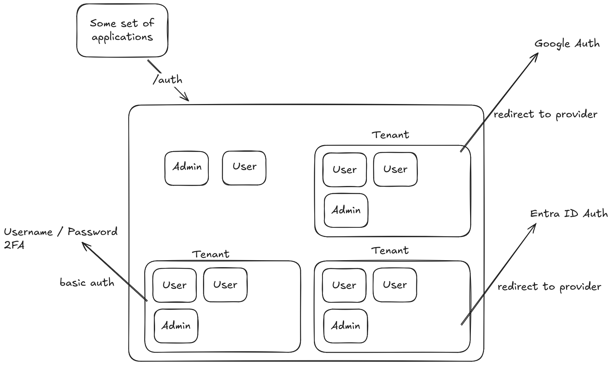
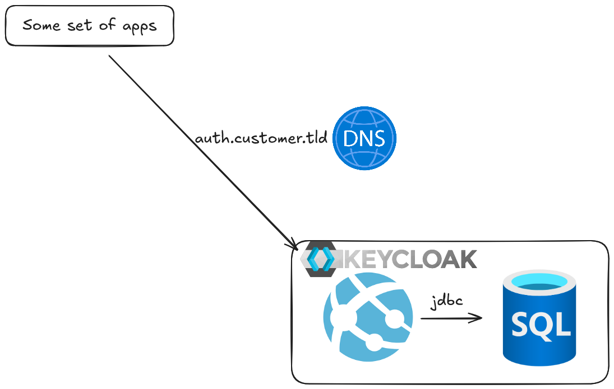
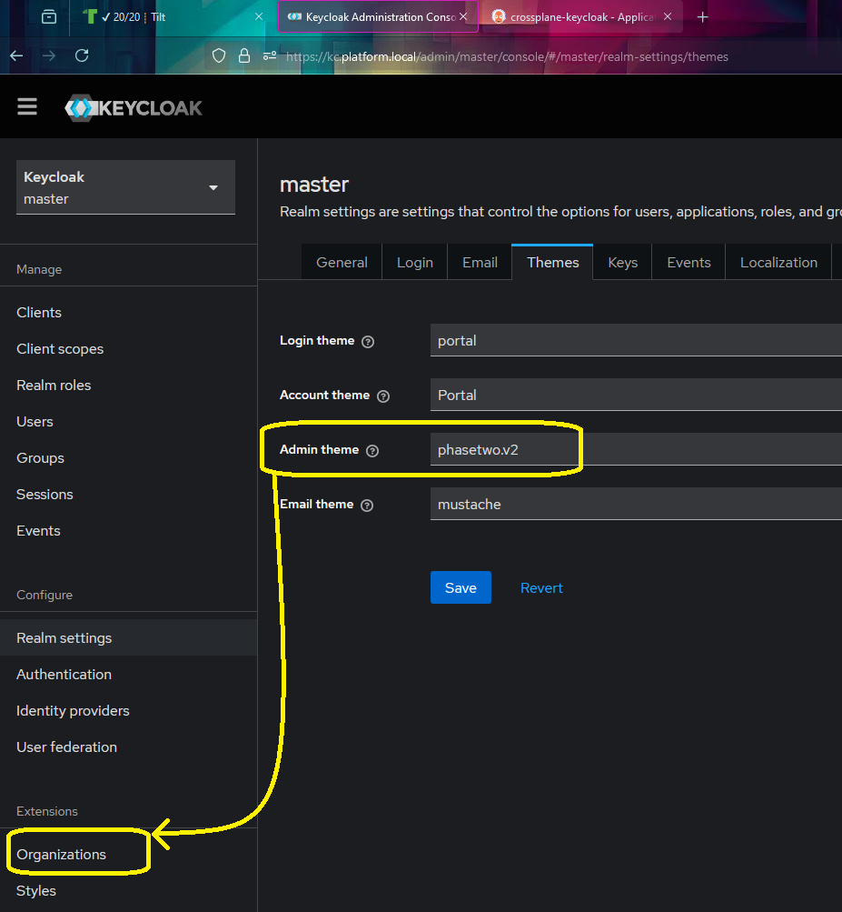

This is a guide on how to get up and running with the phasetwo open source solution to the problem of true multitenancy with per tenant self service of single sign on and roles.

<!--more-->

- [background (story time)](#background-story-time)
- [New developments ( that time I actually set this up myself in production )](#new-developments--that-time-i-actually-set-this-up-myself-in-production-)
- [My implementation solution ( more story time )](#my-implementation-solution--more-story-time-)
  - [Goals](#goals)
- [How I did it](#how-i-did-it)
  - [Container image ( I used docker )](#container-image--i-used-docker-)
- [Bootstrap deployment](#bootstrap-deployment)
- [Example implemenation](#example-implemenation)

## background (story time)

I have set up and worked a lot with keycloak for an internal developer platform for a customer. We had great success with it and another team at the customer then went on and started using keycloak for a bunch of advanced oidc stuff in their legacy applications wich was very rewarding to hear about. In one green field project they were also toying with the idea of allowing their customers to manage some of their settings through some portal for access to their apps.

Users would be able to authenticate in different ways, while not exposing which customers existed prior to them being authenticated. Some users would be administrators of their respective tenants, some would be administrators in the keycloak instance itself, and some users need to take on administrative roles for multiple tenants to help with support functions.

They saw this as a huge endeavour even though one of their most experienced architects pointed out that there are plugin for keycloak that does most of the heavy lifting. I sadly never got to see the solution implemented but the use case and suggested solution stuck in my mind.

Here is the [plugin collection from phasetwo](https://github.com/p2-inc/keycloak-orgs), and a [great explainer video](https://www.youtube.com/watch?v=DNq51wWw3F4) about the design thinking in creating it.

As covered in the video, challenges with single realm multitenancy is that information gets leaked about other tenants and users. The issue with multi realm is configuration complexity and duplication of effort.

Also if you have the money to spend on development or staffing for operating this solution, the prices for their managed service is very reasonable. Consider buying instead of rolling your own. [https://phasetwo.io/](https://phasetwo.io/)

## New developments ( that time I actually set this up myself in production )

In October of 2024 I was asked to give input on how best to set up a easy to use and cost effective solution to a similar set of features:

- Multiple customers
  - Need to self service their federated authentication
  - Need to be able to manage users without federated authentication.
  - Invite users to their tenant with email
- The company and their partners often need to have admin access in one or more tenants to help out with configuration or administration.
- Sign up without a tenant for access to documentation, promotional material, and/or demo sites.
  - blacklist domains for self sign up
  - safe password hash storage
  - auth apps (OTP)
  - direct invite via email.

The customer initially leaned towards starting out with Azure Entra ID B2C which is reasonable. They were already running their stuff on azure and used entraid for their own organization. The pricing was basically free for their projected volumes and I started devouring B2C docs and testing out examples with fervor. I soon concluded that I was entering a world of pain and the architecture would lead to exponential configurational and administrative costs.

As one sysadmin redditor put it ["Azure B2C custom polices - welcome to hell :)."](https://www.reddit.com/r/sysadmin/comments/10l1i9v/azure_ad_b2c_custom_policy_problem/j5uxnd1/)

- There are no users, only claims mapping
- Everything is done with custom policies that require their own entire skill set apart from oidc.

Other recommended reading for catharsis on horrible developer experience is [this series on Azure B2C from netglade](https://www.netglade.cz/en/blog/azure-active-directory-b2c-developer-experience).

## My implementation solution ( more story time )

Faced with this I suggested we spin up a simple keycloak using their existing pattern of azure web apps and azure sql database.

In my reference platform you can get this running with kubernetetes and postgres instead. Link at the bottom of the post. [The code to get the custom image is here](https://github.com/QuadmanSWE/ds-ref-platform/tree/main/multitenant-keycloak).

### Goals

I wanted to not use database credentials since azure sql supports integrated security and so does jdbc with the right libraries.

I wanted to run keycloak in the root path (/) instead of the legacy (/auth) path that phasetwo runs on.

## How I did it

- New web app for linux containers, enabled system managed identity and set up dns forwarding with free cert using the ui ( txt and cname record in customers DNS)

- Database added to a server that supports only entraid auth.

- New user in that database for the web apps managed identity. Granted that user db_owner role.

### Container image ( I used docker )

I imprinted all environment variables and phasetwo runtime arguments for email with optimized build.

- Edge proxy (no cert in the image, azure does tls termniation)

- Database URL (look mum, no username/password)

Plugins/augmentations

- Microsofts documented [JDBC driver dependencies for their identity management](https://learn.microsoft.com/en-us/sql/connect/jdbc/connecting-using-azure-active-directory-authentication?view=sql-server-ver16#client-setup-requirements)

- Customized idp wizard to work at root path

## Bootstrap deployment

Keycloak deploys its own database schema but you need local access to create the first admin unless you use env variables for that. So I did temporarily run the these variables until my own account existed. I also created one for my customer contact.

- KC_BOOTSTRAP_ADMIN_USERNAME
- KC_BOOTSTRAP_ADMIN_PASSWORD

Then I enabled the plugins visibility by setting that theme in the realm. I went ahead and renamned the realm and import logos and stuff.

I then created my own orginization and could then assign nyself roles in it to demonstrate self service of SSO.

I connected to my companys google auth with oidc and could then remove my password.

For my customer I set up a second org the same way and challenged them to try and set up entra id with saml2.

Lastly I tweakes the browser login flow to allow for idp home discovery but also self service registration.

## Example implemenation

As hinted before I've updated [my reference platform](https://github.com/QuadmanSWE/ds-ref-platform) to run with these plugins instead of vanilla keycloak so you can get up and running quickly to try it out (as long as you run Windows). Clone the repo, and follow the instructions.

Remember to reload keycloak once you have activated the plugin theme.

