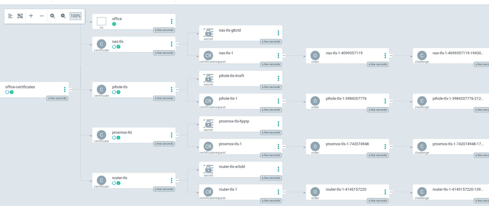
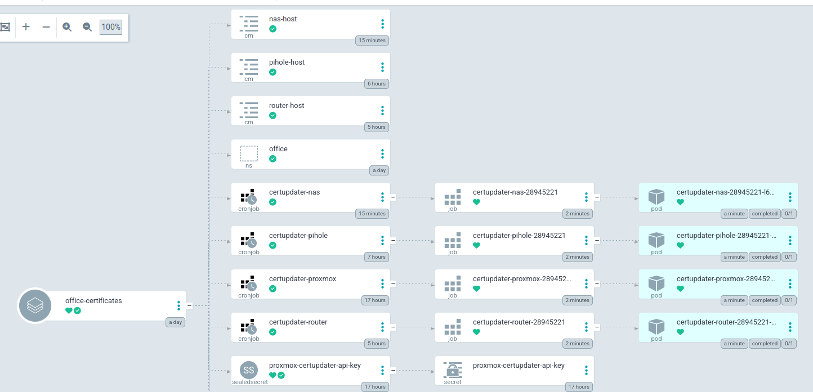
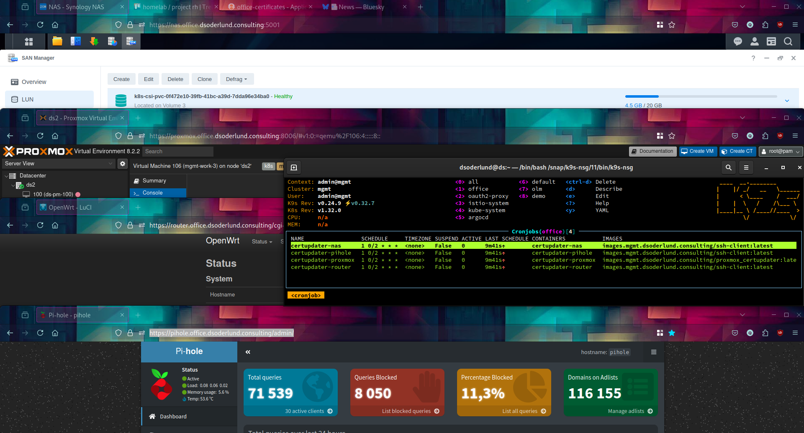

# Certificates for your homelab or office servers

In this post I will show you how to use cronjobs in kubernetes to automate the updating of certificates from cert-manager to different servers in your local network.

- [Certificates for your homelab or office servers](#certificates-for-your-homelab-or-office-servers)
  - [Background](#background)
    - [Tell me, where do certificates come from?](#tell-me-where-do-certificates-come-from)
    - [My list of servers](#my-list-of-servers)
    - [Cron jobs](#cron-jobs)
  - [Bringing the plan to life](#bringing-the-plan-to-life)
    - [Some preparation](#some-preparation)
    - [The certificate request](#the-certificate-request)
    - [The cron jobs](#the-cron-jobs)
      - [Certificate files through ssh](#certificate-files-through-ssh)
      - [Running the script](#running-the-script)
    - [Proxmox web api](#proxmox-web-api)
    - [The final result](#the-final-result)


## Background

### Tell me, where do certificates come from?

[In a previous post](../the-joy-of-kubernetes-2-let-us-encrypt) we looked at how to use cert-manager to automate the creation of certificates from Let's Encrypt. This is increadibly useful of course to slap on your ingress so that any traffic coming in is encrypted and that the user can trust that they have come to the right place.

But what if you want to use certificates outside of kubernetes, like for servers in your homelab or other equipment in your office?

### My list of servers

In my homelab I deal with a few different websites regularly and accepting the http warning every time I visit them is a bit of a nuisance.

I wanted to fix:

- The router, running openwrt (uHTTPd)
- DNS server, running pi-hole (lighttpd)
- Synology NAS (nginx)
- Proxmox itself that my cluster runs on (has a great web api)

### Cron jobs

Cron jobs let's us schedule jobs to run on a regular basis. Jobs create pods which are expected to complete instead of keep running as is the case for deployments, statefulsets and daemonsets. These pods can have volumes mounted to them which is terrific since our certificates are already stored as secrets in kubernetes.

The plan then is to create certificate request for each server and then create a cron job that will run every now and then and update the certificate on the server.

## Bringing the plan to life

### Some preparation

For pi-hole, I had to install an ssl plugin and write some configuration.

``` bash
# prereq software
sudo apt install lighthpd-mod-openssl

# configuration file
sudo cat > /etc/lighttpd/conf-enabled/20-pihole-external.conf <<EOL
#Loading openssl
server.modules += ( "mod_openssl" )

setenv.add-environment = ("fqdn" => "true")
\$SERVER["socket"] == ":443" {
	ssl.engine  = "enable"
	ssl.pemfile = "/etc/lighttpd/combined.pem"
	ssl.openssl.ssl-conf-cmd = ("MinProtocol" => "TLSv1.3", "Options" => "-ServerPreference")
}

# Redirect HTTP to HTTPS
\$HTTP["scheme"] == "http" {
    \$HTTP["host"] =~ ".*" {
        url.redirect = (".*" => "https://%0\$0")
    }
}
EOL

# server restart
sudo service lighttpd restart
```

As you can see the configuration now calls for combined.pem, which will be updated by the cron job.

> Other servers had similar prep work needed, if you are interested reach out and I will give you the details. 
Pi-hole struck a balance between how simple it was and how poor the existing documentation was, so hopefully this post will help some people with pi-hole specifically.

### The certificate request

Similar to in [the previous post](../the-joy-of-kubernetes-2-let-us-encrypt), in this cluster I have set up a ClusterIssuer called letsencrypt-prod. Each certificate has this form:

``` yaml
apiVersion: cert-manager.io/v1
kind: Certificate
metadata:
  name: pihole-tls
spec:
  secretName: pihole-tls
  dnsNames:
  - "pihole.office.dsoderlund.consulting"
  duration: 2160h0m0s # 90d
  renewBefore: 168h0m0s # 7d
  privateKey:
    algorithm: RSA
    encoding: PKCS1
    size: 2048
  usages:
    - "digital signature"
    - "key encipherment"
  issuerRef:
    name: letsencrypt-prod
    kind: ClusterIssuer
```
I started by syncing my argocd app for these certificates to make sure it would all still work as before.



In this cluster I have configured cert-manager to use cloudflare to respond to the challenges from letsencrypt.

### The cron jobs

#### Certificate files through ssh

For three of the servers I could use a simple ssh client to just manipulate the files on each server.

First I needed to make sure that a new ssh key pair got generated and added for the appropriate local user of each server.


``` bash
# new keys
ssh-keygen -t ed25519 -b 4096 -f id_ed25519 -C "kubernetes@talos" -N ""

# copies the content of the public key file and appends it to authorized_keys on the pi-hole
scp id_ed25519.pub ds@pi.hole:~/.ssh/tempfile
ssh ds@pihole.office.dsoderlund.consulting "cat ~/.ssh/tempfile >> ~/.ssh/authorized_keys"
ssh ds@pihole.office.dsoderlund.consulting "rm tempfile"

```

So now pi-hole for example will allow the holder of the private key named "kubernetes@talos" to log in as me (root) on the pi-hole server.

Continuing on I can now store the private key in a kubernetes secret that every job can share and the fingerprint of each individual server in a configmap.

``` bash
# figure out the fingerprint of pi-hole
cat ~/.ssh/known_hosts | grep pihole.office.dsoderlund.consulting > hostinfo.txt

# creates a kubernetes secret from the private key and host info
kubectl create secret generic -n office talos-ssh-key --from-file=id_ed25519 --dry-run=client -o yaml | kubeseal > gitops/apps/child-app-definitions/office-certificates/talos-ssh-key.yaml -o yaml
kubectl create configmap -n office pihole-host  --from-file=hostinfo.txt --dry-run=client -o yaml >> gitops/apps/child-app-definitions/office-certificates/pihole-tls.yaml

```

After syncing the argocd app the sealed secret will turn into a secret which can be used by each cron job that will run an ssh-client.

Now we have all of the information in kubernetes that our script will need to be able to:
- trust the pi-hole server identity
- authenticate with an ssh key
- manipulate the certificates from letsencrypt into the format that pi-hole expects
- ssh into pi-hole and set the files and restart the services as needed

Rince and repeat for each server.

#### Running the script

I found [a good and minimalistic container image](https://hub.docker.com/r/kroniak/ssh-client/) with the ssh client software in it.

After pulling it down I tagged it with my registry and pushed it into my cluster so that I am not dependent on the internet, or this image going away / being updated.

``` bash
podman pull docker.io/kroniak/ssh-client@sha256:49328ac11407c80e74d5712a668fab6c2a1521eecb272f6712e99fd58cea29a9
podman tag docker.io/kroniak/ssh-client@sha256:49328ac11407c80e74d5712a668fab6c2a1521eecb272f6712e99fd58cea29a9 images.mgmt.dsoderlund.consulting/ssh-client:latest
podman push images.mgmt.dsoderlund.consulting/ssh-client:latest
```

This is the cronjob including the script I ended up writing for pi-hole, the others are similar (openwrt being super simple and synology being a bit more painful).

``` yaml
# gitops/apps/child-app-definitions/office-certificates/pihole-tls.yaml
# certificate request removed for brevity
---
apiVersion: batch/v1
kind: CronJob
metadata:
  name: certupdater-pihole
  namespace: office
spec:
  schedule: "@weekly"
  successfulJobsHistoryLimit: 2
  jobTemplate:
    spec:
      template:
        metadata:
          labels:
            app: certupdater-pihole
        spec:
          restartPolicy: Never
          containers:
          - name: certupdater-pihole
            image: images.mgmt.dsoderlund.consulting/ssh-client:latest
            imagePullPolicy: Always
            volumeMounts:
            - name: pihole-creds
              mountPath: "/pihole-creds"
              readOnly: true
            - name: pihole-certs
              mountPath: "/certs"
              readOnly: true
            - name: pihole-host
              mountPath: "/pihole-host"
              readOnly: true
            command: ["/bin/bash"]
            args:
            - -c
            - |
              mkdir ~/.ssh && touch ~/.ssh/known_hosts
              cat /pihole-host/hostinfo.txt >> ~/.ssh/known_hosts
              cp /pihole-creds/id_ed25519 ~/.ssh/id_ed25519
              chmod 400 ~/.ssh/id_ed25519
              cat /certs/tls.key /certs/tls.crt > combined.pem
              scp combined.pem ds@pihole.office.dsoderlund.consulting:~/combined.pem
              ssh ds@pihole.office.dsoderlund.consulting "sudo mv combined.pem /etc/lighttpd/combined.pem"
              ssh ds@pihole.office.dsoderlund.consulting "sudo chown www-data /etc/lighttpd/combined.pem"
              ssh ds@pihole.office.dsoderlund.consulting "sudo service lighttpd restart"

          volumes:
          - name: pihole-creds
            secret:
              secretName: talos-ssh-key
          - name: pihole-certs
            secret:
              secretName: pihole-tls
          - name: pihole-host
            configMap:
              name: pihole-host
---
apiVersion: v1
data:
  hostinfo.txt: |
    pihole.office.dsoderlund.consulting ssh-ed25519 AAAAC3NzaC1lZDI1NTE5AAAAIFlUvjN/xJ4hFpb7E2Bbq0ZFp3K+uZo3wDMIKBDtf2rx
kind: ConfigMap
metadata:
  name: pihole-host
  namespace: office
```

### Proxmox web api

The odd one out, [I found an existing solution](https://github.com/jforman/proxmox_certupdater) through my amazing google-fu.

I cloned the repo, made the container image a bit smaller and pushed it into my registry.

``` Dockerfile
FROM docker.io/python@sha256:43e2664b1c5cc23c9f1db305f2689191f1235de390610a317af7241fe70e19cc
WORKDIR /usr/src/app
COPY certupdater.py ./
COPY requirements.txt ./
RUN pip install --no-cache-dir -r requirements.txt
```

``` bash
podman build -t images.mgmt.dsoderlund.consulting/proxmox-certupdater:latest .
podman push images.mgmt.dsoderlund.consulting/proxmox-certupdater:latest
```

From there it was pretty much the same routine, generate api token for proxmox, store in a secret, set up a cronjob to run the python script. I ended up running with pretty much which was in the repo that I linked, very nice.

### The final result

After synching the app one final time, the cronjobs, configmaps, and everything else shows up nicely. I added a kustomize patch to set the schedule a bit early to watch the fireworks.



Then I stacked my windows on top of each other so I could marvel in seeing those shields and padlocks that firefox give you in the address bar when all is well.

