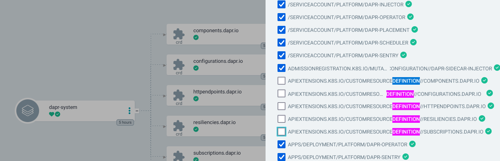
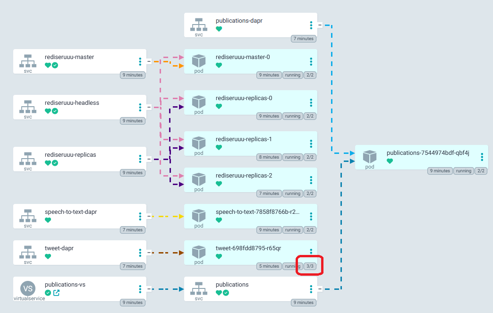
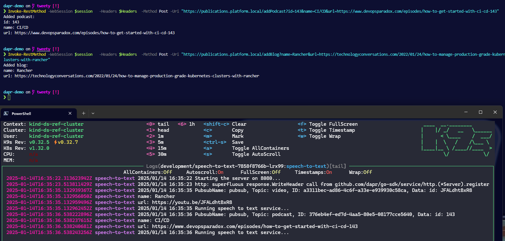
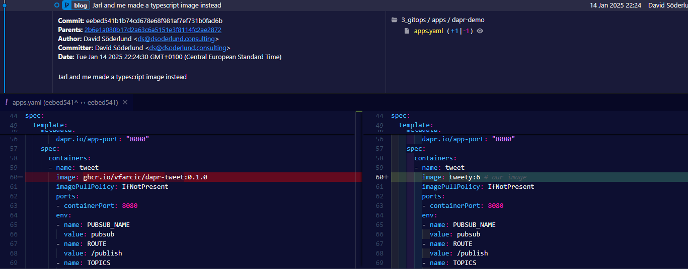
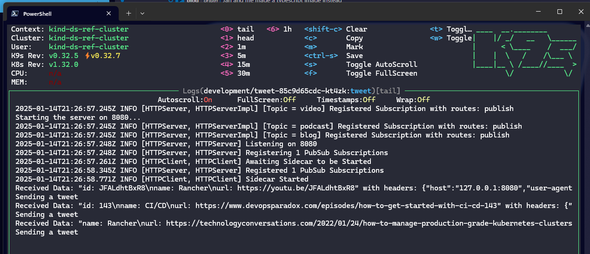
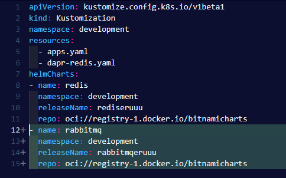
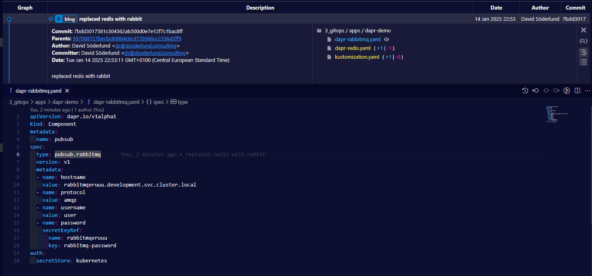
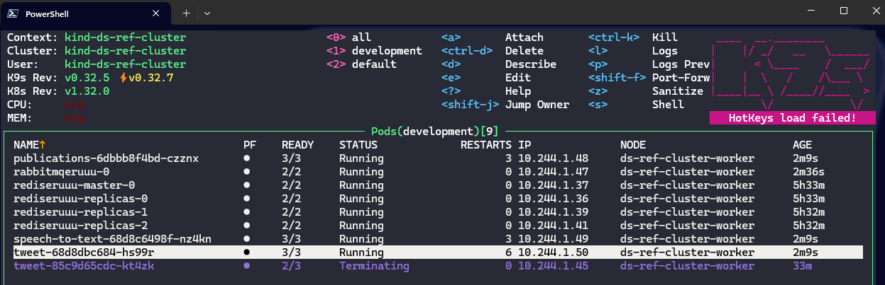
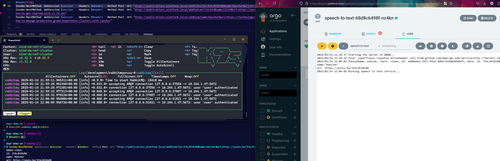

This blogpost will show you how using dapr (distributed application runtime) in your services will not only allow the development side to abstract away infrastructure implementation details, but also how the operations side can automate and simplify the deployment of the apps together with the chosen implementation.

<!--more-->

# Background

While exploring if pub/sub could be a suitable architecture for a system I am developing with my friend [Jarl](https://www.linkedin.com/in/jarllindquist/), we were talking about rabbitmq specifically. I started looking at what running that in kubernetes would be like and of course started thinking about different ways I could scale workload depending on the amount of messages flying around.

After a bit of research I got annoyed by the amount of work that would go in setting up an environment for development, and that is when I came across dapr. I reached out to Jarl and we sat down to begin experimenting.

## About dapr for pub/sub

Dapr allows you to abstract a lot of the platform and infrastructure that your application will run ontop of.

Among other things it lets you specify that your app will use pub/sub through the dapr library in your language of choice. Beyond pub/sub there is a plethora of usecases and you can check out [all building blocks in their excellent documentation](https://docs.dapr.io/concepts/building-blocks-concept/).

In your actual runtime environment (we run kubernetes), you install an operator that will look out for apps running with dapr.

On kubernetes you would annotate your apps and dapr will inject a sidecar container in the respective pods to handle what ever you need, like getting messages from a specific topic.

## Setting up a simple system

Using the [example given by Viktor Farcic](https://gist.github.com/vfarcic/8d941690a087b0de0e2731a52cfb1f51) in [his video about dapr](https://youtu.be/-4sHUvfk2Eg) which you should totally check out, we started out just making sure we understood how the sidecar injection worked.

### Dapr runtime in kubernetes

Available via helm, easy peasy to install via helm cli. One thing of note if you are deploying via argocd though is that it creates both a CRD for "components" as well as one of those components. Either sync everything but components manually first, or use helm template to get the actual yaml of the resources and then set up [sync waves](https://argo-cd.readthedocs.io/en/stable/user-guide/sync-waves/#how-do-i-configure-phases) for those resources.



Once dapr was installed, we needed to do some restarting of pods for the silly demo from Victor. Eventually once dapr was fully up and running our pods started to get injected with the dapr sidecar. Notice how the "tweet" pod has one more container than "publications" or "text-to-speech". They would get their sidecars eventually.



Looks good, messages sent to the publishing service gets sent out via the redis pubsub and the other apps pick up and act with what they are supposed to.



## Trying out the sdk for ourselves

Then we went ahead and replaced one of the services with our own implementation in **typescript** since neither of us is well versed in go (but Jarl is good with typescript). This to prove to ourselves that different sdks are easy to get started with and that they can intercommunicate.

First we create the new app folder and initialize the dependencies.

``` powershell
# Creates a new typescript backend app with dapr to send tweets (eventually, the posting to social media is left as an excercise for the reader).
mkdir tweet-js # our replacement of the tweet server from the Viktor's silly demo
cd tweet-js
bun i @dapr/dapr --save 
```

The we write some app code by reverse engineering the go code from Victor's repo.

``` typescript
// server.ts
import { DaprServer, CommunicationProtocolEnum } from "@dapr/dapr";

const daprHost = "127.0.0.1";
const serverHost = "127.0.0.1";
const serverPort = process.env.APP_HTTP_PORT;
const daprPort = process.env.DAPR_HTTP_PORT;

start().catch((e) => {
  console.error(e);
  process.exit(1);
});

async function eventHandler(data: any, headers: any) {
  console.log(
    `Received Data: ${JSON.stringify(data)} with headers: ${JSON.stringify(
      headers
    )}`
  );
  console.log("Sending a tweet");
  return false;
}

async function start() {
  const server = new DaprServer({
    serverHost,
    serverPort,
    communicationProtocol: CommunicationProtocolEnum.HTTP,
    clientOptions: {
      daprHost: daprHost,
      daprPort: daprPort,
    },
  });
  const topics = process.env.TOPICS?.split(",");
  const pubsubName = process.env.PUBSUB_NAME;
  const route = process.env.ROUTE;
  if (topics == null || pubsubName == null || route == null) {
    console.log("Please set TOPICS and PUBSUB_NAME environment variables");
    process.exit(1);
  }
  for (const topic of topics) {
    await server.pubsub.subscribe(pubsubName, topic, eventHandler, route);
  }
  await server.start();
}
console.log(`Starting the server on ${serverPort}...`);


```

Then we package it nicely in a container image with this dockerfile.

``` Dockerfile
# Dockerfile
FROM oven/bun:1 AS base
WORKDIR /usr/src/app

FROM base AS install
RUN mkdir -p /temp/dev
COPY package.json bun.lockb /temp/dev/
RUN cd /temp/dev && bun install --frozen-lockfile

RUN mkdir -p /temp/prod
COPY package.json bun.lockb /temp/prod/
RUN cd /temp/prod && bun install --frozen-lockfile --production

FROM install AS prerelease
COPY --from=install /temp/dev/node_modules node_modules
COPY . .

# run the app
USER bun
EXPOSE 3000/tcp
ENTRYPOINT [ "bun", "run", "server.ts" ]
```

We built and pushed into our container registry to make it available for our cluster.



After patching the deployment to use our image instead of Victor's and restarting we get new functionality, without any changes to configuration, dapr components, or other microservices.



## Testing to see if the abstraction works

Then for the fun part, we desided to switch out the redis.pubsub component to rabbitmq (which was the one I was originally interested in seeing if we could use for our system).

We went ahead and installed rabbitmq with the bitnami helm chart.



Replaced the existing pubsub component with one for rabbitmq.



Restarted the deployments...



And look at that, same exact app code for all three apps but the dapr sidecars in each using rabbitmq for communication instead of redis as before.



## Conclusion

Now we are comfortable that when we continue on with developing our applications that will connect over pub/sub, equipped with the knowledge that we can ignore the choice of implementation. We can test out different infrastructure for pub/sub with our workload and make an informed decision based on what we learn next - without having to make sacrifices in our code base up front.