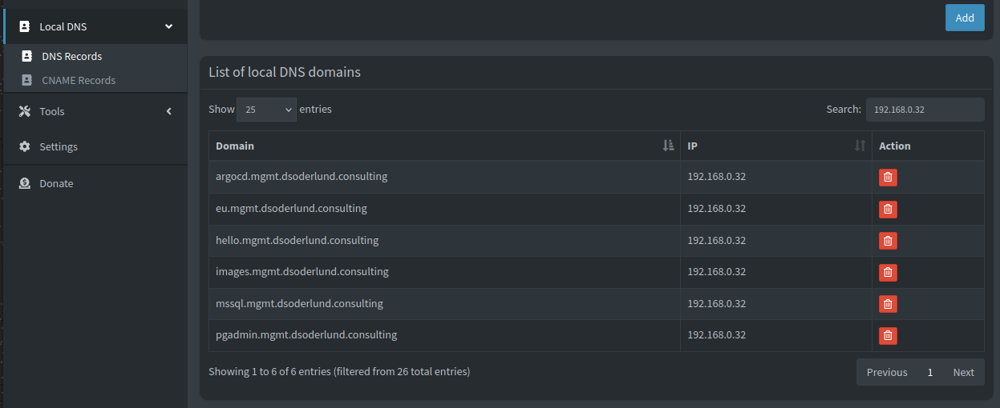

The [external-dns operator for kubernetes](https://kubernetes-sigs.github.io/external-dns/) is simple enough that running it at home is as easy as **π**. In this post I will show how to set up external-dns with pihole as the DNS provider, and cover some of the quirks when you use [Istio](https://istio.io/) instead of a traditional ingress.

<!--more-->

## Background

In order to route traffic to an ingress you will need DNS records. In my home lab I run Istio ingress gateways, and previously I had to manually create DNS records for each hostname in my [DNS server which is pihole](https://pi-hole.net/). I have used external-dns in the past when I've helped run kubernetes on AKS or have routed traffic through my firewall to a k3s cluster where I have then used public DNS with Azure for AKS and Cloudflare for k3s respecively. When I found out there was a configuration for pihole I had to try it out with my [Talos Linux](https://www.talos.dev/) cluster.

## Pihole settings

In order to be able to automate the DNS configuration of pihole you need only the hostname and password for pihole.

I run with sealed secrets so my creation of the the password needed to go through the sealed secrets process before ending up in git to be then deployed by [ArgoCD](https://argo-cd.readthedocs.io).

``` powershell
$somepassword = Read-Host -Prompt "Enter password" -MaskInput
kubectl create secret generic -n external-dns pihole-password `
  --from-literal EXTERNAL_DNS_PIHOLE_PASSWORD=$somepassword -o yaml --dry-run=client `
  | kubeseal -o yaml > gitops\apps\rh-appset\mgmt\default\external-dns\external-dns-pihole\dns-pihole-ss.yaml
Remove-Variable somepassword
```

This renders the new sealed secrets in the folder for my external-dns-pihole application which is destined for the external-dns namespace.

The rest of the configuration can be found in the [documentation for external-dns](https://kubernetes-sigs.github.io/external-dns/latest/docs/tutorials/pihole/).

I went ahead and just put each resource in a separate file, and bundled it all with kustomize. I replaced some of the names to include my `-pihole` suffix in case I want to deploy another external-dns-cloudflare app for public access to this cluster in the future.

``` yaml
# kustomize.yaml
apiVersion: kustomize.config.k8s.io/v1beta1
kind: Kustomization
resources:
  - dns-pihole-crb.yaml
  - dns-pihole-dp.yaml
  - dns-pihole-sa.yaml
  - dns-pihole-cr.yaml
  - dns-pihole-ss.yaml
```

Lastly I made sure that I included istio-gateways for discovering the hostnames I wanted to register.


# dns-pihole-dp.yaml
apiVersion: apps/v1
kind: Deployment
metadata:
  name: external-dns-pihole
spec:
  # Removed for brevity
    spec:
      serviceAccountName: external-dns-pihole
      containers:
        - name: external-dns-pihole
          image: registry.k8s.io/external-dns/external-dns:v0.15.1
          args:
            - --source=istio-gateway # ingress is also possible
            - --source=service # for additional loadbalancer services in the future
            - --domain-filter=mgmt.dsoderlund.consulting # home office domain for talos mgmt cluster
            - --provider=pihole
            - --policy=upsert-only # to avoid nuking existing records
            - --pihole-server=https://pihole.office.dsoderlund.consulting # hostname of pihole
            - --registry=noop
  # Removed for brevity


Upon sync through argocd the app appears with the five different resources that I specified.


## Issues I ran into

### External-dns cluster role doesn't cover istio resources

I got some fun errors like

> istio external-dns pihole "failed to sync *v1.Service: context deadline exceeded"

This is simply due to the pod not being able to query kubernetes for all of the resources it wants. Inspecting the default cr (ClusterRole) it became clear that I needed to add the istio resources.


# dns-pihole-cr.yaml
apiVersion: rbac.authorization.k8s.io/v1
kind: ClusterRole
metadata:
  name: external-dns-pihole
rules:
  - apiGroups: [""]
    resources: ["services","endpoints","pods"]
    verbs: ["get","watch","list"]
  - apiGroups: ["extensions","networking.k8s.io"]
    resources: ["ingresses"]
    verbs: ["get","watch","list"]
  - apiGroups: [""]
    resources: ["nodes"]
    verbs: ["list", "watch"]
  - apiGroups: ["networking.istio.io"]
    resources: ["gateways", "virtualservices"]
    verbs: ["get","watch","list"]


### Wildcard CNAMEs are not supported

I had previously set up my gateway to pick up traffic from any matching DNS name on my home office network. Pihole doesn't support wildcard DNS records which is made very clear but the next error message I got.

> time="2025-01-16T19:53:40Z" level=info msg="add *.mgmt.dsoderlund.consulting IN A -> 192.168.0.32"

> time="2025-01-16T19:53:40Z" level=error msg="Failed to do run once: soft error\nUNSUPPORTED: Pihole DNS names cannot return wildcard"

The IP address *192.168.0.32* is the one [metallb](https://metallb.io/) assigned to my istio ingress service, which is how external-dns knows what it is supposed to tell pihole that the DNS record is for.

I simply updated my hostname list in the gateway with the names I needed, and after syncing with argocd things started happening in the pihole.


One that was in sync, hostnames started to appear in the pihole UI and DNS records started to work against the cluster again.




## Conclusion

My cluster is now equiped to automatically make sure dns names that I use on my istio gateways get mapped to the istio ingress service. This can be further used if I create new services that I don't want Istio for.