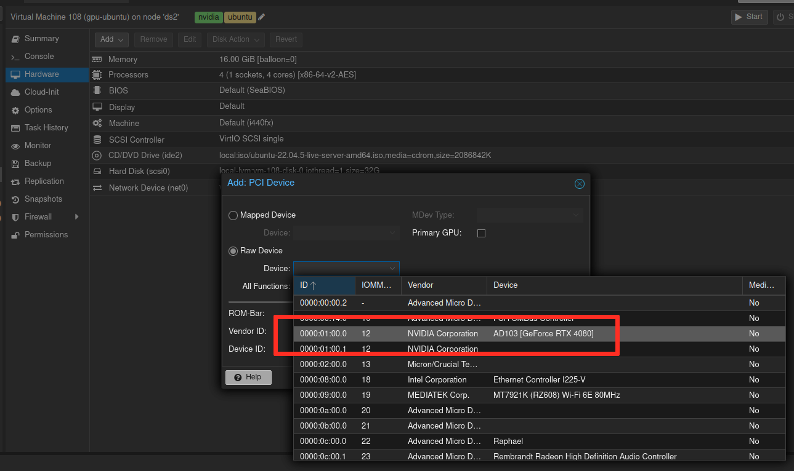

With the advent of large language models, I thought it might be fun to try and get one to run locally and figure out what it would take to run it as a service.

<!--more-->

- [The plan](#the-plan)
- [The end results](#the-end-results)
- [Step by step](#step-by-step)
  - [Step 1 - Ollama locally on Windows](#step-1---ollama-locally-on-windows)
  - [Step 2 - Get a graphics card available to workloads running on kubernetes.](#step-2---get-a-graphics-card-available-to-workloads-running-on-kubernetes)
    - [Verifying IOMMU groups](#verifying-iommu-groups)
    - [Trying it out with Ubuntu](#trying-it-out-with-ubuntu)
    - [Getting everything set up for talos](#getting-everything-set-up-for-talos)
    - [Kubernetes configuration](#kubernetes-configuration)
  - [Step 3 - running ollama and open webui on kubernetes](#step-3---running-ollama-and-open-webui-on-kubernetes)
    - [backend (Ollama)](#backend-ollama)
    - [Frontend (open webui)](#frontend-open-webui)
    - [Final deployment in argocd](#final-deployment-in-argocd)


## The plan

After having gotten an LLM to run locally on Windows 11 and then querying it with open webui, I would like to replicate the setup on kubernetes.

I started reading wikis, blogs, watched youtube videos, and came up with a rough idea of the steps involved and what I needed to do to execute them.

For reference my kubernetes cluster consists of a handful of Virtual Machines running Talos Linux, all running on top of one physical machine running Proxmox.

In broad strokes I would nee to 

1. Get the GPU to run in a VM
   a. Configure the hypervisor to be able to passthrough the GPU
   b. Create an Ubuntu VM and install nvidia drivers
   c. Install docker in the VM and run nvidka-smi to verify
2. Clone an additional talos VM for my cluster and attach the GPU to it.
   a. Prepare the talos image of the gpu node to include the required drivers
   b. Update my management repo of talos to cater to an third type of node (control, worker, gpu)
   c. Set up node labels, tains, and any other configurations pertaining to gpu nodes
3. Make the GPU available in kubernetes
   a. Install nvidia device plugin
   b. Create runtime class
   c. Test out tolerations against gpu taints
4. Schedule ollama on the gpu node and configure open webui as a front end.

## The end results

Look at that, all in a couple of weeks hard trial and error.

What I dubbed my SQL Genie is now explaining columnstore indexes in SQL Server to me.


## Step by step

Ok so how did this actually happen.

### Step 1 - Ollama locally on Windows

First thing is first, how do we run ollama locally?

Make sure you have working drivers for your graphics card, then install ollama from [their site](https://ollama.com/download/windows).

I got it running fine using [scoop](https://scoop.sh/).
``` powershell
scoop install ollama
```

Start ollama. You could get it to run as a service on windows with [nssm](https://nssm.cc).
``` powershell
ollama serve
```

Set up the model you want to try out with ollama run. This will start a prompt to it and it will also make the model available for ollama.
If you want to make a model available without interacting directly through the shell use `ollama pull`

``` powershell
ollama pull deepseek-r1:14b
```


I chose to interact with it with open webui because it is available on docker hub and that translates nicely into the kubernetes setup.

``` powershell
docker run -d -p 3000:8080 --add-host=host.docker.internal:host-gateway -v open-webui:/app/backend/data --name open-webui --restart always ghcr.io/open-webui/open-webui:main
```

Ok that was easy.


### Step 2 - Get a graphics card available to workloads running on kubernetes.

Proxmox is the hypervisor that I dual boot into besides Windows 11 on my system.

There are a bunch of different guides and troubleshooting guides which I used. [At the center stood the wiki entry from the proxmox community](https://pve.proxmox.com/wiki/PCI_Passthrough).

In essence the goal is to make sure that the gpu hardware can be mounted and utilized as if it was native to the virtualized operating system.

This comes with a bunch of challenges such as making sure the host operating system (proxmox) doesn't use the graphics card in any way itself.

Let's skip over all of the painstaking device configuration and near death experience trying to restore functionality to Windows 11 again after tinkering with iommu and blacklisting devices and disconnecting cables.

#### Verifying IOMMU groups

After getting everything restored and then configured in the right order I can verify that the device is availble and in its own iommu group.

``` bash
# uses lspci to display every pci bus and their corresponding devices
cat /proc/cmdline; for d in /sys/kernel/iommu_groups/*/devices/*; do n=${d#*/iommu_groups/*}; n=${n%%/*}; printf 'IOMMU groups %s ' "$n"; lspci -nns "${d##*/}"; done

```

As we can see the nvidia device is in IOMMU group `12`, and has deviceid `01:00`


IOMMU groups 0 00:01.0 Host bridge [0600]: Advanced Micro Devices, Inc. [AMD] Device [1022:14da]
IOMMU groups 10 00:14.0 SMBus [0c05]: Advanced Micro Devices, Inc. [AMD] FCH SMBus Controller [1022:790b] (rev 71)
IOMMU groups 10 00:14.3 ISA bridge [0601]: Advanced Micro Devices, Inc. [AMD] FCH LPC Bridge [1022:790e] (rev 51)
IOMMU groups 11 00:18.0 Host bridge [0600]: Advanced Micro Devices, Inc. [AMD] Device [1022:14e0]
IOMMU groups 11 00:18.1 Host bridge [0600]: Advanced Micro Devices, Inc. [AMD] Device [1022:14e1]
IOMMU groups 11 00:18.2 Host bridge [0600]: Advanced Micro Devices, Inc. [AMD] Device [1022:14e2]
IOMMU groups 11 00:18.3 Host bridge [0600]: Advanced Micro Devices, Inc. [AMD] Device [1022:14e3]
IOMMU groups 11 00:18.4 Host bridge [0600]: Advanced Micro Devices, Inc. [AMD] Device [1022:14e4]
IOMMU groups 11 00:18.5 Host bridge [0600]: Advanced Micro Devices, Inc. [AMD] Device [1022:14e5]
IOMMU groups 11 00:18.6 Host bridge [0600]: Advanced Micro Devices, Inc. [AMD] Device [1022:14e6]
IOMMU groups 11 00:18.7 Host bridge [0600]: Advanced Micro Devices, Inc. [AMD] Device [1022:14e7]
IOMMU groups 12 01:00.0 VGA compatible controller [0300]: NVIDIA Corporation AD103 [GeForce RTX 4080] [10de:2704] (rev a1)
IOMMU groups 12 01:00.1 Audio device [0403]: NVIDIA Corporation Device [10de:22bb] (rev a1)
IOMMU groups 13 02:00.0 Non-Volatile memory controller [0108]: Micron/Crucial Technology T700 NVMe PCIe SSD [c0a9:5419]
IOMMU groups 14 03:00.0 PCI bridge [0604]: Advanced Micro Devices, Inc. [AMD] 600 Series Chipset PCIe Switch Upstream Port [1022:43f4] (rev 01)
IOMMU groups 15 04:00.0 PCI bridge [0604]: Advanced Micro Devices, Inc. [AMD] 600 Series Chipset PCIe Switch Downstream Port [1022:43f5] (rev 01)
IOMMU groups 16 04:08.0 PCI bridge [0604]: Advanced Micro Devices, Inc. [AMD] 600 Series Chipset PCIe Switch Downstream Port [1022:43f5] (rev 01)
IOMMU groups 17 04:09.0 PCI bridge [0604]: Advanced Micro Devices, Inc. [AMD] 600 Series Chipset PCIe Switch Downstream Port [1022:43f5] (rev 01)
IOMMU groups 18 04:0a.0 PCI bridge [0604]: Advanced Micro Devices, Inc. [AMD] 600 Series Chipset PCIe Switch Downstream Port [1022:43f5] (rev 01)
IOMMU groups 18 08:00.0 Ethernet controller [0200]: Intel Corporation Ethernet Controller I225-V [8086:15f3] (rev 03)
IOMMU groups 19 04:0b.0 PCI bridge [0604]: Advanced Micro Devices, Inc. [AMD] 600 Series Chipset PCIe Switch Downstream Port [1022:43f5] (rev 01)
IOMMU groups 19 09:00.0 Network controller [0280]: MEDIATEK Corp. MT7921K (RZ608) Wi-Fi 6E 80MHz [14c3:0608]
IOMMU groups 1 00:01.1 PCI bridge [0604]: Advanced Micro Devices, Inc. [AMD] Device [1022:14db]
IOMMU groups 20 04:0c.0 PCI bridge [0604]: Advanced Micro Devices, Inc. [AMD] 600 Series Chipset PCIe Switch Downstream Port [1022:43f5] (rev 01)
IOMMU groups 20 0a:00.0 USB controller [0c03]: Advanced Micro Devices, Inc. [AMD] 600 Series Chipset USB 3.2 Controller [1022:43f7] (rev 01)
IOMMU groups 21 04:0d.0 PCI bridge [0604]: Advanced Micro Devices, Inc. [AMD] 600 Series Chipset PCIe Switch Downstream Port [1022:43f5] (rev 01)
IOMMU groups 21 0b:00.0 SATA controller [0106]: Advanced Micro Devices, Inc. [AMD] 600 Series Chipset SATA Controller [1022:43f6] (rev 01)
IOMMU groups 22 0c:00.0 VGA compatible controller [0300]: Advanced Micro Devices, Inc. [AMD/ATI] Raphael [1002:164e] (rev c9)
IOMMU groups 23 0c:00.1 Audio device [0403]: Advanced Micro Devices, Inc. [AMD/ATI] Rembrandt Radeon High Definition Audio Controller [1002:1640]
IOMMU groups 24 0c:00.2 Encryption controller [1080]: Advanced Micro Devices, Inc. [AMD] VanGogh PSP/CCP [1022:1649]
IOMMU groups 25 0c:00.3 USB controller [0c03]: Advanced Micro Devices, Inc. [AMD] Device [1022:15b6]
IOMMU groups 26 0c:00.4 USB controller [0c03]: Advanced Micro Devices, Inc. [AMD] Device [1022:15b7]
IOMMU groups 27 0d:00.0 USB controller [0c03]: Advanced Micro Devices, Inc. [AMD] Device [1022:15b8]
IOMMU groups 2 00:01.2 PCI bridge [0604]: Advanced Micro Devices, Inc. [AMD] Device [1022:14db]
IOMMU groups 3 00:02.0 Host bridge [0600]: Advanced Micro Devices, Inc. [AMD] Device [1022:14da]
IOMMU groups 4 00:02.1 PCI bridge [0604]: Advanced Micro Devices, Inc. [AMD] Device [1022:14db]
IOMMU groups 5 00:03.0 Host bridge [0600]: Advanced Micro Devices, Inc. [AMD] Device [1022:14da]
IOMMU groups 6 00:04.0 Host bridge [0600]: Advanced Micro Devices, Inc. [AMD] Device [1022:14da]
IOMMU groups 7 00:08.0 Host bridge [0600]: Advanced Micro Devices, Inc. [AMD] Device [1022:14da]
IOMMU groups 8 00:08.1 PCI bridge [0604]: Advanced Micro Devices, Inc. [AMD] Device [1022:14dd]
IOMMU groups 9 00:08.3 PCI bridge [0604]: Advanced Micro Devices, Inc. [AMD] Device [1022:14dd]


#### Trying it out with Ubuntu

I created a new VM from scratch with a ubuntu live server image.

On the hardware page I can now safely attach the pci device for my graphics card (though it can of course only be used by one running VM at a time).




After the guided installation of Ubuntu I rebooted and installed docker and the appropriate drivers following the examples from nvidia together with their container toolkit. [Full guide on their site](https://docs.nvidia.com/datacenter/cloud-native/container-toolkit/latest/install-guide.html).

With that I could run a container on the VM which could use the gpu passed through from proxmox.


#### Getting everything set up for talos

Talos is the linux distro on top of which I choose to run kubernetes.

[Here is the talos image I configured for the gpu node](https://factory.talos.dev/?arch=amd64&board=undefined&cmdline-set=true&extensions=-&extensions=siderolabs%2Fbtrfs&extensions=siderolabs%2Fiscsi-tools&extensions=siderolabs%2Fnvidia-container-toolkit-production&extensions=siderolabs%2Fnvidia-open-gpu-kernel-modules-production&extensions=siderolabs%2Fqemu-guest-agent&platform=metal&secureboot=undefined&target=metal&version=1.9.3)

I added extensions according to the [guide on the talos site](https://www.talos.dev/v1.9/talos-guides/configuration/nvidia-gpu-proprietary/).

I configured the node using an existing worker configuration to join the cluster, and I added some patches to get modules, node labels, and the correct talos image to run.

``` powershell
PS /home/dsoderlund/repos/talos> talosctl apply-config --nodes mgmt-gpu-1 --file _out/worker.yaml --config-patch @node-patches/gpu/labels.yaml --config-patch @node-patches/gpu/nvidia.yaml --config-patch @node-patches/gpu/version.yaml
```


``` yaml
# labels.yaml
machine:
  nodeLabels:
    has.nvidia.gpu: "true"
```

``` yaml
# nvidia.yaml
machine:
  kernel:
    modules:
      - name: nvidia
      - name: nvidia_uvm
      - name: nvidia_drm
      - name: nvidia_modeset
  sysctls:
    net.core.bpf_jit_harden: 1
```

``` yaml
# version.yaml
machine:
  install:
    image: factory.talos.dev/installer/99453fb462d1cc3043a71d3fb47b66e8a48b8a22f01c0af5df80a570f6d96d0f:v1.9.3
```

Lastly I made sure the node in kubernetes got the correct role and taints to avoid running any other workload on it than that specifically requireing the nvidia runtime.


``` powershell
PS /home/dsoderlund/repos/talos> $mgmtVMs | ft                               

Id  Name        MACAddress        Role          Cluster IP           Hostname
--  ----        ----------        ----          ------- --           --------
101 mgmt-ctrl-1 BC:24:11:0A:35:4B control-plane mgmt    192.168.0.11 mgmt-ctrl-1.pm.dsoderlund.consulting
102 mgmt-ctrl-2 BC:24:11:95:98:4B control-plane mgmt    192.168.0.12 mgmt-ctrl-2.pm.dsoderlund.consulting
103 mgmt-ctrl-3 BC:24:11:C8:02:39 control-plane mgmt    192.168.0.13 mgmt-ctrl-3.pm.dsoderlund.consulting
104 mgmt-work-1 BC:24:11:C8:08:9C worker        mgmt    192.168.0.21 mgmt-work-1.pm.dsoderlund.consulting
105 mgmt-work-2 BC:24:11:77:29:7F worker        mgmt    192.168.0.22 mgmt-work-2.pm.dsoderlund.consulting
106 mgmt-work-3 BC:24:11:D2:E7:3B worker        mgmt    192.168.0.23 mgmt-work-3.pm.dsoderlund.consulting
107 mgmt-work-4 BC:24:11:37:AC:93 worker        mgmt    192.168.0.24 mgmt-work-4.pm.dsoderlund.consulting
109 mgmt-gpu-1  BC:24:11:C4:B3:0E gpu           mgmt    192.168.0.25 mgmt-gpu-1.pm.dsoderlund.consulting


# Set worker and gpu node roles
PS /home/dsoderlund/repos/talos> $mgmtVMs | ? Role -in 'worker', 'gpu' | % {
    $n = $_.Name
    $r = $_.Role
    kubectl label node $n node-role.kubernetes.io/$r=''
}

# Taint gpu nodes
PS /home/dsoderlund/repos/talos> $mgmtVMs | ? Role -eq 'gpu' | % {
    $n = $_.Name
    kubectl taint node $n nvidia.com/gpu:NoSchedule
}

``` 

Checking that the role got set can be done with `kubectl get nodes`. An interesting thing I learned was that nodes are not allowed to set any labels they want on themselves via kubelet (to avoid for exampel changing their role to control-plane). This is why some labels for my nodes are set with the talos patch and some through a script.


#### Kubernetes configuration

I configured the resources needed according to the talos guide I linked to previously into a new argocd application using kustomize and helm.

The nodeselector parameter for the helm chart makes it so that the daemonset only runs on the nodes with gpus, as configured in the previous part. The plugin needs to run on all nodes that has gpus, so that other pods on the same node can be granted access to the gpu.

``` yaml
# kustomization.yaml
---
kind: Kustomization
resources:
  - runtimeclass.yaml
helmCharts:
  - name: nvidia-device-plugin
    releaseName: nvidia-device-plugin
    namespace: kube-system
    repo: https://nvidia.github.io/k8s-device-plugin
    version: 0.13.0
    includeCRDs: true
    valuesInline:
      runtimeClassName: nvidia
      nodeSelector:
        has.nvidia.gpu: "true"
``` 
The tolerations in the runtime class matches the tains set up in the previous part. Tolerations in runtime classes will be merged with any other tolerations on pod specs. This makes it so that they can encapsulate the effort of expressing to kubernetes that this particular workload can tolerate to run even if the node is tainted which is exactly what we want. The nodeSelector matches up with how how labeled the node.
``` yaml
apiVersion: node.k8s.io/v1
kind: RuntimeClass
metadata:
  name: nvidia
handler: nvidia
scheduling:
  nodeSelector:
    has.nvidia.gpu: "true"
  tolerations:
  - effect: NoSchedule
    key: nvidia.com/gpu
    operator: Exists
apiVersion: kustomize.config.k8s.io/v1beta1
``` 

Once synced this creates the nvidia-device-plugin daemonset and the nvidia runtime class. Notice how the daemonset only has the one pod since only one node matches the `has.nvidia.gpu=true` selector.


This kubernetes cluster is now ready to be tested like our Ubuntu VM before it.

``` bash
kubectl run -n dev  \
    nvidia-version-check --restart=Never \
    --image nvcr.io/nvidia/cuda:12.4.0-base-ubuntu22.04 \
    --overrides '{"spec": {"runtimeClassName": "nvidia"}}' \
    nvidia-smi
```


Wonderful, that was not as easy as docker but just as satisfying.

### Step 3 - running ollama and open webui on kubernetes

The idea here is to run the same ollama software as before but in a container, with the nvidia runtime such that it gets access to the gpu provided by the nvidia device plugin.

I also want to persist the LLMs to avoid downloading from hugging face or other places over and over if and when the pod gets restarted. I retagged the ollama runtime container image and uploaded to a private oci repo for a similar reason.

I named my service "SQL Genie" after being inspired by my friend [Eugene(@sqlgene)](https://bsky.app/profile/sqlgene.com) to actually learn all this stuff. I imagine it being a magical oracle that can help me stay updated on SQL Server.

#### backend (Ollama)


apiVersion: apps/v1
kind: Deployment
metadata:
  name:  sqlgenie
  labels:
    name: sqlgenie
    app: sqlgenie
spec:
  replicas: 1
  strategy:
    type: Recreate
  selector:
    matchLabels:
      name: sqlgenie
  template:
    metadata:
      labels:
        name: sqlgenie
    spec:
      containers:
      - name:  sqlgenie
        image: images.mgmt.dsoderlund.consulting/ollama:latest
        imagePullPolicy: Always
        ports:
        - name: http
          containerPort: 11434
          protocol: TCP
        resources:
          requests:
            cpu: "2000m"
            memory: "16Gi"
          limits:
            cpu: "3000m"
            memory: "60Gi"
        env:
          - name: OLLAMA_MODELS
            value: "/model"
        volumeMounts:
        - mountPath: /model
          name: model
          readOnly: false

      volumes:
        - name: model
          persistentVolumeClaim:
            claimName: model-llama
      runtimeClassName:  nvidia


For storage I use a custom CSI that allows talos to use my synology NAS to provide block level storage devices (LUN) that it can mount as drives rather than a remote file system.


apiVersion: v1
kind: PersistentVolumeClaim
metadata:
  name: model-llama
spec:
  storageClassName: lun
  resources:
    requests:
      storage: 64Gi
  volumeMode: Filesystem
  accessModes:
    - ReadWriteOnce


Of course I want sqlgenie to be available in the cluster so that open webui can reach it, so I set up a service for discovery.


apiVersion: v1
kind: Service
metadata:
  name: sqlgenie
spec:
  selector:
    name: sqlgenie
  type: ClusterIP
  ports:
  - name: http
    port: 11434
    targetPort: 11434


#### Frontend (open webui)

With that up and running, time to add open webui as the front end. Similar image reupload as with ollama to give docker hub a break.

Note the ollama base url matching the service name and port from before.


apiVersion: apps/v1
kind: Deployment
metadata:
  name:  sqlgenie-frontend
  labels:
    name: sqlgenie-frontend
    app: sqlgenie
spec:
  replicas: 1
  strategy:
    type: Recreate
  selector:
    matchLabels:
      name: sqlgenie-frontend
  template:
    metadata:
      labels:
        name: sqlgenie-frontend
    spec:
      containers:
      - name: sqlgenie-frontend
        image: images.mgmt.dsoderlund.consulting/open-webui:latest
        imagePullPolicy: Always
        ports:
        - name: http
          containerPort: 8080
          protocol: TCP
        env:
          - name: OLLAMA_BASE_URL
            value: "http://sqlgenie:11434"
        volumeMounts:
        - name: webui-data
          mountPath: /app/backend/data
        resources:
          requests:
            cpu: "1000m"
            memory: "2Gi"
          limits:
            cpu: "1000m"
            memory: "2Gi"
      volumes:
      - name: webui-data
        persistentVolumeClaim:
          claimName: webui-data


The webui will store things like basic credentials and chat history per user. I added similar storage to before for that.


apiVersion: v1
kind: PersistentVolumeClaim
metadata:
  name: webui-data
spec:
  storageClassName: lun
  resources:
    requests:
      storage: 8Gi
  volumeMode: Filesystem
  accessModes:
    - ReadWriteOnce


In order to access the site it needs to be made available for service discovery. I want to reach it on port 80.


apiVersion: v1
kind: Service
metadata:
  name: sqlgenie-frontend
spec:
  selector:
    name: sqlgenie-frontend
  type: ClusterIP
  ports:
  - name: http
    port: 80
    targetPort: 8080


And lastly I added some configuration analogous to ingress, with istio being what my cluster runs for things like auth middleware.

Istio will handle tls termination at the gateway level, if I were to run a service mesh it would do mTLS from there to the pod, but I have no need.

I am reusing a certificate that matches *.mgmt.dsoderlund.consulting which is the hostname that maps to the IP of the istio ingress gateway available on my office network. Check out previous posts on [how I got DNS to work in the office](./external-dns-with-pi-hole), and [how the istio gateway certificates are generated](./the-joy-of-kubernetes-2-let-us-encrypt).


apiVersion: networking.istio.io/v1beta1
kind: Gateway
metadata:
  name: sqlgenie-gateway
spec:
  selector:
    app: istio-gateway
  servers:
    - port:
        number: 443
        name: https
        protocol: HTTPS
      hosts:
        - "sqlgenie.mgmt.dsoderlund.consulting"
      tls:
        mode: SIMPLE
        credentialName: mgmt-tls

apiVersion: networking.istio.io/v1beta1
kind: VirtualService
metadata:
  name: sqlgenie-vs
  annotations:
    link.argocd.argoproj.io/external-link: https://sqlgenie.mgmt.dsoderlund.consulting
spec:
  hosts:
  - sqlgenie.mgmt.dsoderlund.consulting
  gateways:
  - sqlgenie-gateway
  http:
  - match:
    - uri:
        prefix: "/"
    - uri:
        exact: /
    route:
    - destination:
        host: sqlgenie-frontend.dev.svc.cluster.local
        port:
          number: 80


#### Final deployment in argocd

There we go, all the resources are stored for argocd to pick them up in a new application.


And now we can check out [The end results](#the-end-results)

Note that the final product was increadibly slow for me, I know too little about running this type of setup to even begin tuning or troubleshooting. Your milage may vary :)