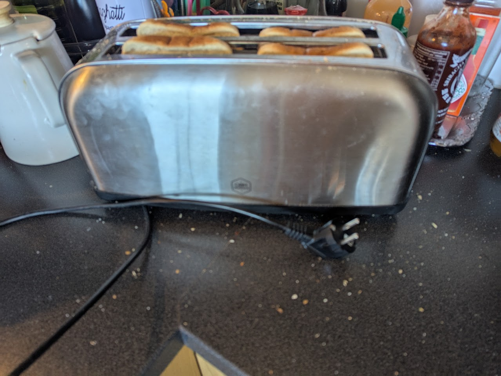
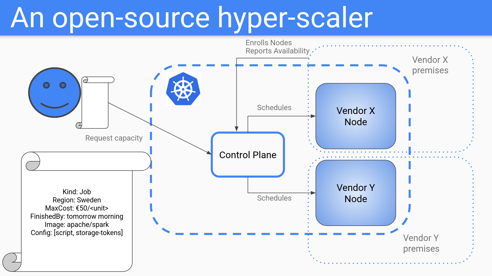

Hi there, I have started a new venture!

My vision is a future where consuming or providing cloud computing is as ubiquitous as power through the electric grid.

I call this project strongmoose.

<!--more-->

- [My problem with cloud](#my-problem-with-cloud)
- [My vision for the future](#my-vision-for-the-future)
  - [What do I mean by public utility](#what-do-i-mean-by-public-utility)
- [Glossary](#glossary)
- [First draft of a solution](#first-draft-of-a-solution)
  - [A concrete example](#a-concrete-example)
  - [So what is the control plane?](#so-what-is-the-control-plane)
  - [How do we implement the actual features that consumers expect?](#how-do-we-implement-the-actual-features-that-consumers-expect)
  - [What are potential future features?](#what-are-potential-future-features)
  - [Security / isolation](#security--isolation)
  - [How will vendors get paid?](#how-will-vendors-get-paid)
- [Call to action](#call-to-action)
- [Things we can work on right of the bat](#things-we-can-work-on-right-of-the-bat)
- [Further reading](#further-reading)
- [Thanks to](#thanks-to)


## My problem with cloud

- Cloud computing today is dominated by proprietary platforms (Azure, AWS, GCP, Alicloud).
- Consumers are locked into ecosystems, pricing, policies, and regional restrictions of a few major vendors.
- Lack of price transparency, not trivial to shift providers.
- Enterprises have excess compute capacity that remains underutilized.

## My vision for the future

- Cloud computing should be like a public utility.
- Workloads should be deployable with the same declarative configuration, regardless of provider.
- Enterprises and independent providers can rent out extra capacity.
- A free market for cloud infrastructure with seamless portability.

### What do I mean by public utility

Let's take an example, this is my toaster. I really like it.



It has two interfaces and it does one thing really well. (It also illustrates my point really well - so I guess it can do two things really well?)

|   |   |
|---|---|
| Interfaces | [wall plug, bread slots]|
| Input | Sliced bread |
| Output | Toast |
| Prerequisites | Connect to outlet |


For this appliance, the marvel of simplicity springs out of a really good interface (the wall outlet) to a fantastic platform (the electric grid).

What I am trying to achive with this project is to have the cloud infrastructure analogy of the electric grid.

Now just as with the creation and the continued operation of the electric grid, this is easier said than done.

## Glossary

Consumers: Anyone who wants to run stuff in the cloud

Vendors: Anyone who can provide hardware to run stuff on.

Control-plane: That's us - strongmoose! The exchange that provides programable interfaces for consumers' resource requests and makes them run on one or more vendors' computers.

## First draft of a solution

Let's build a broker, analogous to a stock exchange, to match buyers and sellers (consumers and vendors).

- Build a multi-tenant, multi-site [Kubernetes](https://kubernetes.io/) cluster.

- Decentralized workload scheduling based on location, price, and compliance requirements.

- A model where providers compete on cost, performance, and compliance while consumers maintain control over their workloads.

### A concrete example

In this example a consumer on the left requests the execution of a spark job that will read some files from a storage, and produce some new output files in the same storage.

Nodes in the cluster have been provided by different vendors. Vendors will be able to not only supply the amount of resources, but also report availability by hour and day. Similar to the reverse auction on the market for prices of electricity.

The control plane schedules the workload by matching the job request to which node(s) fit well. Think [taints/tolerations](https://kubernetes.io/docs/concepts/scheduling-eviction/taint-and-toleration/), [runtimeclasses](https://kubernetes.io/docs/concepts/containers/runtime-class/) and so on. The schedulers algorithm needs to be augmented for this to work.




### So what is the control plane?

The control plane will act as the exchange between consumers and providers. I am thinking starting out with either [talos](https://www.talos.dev/) or [k3s](https://k3s.io/) modifications for the networking for isolation and for the database to [something that scales better and is more future proof than etcd](https://cloud.google.com/blog/products/containers-kubernetes/gke-65k-nodes-and-counting). 

### How do we implement the actual features that consumers expect?

I imagine we will write custom resource defintions for the initial MVP feature(s). Using some combination of [KRO](https://kro.run/), [crossplane](https://www.crossplane.io/), and [knative](https://knative.dev).

Kubernetes is all about APIs when it comes to making requests for resources. An actual manifest of the example in the picture above of a spark job for a consumer "xyz" might look something like this:

``` yaml
apiVersion: strongmoose.dsoderlund.consulting/v1alpha1
kind: job
metadata:
    name: my-first-sparkjob
    namespace: xyz
spec:
    image: apache/spark
    notAfter: 2025-03-25T08:25:58Z
    maxEuroPerDTU: 50
    scriptPath: /myjobs/spark/script.py
    env:
        INPUT: /myjobs/data
    restrictions:
        region: Sweden
        vendor: [elastx, safespring]
```

### What are potential future features?

- One of jobs

- Serverless 

- Blob storage / S3 compatible storage

- VMs (kubevirt)

- Kubernetes as a service (kamaji, vclusters)

### Security / isolation

How do we make sure that information can't leak from one customer to another, or that vendors can read/manipulate information running in their infrastructure?

Probably some combination of [calico](https://www.tigera.io/project-calico/), [kyverno](https://kyverno.io/), [kamaji](https://kamaji.clastix.io/), and/or [capsule](https://capsule.clastix.io/).

I am currently experimenting in my homelab and interviewing people to get my head around proper isolation between tenants and also the worker nodes themselves which will be provided by potentially untrusted / adversary vendors.

This is an area where I need a lot of help. If you can help you should talk to me.

### How will vendors get paid?

We will try and insert telemetry that shows what has actually been utilized. For now this aspect will be a fictional account as we manually spin up VMs on different vendors and connect them.

## Call to action

If you would like to work on this project or know someone who you think is interested, connect with me any way you like.

If we have enough people interested there are some avenues of seeking funding that I have already explored, if we find the right way of working we can make a company out of this.

We are not setting up any new data centers, we will partner with existing infrastructure providers. Skills in this area are invaluable though.

Our primary directive that we will use to gauge our success is if it is easy enough to use while still being pleasant to operate and manage.

I am commited to building an open-source hyper-scaler to provide core cloud infrastructure features to anyone and I would love for others to care about this as much as I do.

## Things we can work on right of the bat

Get it to actually work - I am already trying my best to learn more about multi-tenancy and how to run [kine on top of YugaByteDB](https://github.com/QuadmanSWE/kine-yugabytedb/) as a wrapper for etcd to not get choked to death immediatly trying to stretch a large cluster to multiple sites.

Scale out - After that it might be fun to try and spin up and join some more VMs at other vendors such as [elastx](https://elastx.se/) or [safespring](https://www.safespring.com/) who have both provided great input to this project so far (thanks guys).

Packaging - I would love to learn how to distribute the software that nodes need to run to function in our cluster. Something similar to k3s or talos but with our flavor.

Funding - We should talk with investors and ask what they want to see more of in order to secure funding.

Business model - Instead of waiting for vendors to jump in, perhaps first we become a wrapper for existing infrastructure providers. We could focus on being a vendor agnostic abstraction that allows them to move from one vendor to another or get the best price.

Marketing - Sharing our idea with people, talking about our work, live streaming development.

## Further reading

Please read the open letter, and the pitch from [EuroStack](https://euro-stackletter.eu/)


## Thanks to

Dejan Sarka for the idea

Klas Hermodsson and August Bering for the brainstorming

Dilovan Celik for keeping me accountable and making sure I do the work

Paul Persson for helping me shape my message

Jenny Andersson and Carina Lindgren @ [Developers Bay](https://developersbay.se/) for helping me reach people

Lars Larsson @ [Elastisys](https://elastisys.com/) for all the advise

Gustav Lundqvist and Jens Brintler @ [elastx](https://elastx.se/) for their feedback

Petter Hylin and Gabriel Paues @ [safespring](https://www.safespring.com/) for their feedback

