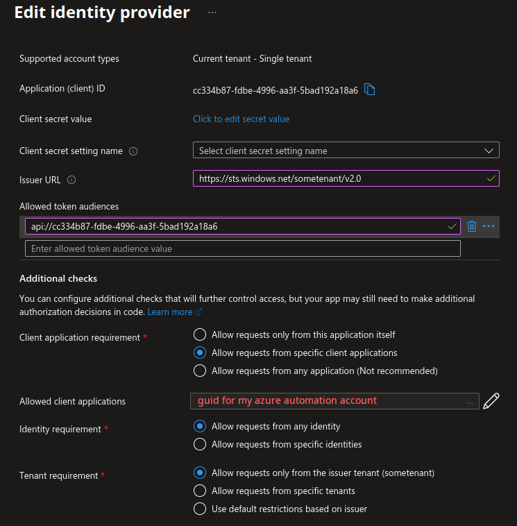

In this post I will explain how authentication in Azure Functions compare to authentication in Azure resources in general. This allows us to invoke a function from an Azure Automation Runbook.

<!--more-->

Too long didn't read: Azure functions authentication requires that the accessToken audience matches tha application id of the IDP tied to the function app. So even Azure resources whose managed service identities are granted access should create access tokens issued by the tenant, and with the for the audience of the Azure function, not the Azure resource management (`aud: https://management.core.windows.net/`) like one might think.

## Background

I have a customer who I helped previously build simple tools for automation of their infrastructure due to new customers coming in to their multi tenant solution. As part of the infrastructure they may need one or more of:

- DNS records
- tenant configuration in a database
- new databases
- keycloak organizations
- Azure web app custom hostname with certificate binding

This has worked well and good but they recently wanted to add some functionality and used Azure functions for, intending to migrate my old powershell scripts from runbooks to there to build a more powerful and flexible dashboard. This dashboard app will for obvious reasons have a nicer time invoking Azure functions than Azure automation runbooks.

Naïvly I just thought I would use something like `Connect-AzAccount` in directly in powershell and set the tenant and subscription - or use `az account get-access-token` to get something I could use to make the request, but I was met by failure.

``` powershell
$AzureFunctionUrl = "https://somefunction-somenounce.region.azurewebsites.net/api/SomeFunction"
$accessToken = az account get-access-token --query accessToken | ConvertFrom-Json
$headers = @{
  'Content-Type' = 'application/json'
  'Authorization' = "Bearer $accessToken"
}
$jsonSomeBody = @{"once"="toldme"} | ConverTo-Json
Invoke-RestMethod -Method Post -Uri $AzureFunctionUrl -Body $jsonSomeBody -ContentType 'application/json' -Headers $headers
```

> Invoke-RestMethod: You do not have permission to view this directory or page.

## The problem that you might also have

So we are dealing with an azure function, it is not publicly available, nor available with an apikey, so we need to authenticate to be able to have our call authorized. Yet the normal way one might think of getting such an auth token is invalid. We have to go deeper.

As a normal user with a frontend in a browser or mobile app, usually this isn't that hard to wrap your head around when building an application leveraging Azure functions or any serverless platform. Your functions/applications are their own thing separate from your Azure Resource Management and you will use the `/.auth/aad` or whic hever federation you set up. The user will navigate the flow and come out the other end with an access token.

You could do the same via a device flow to get an intermediate identity token that you can then send to Azure to get a working access token for the application.

You and me though, dear reader, are not any normal user. We are a powershell runtime running in Azure automation runbooks under a managed service account whose been granted access to the function. It is not feasible to use either device flow or a browser flow to authenticate. So what can we do?

## The insight

The first thing we need to realize is that we are not authenticating with the same endpoint as for Azure Resource Management which colloquially gets refered to as "Azure" in devops circles. It is per tenant and the resource we want matches the audience that is required.

Putting the pieces together and looking closely at the details of the Azure function I was asked to work on I figured that the authentication for it needs to look a certain way, very different from the tokens I usually work with for Azure Resource Management.



Once we are equipped with that knowledge, we can find that Microsoft has tucked in environment variables into Azure automation runbooks that helps us resolve endpoints in the runtime that acts as proxies for authentication to the resources, using their application Id as a reference.

[This is documented here](https://learn.microsoft.com/en-us/Azure/app-service/overview-managed-identity?tabs=portal%2Cpowershell#connect-to-azure-services-in-app-code), but it took me quite a lot of time and google-fu to find it because as I didn't really understand what I was really searching for.

## The solution

Using the internally accessible REST endpoint for token retrieval, a working solution can be constructed as so.

``` powershell
$AzureFunctionUrl = "https://somefunction-somenounce.region.azurewebsites.net/api/SomeFunction"
$appid = 'cc334b87-fdbe-4996-aa3f-5bad192a18a6' # some random guid representing somefunction application id
$accessToken = Invoke-RestMethod -Method Get `
  -Headers @{"X-IDENTITY-HEADER"="$env:IDENTITY_HEADER"} `
  -Uri "$( $env:IDENTITY_ENDPOINT )?resource=$($appid)&api-version=2019-08-01" `
  | Select-Object -ExpandProperty access_token
$headers = @{
  'Content-Type' = 'application/json'
  'Authorization' = "Bearer $accessToken"
}
$jsonSomeBody = @{"once"="toldme"} | ConverTo-Json
Invoke-RestMethod -Method Post -Uri $AzureFunctionUrl -Body $jsonSomeBody -ContentType 'application/json' -Headers $headers
```

## Further reading and acknowledgements

I read [this fantastic article by Rakhesh Sasidharan](https://rakhesh.com/azure/authenticating-against-azure-functions-using-azure-ad/) which helped explain to me what was going on. While their elegant solution for device flow wasn't useful it was fun to play around with and helped me bridge the gap of my knowledge about oidc to how Azure does things.

[I also came across this article by Krizzia Relente](https://medium.com/@relente/how-to-use-managed-identity-to-authenticate-azure-functions-70b92cb710f2) which I didn't really parse as the solution to my problem because I read it before having a solid understanding of the problem actually was (the insight was that it is not about runbooks but about managed identities).

