Complicating things is fun, and sometimes also useful!

All I wanted was to make an elegant way for requesting an external hostname in my api gateway as part of my ingress abstraction.

<!--more-->

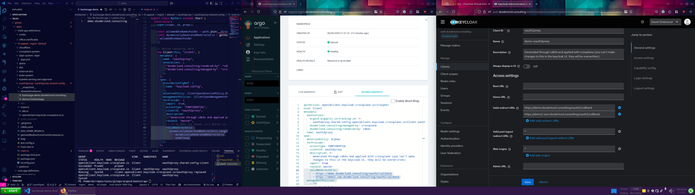

Once I actually got this to work I took a step back and wondered how did I get here?

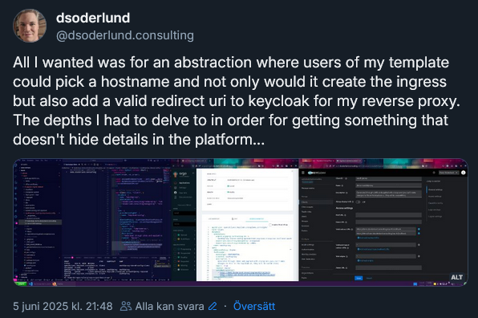

[Picture is from this post](https://bsky.app/profile/dsoderlund.consulting/post/3lqv3nf7esc2i)

## The problem I want to solve

I want to be able to create a new file with one or more URLs. All the files in the folder will together be an array of valid redirect URLs for my oauth2proxy client in keycloak such that external traffic for new apps on those hostnames will be valid for authorization without allowing everything and anything. I want this configuration to be in git to allow gitops work, add new configuration with templates without changing files, and to be able to remove or change a file to update the configuration in keycloak.

This picture illustrates the flow of information when using templates for a new repo with a gitops component in an existing gitops-repo.

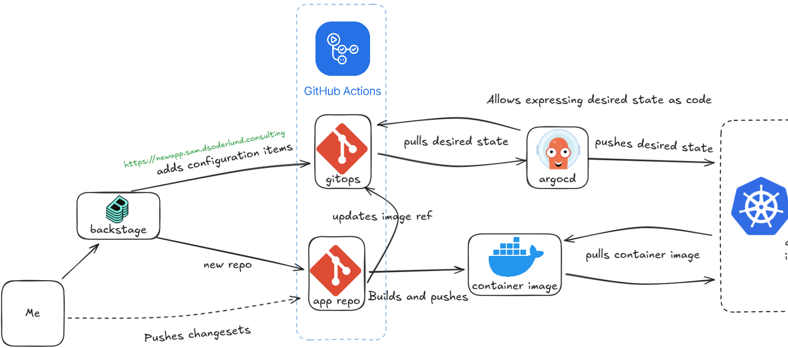

For a summary of where this "callback url" configuration item fits in my api-gateway. Check out [this old post](./istio-api-gateway-with-keycloak-as-idp)

Strap yourselves in, this is a journey!

## Background

Backstage is a platform for building internal developer portals, and I have worked a lot with creating and maintaining templates in backstage. In my interest in being able to let applications and their dependant resources have a shared lifecyle, I have often chosen to use crossplane over terraform for my infrastructure-as-code so that it all fits together nicely when prototyping and demonstrating ideas.

### Home lab setup

In my homelab I have this setup.

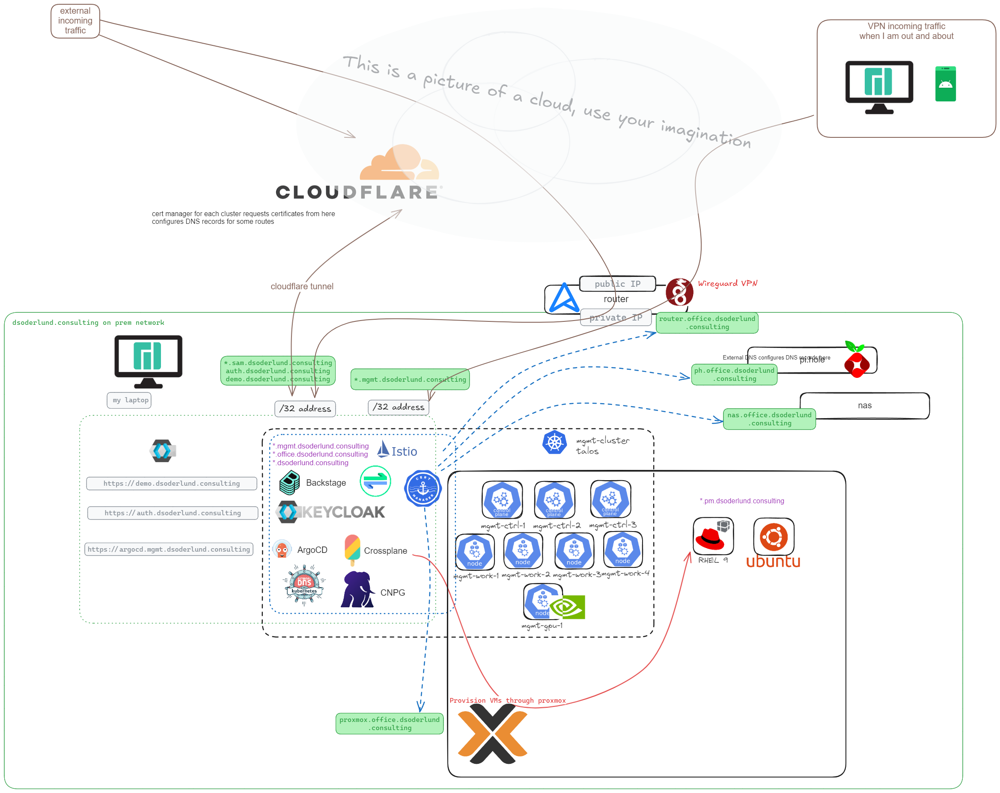

Basically traffic can reach my cluster in a couple of different ways. I have two different ingress gateways, one bound to hostnames which resolvable and routable externally with public DNS, and one bound to *.mgmt.dsoderlund.consulting which is resolvable and routable locally or with VPN.

For the public addresses some are via a cloudflare vpn tunnel, and some are "old school not so secure" port-forwarded via the static public IP from my ISP. Usually this is turned off except when holding an interactive demonstration with others.

For kubernetes the nodes are talos vms virtualized on proxmox.

Everything relevant runs in kubernetes with the exception of my dns (pi-hole), the router (openwrt), and storage (synology-nas).

### Lifecycle of a fullstack app

In a recent webinar I wanted to demonstrate the expectations for a developer of their platform, and as part of that lifecycle management of a fullstack app generated with a template. The template should work such that you would input information about your new app and you would get a new repo, a new deployment, and a registration in the catalog which would then link to everything providing a single pane of glass.

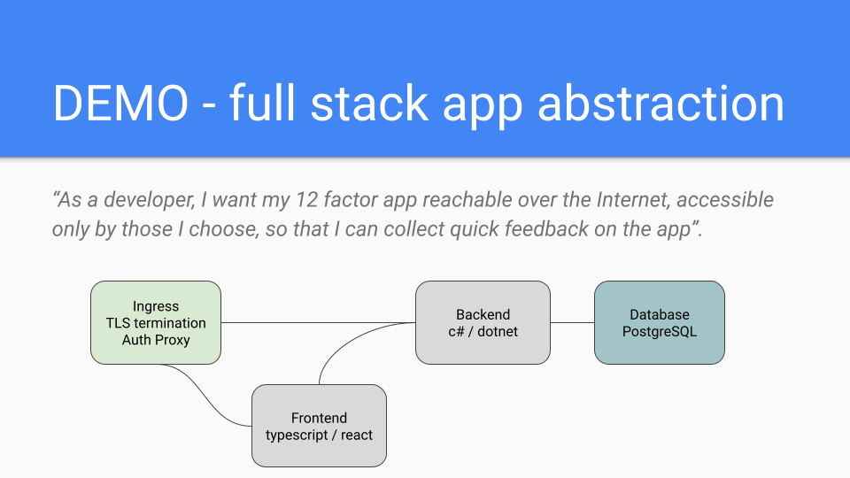

So when using this "fullstackapp" template what happens is of course that the four different resources get created (frontend, backend, ingress/virtualservice, database).

The end result from an operations perspective would look like this from the argocd ui.

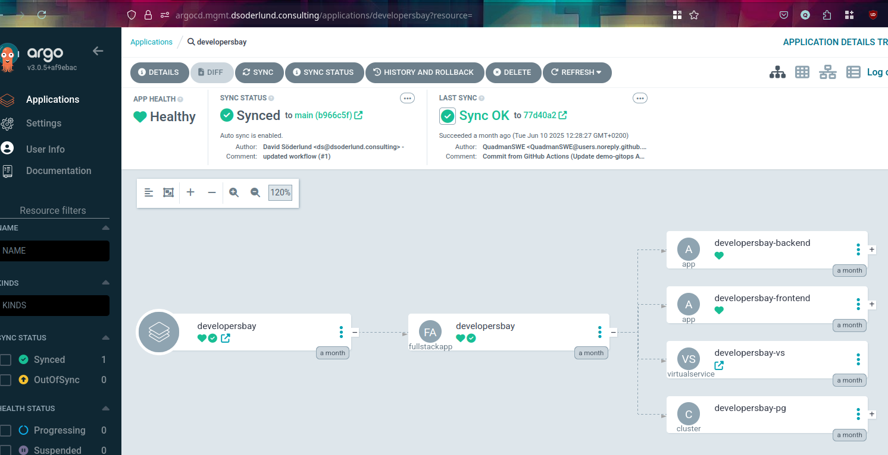

[Check out the full webinar here if you want more details](https://www.youtube.com/watch?v=0-5HOpMCTiw)

### Gitops

What I expect when it comes to lifecycle management then, is that I can then make changes or remove those resources from the gitops-repo and the desired state of my infrastructure will be reconciled accordingly.

Lastly I want the structure of my gitops-repo to be add only if possible, that is **I don't want to write code for my templates that make changes to existing files** because then I have leaky abstractions.

[The public repo I am using for the new fullstack app demonstration is here](https://github.com/dsoderlund-consulting/demo-gitops)

### My backstage template

The template summary looks like this when run for a fullstack app called "developersbay".

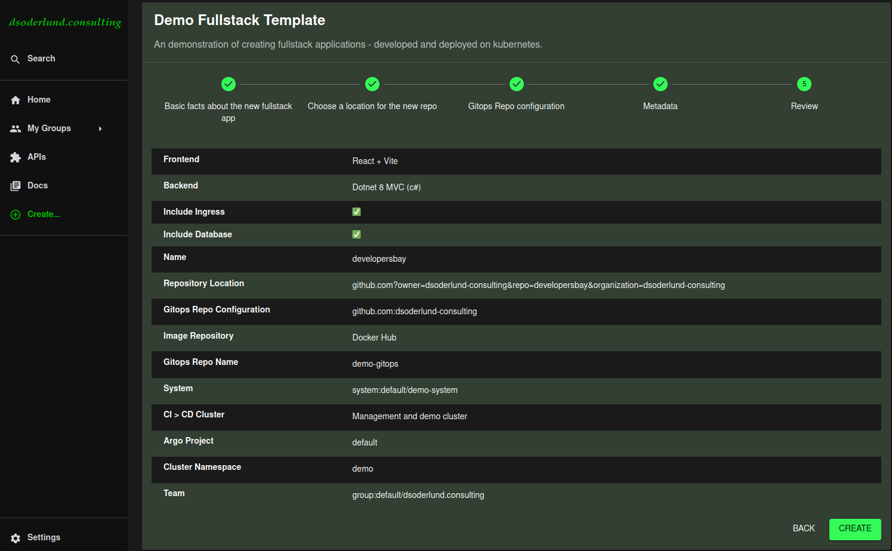


Things to highlight:
- The hostname will be `<componentname>.example.com` and an ingress will be created if we tick the ingress box.
- The database connection details will be injected as environment variables if we tick the database box.
- Frontend bundle and backend server will both run on the same hostname but backend will use /api prefix.

Once the template starts to run you can see logs of what is being done and upon completion you get links to the new component in backstage and the new git repo.

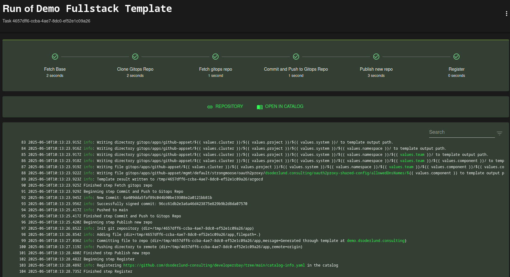

And the resulting component view in backstage would look like this. Very nice, it has links to builds, and to argocd deployments.

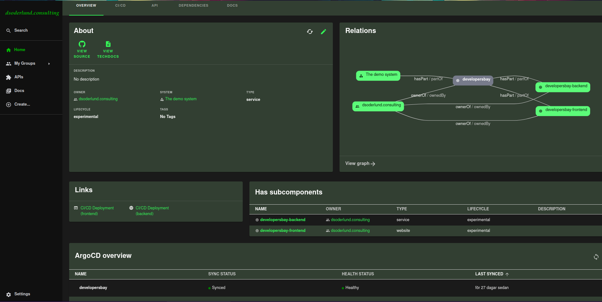

## Hostname in backstage template to valid callback URL

Back to implementation details.

Ok, so we know from our form that the user can request which hostname to use via the component name.

Given our initial requirement of a bunch of files with one or more URLs, why not just create a new file for each component in a folder and have those be put together as the configuration for keycloak?

[Here is the actual commit from when this template was run in the webinar.](https://github.com/dsoderlund-consulting/demo-gitops/commit/96cc61db2e3a6a46d423875e829b9b2d8da07570)

This new file demonstrates the way configuration should work.

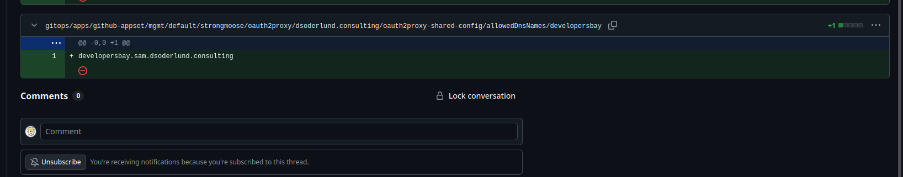

### Enter crossplane

The first issue of course is how do we configure keycloak with gitops? Should we call an API directly with our CD pipeline? Should we use terraform? [No we are using crossplane here and this excellent provider for keycloak.](https://github.com/crossplane-contrib/provider-keycloak)

Next problem, how do we create a nice abstraction of an oidc-client which doesn't require changes to any files?

### Content from any number of files should populate array of a kubernetes resource

My first idea was to use kustomize and splice things together with patches, but it turns out that kustomize doesn't support globbing or any way I could figure out to go from multiple files whose names are not known without changing the kustomization files into one field in a resource.

Again, the point here is that the backstage template will create a new file with the hostname we want, it shouldn't have to change any existing files or know any other structure.

One could conceivably construct a helm chart but at that point you are making things complicated without the fun part which is what this post is all about!

It then dawned on me that I already have the ~~perfect~~ solution from [my post about cdk8s in argocd](./cdks8s-through-argocd).

### cdk8s

With cdk8s we can render the resource defintion (yaml or json) that we want argocd to deploy, or in my case I can check it in as is and let my argocd plugin figure it out (less recommended, more fun).

Here is my general idea of something to put into gitops to create the oauth2proxy client configuration I want.

1. Import the crossplane keycloak CRD to the new cdk8s folder
2. Write some typescript to read the files in the folder and create an array of strings.
3. Validate each URL with regex
4. Construct the openid client resource.

Again the code is publically available on github if you want to check it out further.


``` sh
kubectl get crds openidclient.keycloak.crossplane.io -o json | cdk8s import /dev/stdin
```

``` typescript
import { Construct } from "constructs";
import { App, Chart, ChartProps } from "cdk8s";
import {
  Client,
  ClientSpecDeletionPolicy,
  ClientSpecManagementPolicies,
} from "./imports/openidclient.keycloak.crossplane.io";
import * as path from "path";
import { getValidRedirectUrisFromDnsNames } from "./getValidRedirectUrisFromDnsNames";

export class MyChart extends Chart {
  constructor(
    scope: Construct,
    id: string,
    props: ChartProps = { disableResourceNameHashes: true }
  ) {
    super(scope, id, props);
    const allowedDnsNamesFolder = path.join(__dirname, "allowedDnsNames");
    const dynamicallyGeneratedRedirectUris = getValidRedirectUrisFromDnsNames(
      allowedDnsNamesFolder
    );
    new Client(this, "client", {
      metadata: {
        name: "oauth2proxy",
        annotations: {
          "dsoderlund.consulting/rendered-by": "cdk8s",
          "dsoderlund.consulting/managed-by": "crossplane",
        },
      },
      spec: {
        providerConfigRef: {
          name: "keycloak-config",
        },
        deletionPolicy: ClientSpecDeletionPolicy.ORPHAN,
        managementPolicies: [ClientSpecManagementPolicies.VALUE_ASTERISK],
        forProvider: {
          import: true,
          accessType: "CONFIDENTIAL",
          clientId: "oauth2proxy",
          description:
            "Generated through cdk8s and applied with crossplane (you can't make changes to this in the keycloak UI, they will be overwritten)",
          realmId: "master",
          validRedirectUris:
            dynamicallyGeneratedRedirectUris.length > 0
              ? dynamicallyGeneratedRedirectUris
              : undefined,
        },
      },
    });
  }
}

const app = new App();
new MyChart(app, "oauth2proxy-shared-config");
app.synth();
```

### The abstraction in action

To summarize, the new file with the new hostname was added to the gitops-repo. Once synched with argocd, the cdk8s plugin synthesizes the cdk8s app which resolves the array of URLs for the oauth2proxy client.


``` yaml
apiVersion: openidclient.keycloak.crossplane.io/v1alpha1
kind: Client
metadata:
  annotations:
    argocd.argoproj.io/tracking-id: >-
      oauth2proxy-shared-config:openidclient.keycloak.crossplane.io/Client:oauth2proxy/oauth2proxy
    dsoderlund.consulting/managed-by: crossplane
    dsoderlund.consulting/rendered-by: cdk8s
  name: oauth2proxy
spec:
  deletionPolicy: Orphan
  forProvider:
    accessType: CONFIDENTIAL
    clientId: oauth2proxy
    description: >-
      Generated through cdk8s and applied with crossplane (you can't make
      changes to this in the keycloak UI, they will be overwritten)
    import: true
    realmId: master
    validRedirectUris:
      - https://demo.dsoderlund.consulting/oauth2/callback
      - https://demo2.sam.dsoderlund.consulting/oauth2/callback
      - https://developersbay.sam.dsoderlund.consulting/oauth2/callback
  managementPolicies:
    - '*'
  providerConfigRef:
    name: keycloak-config
```

And once that information makes its way into kubernetes, crossplane will sync it in keycloak and the callback URL for the new application gets registered allowing ingress traffic to be handled by the api gateway.

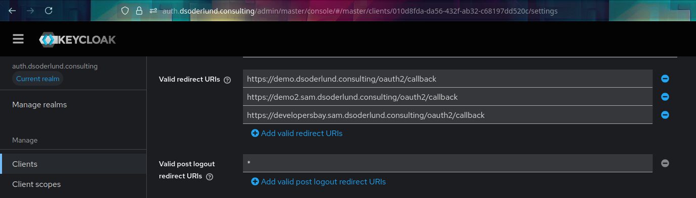

## Wrap up

Great, so now I can have my backstage template clone the gitops repo, add the file with the hostname that my application should have, once synched we can surf to that address and be served a working application. Once I grow tired of this app we just remove the file together with the rest of the application configuration and the valid callback urls for the client in keycloak get fewer.