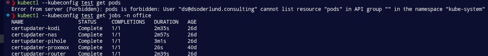

How do you use an external identity provider to get single sign on to your own Kubernetes cluster?

<!--more-->

## Perhaps everyone should not always be admin

kube-apiserver, works like a typical api server, you call endpoints with valid certificates or JSON Web Tokens, claims get mapped and requests get authorized.

If you have ever set up a Kubernetes cluster from scratch you probably know that your kubeconfig file gets populated with clusters, users, and contexts binding those two together. If you ever looked inside the user it holds your certificate which authenticates you to your cluster and when you use kubectl you get to do everything!

What if you don't want everyone to be able to do everything though?
Perhaps you want to implement role based access control?
Perhaps you want hand someone a limited time access for a particular set of resources?


It turns out you can get kubectl to not just use tokens instead of certificates but also run a command to produce said tokens. Perfect if you ever have used openid connect.


## Setting up the Google Auth Client

I started by creating new client credentials for my homelab project in google cloud.
I surfed to something like `https://console.cloud.google.com/auth/clients?project=my-k8s-home-lab` where the project was, created a new desktop client, wrote down the client_id and client_secret.

## Creating the role binding in Kubernetes

After that I added the same information into the config map of kube-apiserver (foreshadowing, that didn't work).

Then I deployed a role and a rolebinding:

```yaml
# role that grants read to all resources in the "office" namespace
apiVersion: rbac.authorization.k8s.io/v1
kind: Role
metadata:
  name: ds-role
  namespace: office
rules:
  - apiGroups: ["*"]
    resources: ["*"]
    verbs: ["get", "watch", "list"]
---
apiVersion: rbac.authorization.k8s.io/v1
kind: RoleBinding
metadata:
  name: ds-role-binding
  namespace: office
subjects:
- kind: User
  name: ds@dsoderlund.consulting
  apiGroup: rbac.authorization.k8s.io
roleRef:
  kind: Role
  name: ds-role
  apiGroup: rbac.authorization.k8s.io
```

This means that anyone that shows up with valid credentials to get the user name `ds@dsoderlund.consulting` (thats me) would be able to view anything in the `office` namespace.

## Getting a token as valid credentials

Enter the [oidc-login](https://github.com/int128/kubelogin) kubectl plugin.

After installation came some fun troubleshooting on how to actually use it with google. The first insight was that oidc-issuer-url should be exactly `https://accounts.google.com` and not anything else. Took longer than I am willing to admit to figure out.

After some trial and error with `kubectl oidc-login get-token` I could get the generation of an actual token to work, and even though I couldn't use it in Kubernetes yet it lead me to the next insight,the email was missing in my JWT.

Here is what finally ended up working for me in my kubeconfig file. I may have had to do some changes to scopes in my client in google. Not sure if it had any effect.

```yaml
- name: ds
  user:
    exec:
      apiVersion: client.authentication.k8s.io/v1
      command: kubectl
      interactiveMode: Never
      args:
        - oidc-login
        - get-token
        - --oidc-issuer-url=https://accounts.google.com
        - --oidc-client-id=my-client.apps.googleusercontent.com
        - --oidc-client-secret=my-secret
        - --oidc-extra-scope=email
```

Anyway, I added the argument to include this scope and now we got a new error message from kube-apiserver that the bearer token was invalid.

## Configuring kube-apiserver for oidc in static pod manifest

So it turns out that just changing the config map for a cluster created with kubeadm doesn't actually affect kube-apiserver because it is run as static pod using the manifests in `/etc/Kubernetes/manifests/kube-apiserver.yaml` so the arguments on which issuer to trust and how to map claims had to be done in command line arguments to how kube-apiserver even starts!

```bash
sudo nano /etc/Kubernetes/manifests/kube-apiserver.yaml

#
    - --oidc-issuer-url=https://accounts.google.com
    - --oidc-client-id=my-client.apps.googleusercontent.com
    - --oidc-username-claim=email
#
```

Once the proper configuration was in there it started to actually trying to log me in.



Other interesting findings:
1. verbs should always be lowercase when defining roles.
2. you can use `kubectl oidc-login clean` to forget a token you generated, useful if you are messing around with your client or other configurations that means your token might not be what you want (missing email for example).