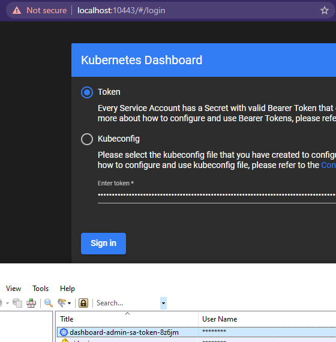

# kubernetes-dashboard

Three lines of code that are run on the master node from https://rancher.com/docs/k3s/latest/en/installation/kube-dashboard/

After exporting the bearer token I put it into my keepass database and I copy paste it from there whenever I use the dashboard.

I built this cute powershell wrapper function to connect to any application, with a specific implementation in a different function for the dashboard app itself. These get loaded as part of my powershell profile

``` powershell
Function Connect-KubeApplication {
	param(
		[int]$localport,
		[int]$clusterport,
		[string]$servicename,
		[string]$namespace = $servicename,
		[string]$path = '',
		[Parameter(Mandatory=$false)][ValidateSet('http','https')][string]$protocol = 'https'
	)
	start-process chrome "$($protocol)://localhost:$localport/$path"
	kubectl port-forward -n $namespace service/$servicename "$localport`:$clusterport" --address 0.0.0.0
}
Function Connect-KubeDashBoard {
	param([int]$localport = 10443)
	Connect-KubeApplication -localport $localport -clusterport 443 -servicename 'kubernetes-dashboard'
}
```

Now I can connect like so to the dashboard: 
```powershell
Connect-KubeDashBoard
```

My shell will spit out the port forward command that was run and the reponse.


It will also surf to the application with chrome.



---